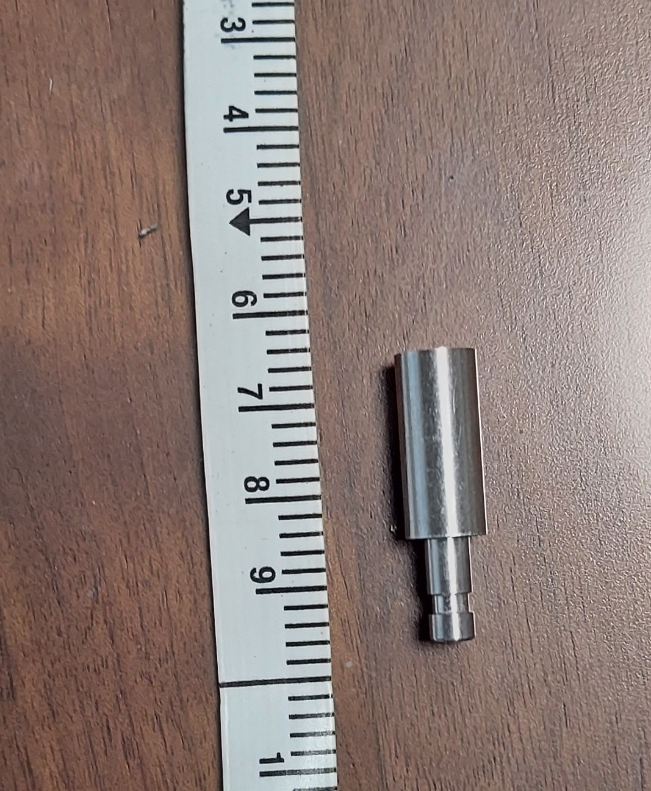
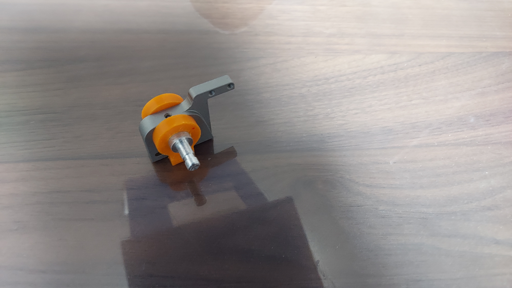

こんにちはハード担当のkapiです。  

# CNCパート 
前回に引き続きスポンサー企業のJLCPCBさんにCNCを作っていただきました。

## スポンサー紹介

前回の内容と被ってしまいますがスポンサーの紹介をさせていただきます。

[JLCPCBさんのホームページはこちら(https://jlcpcb.jp/)](https://jlcpcb.jp/)

JLCPCBさんは中国にある基板のプロトタイプ製作からCNC加工、3Dプリンター印刷まで幅広くいろいろなことをやってくださる企業です。

標準サイズの基板なら5枚で$2から製作できるなど非常に低価格なのが魅力です。また、安い送料プランも用意されており、日本にも迅速に配送できます。

低価格ながら品質は申し分なく、個人の電子工作や競技ロボットにもってこいの企業です。

これからもよろしくお願いします。

## CNCについて
  
今回は足回りに使う金属製の部品をCNCで発注しました。

前回と同じく発注してから2週間で届きました。

今回もいつも通りの丁寧な梱包で届きました。

今回のパーツはロボットの車軸です。車軸は大きな力がかかるため強度的に3Dプリンターで作るのは不安だったので、CNCで発注しました。

設計は[たのロボ！のしろくまさんの設計](https://blog.shirokuma89.dev/20240328/)を参考にさせていただいています。

前回発注した固定金具とぴったりはまりました。加工精度も非常に高いです。

ちなみに今回の表面処理は手磨きで発注しました。バリもなく、つるつるです。

## 発注の仕方

前回の記事に詳しく書いてあるので、ぜひ[こちら](https://tuton-rcj.github.io/20240419/)をご参照ください。

# 月次報告パート

活動を本格的に始めてから２か月ほど経過してしまいましたが、４月の月次報告(？)をやりたいと思います。  

３月はたいして書くようなことはしていなかったのでなかったことにしたいと思います.

## 四月の出来事

### 機体の新規設計!!

今まではレゴ機RCJに出ていたので、今回が初めての自作機体の設計です。 

色々わからないことがあったりしましたが、ロボットの走行機構の設計を終えることができました。
   
今のところロボットの大きさは一般的な折り紙と同じサイズ感なので、かなり小型に作れるかなと思ってます。 
    

### 部品の発注

設計した機体のパーツをさっそくスポンサーであるJLCPCB様に発注して作ってもらいました。この記事と前回の記事分のパーツが届いています。
  
### その他パーツの選定

ロボットのセンサーなどの位置や個数を決めてメーカなどを選定しました。

### 2024名古屋大会の視察

今年は残念ながら、関東大会で敗退してしまったので、メンバー全員で先輩チームの応援を兼ねて名古屋まで見に行きました。

### メンバーの高校生進学

一応、みんなピカピカの高校生になれました。　よかったね

# まとめ

そろそろ基板の発注を始めようと思います。

JLCPCB様、これからもスポンサーよろしくお願いします。

