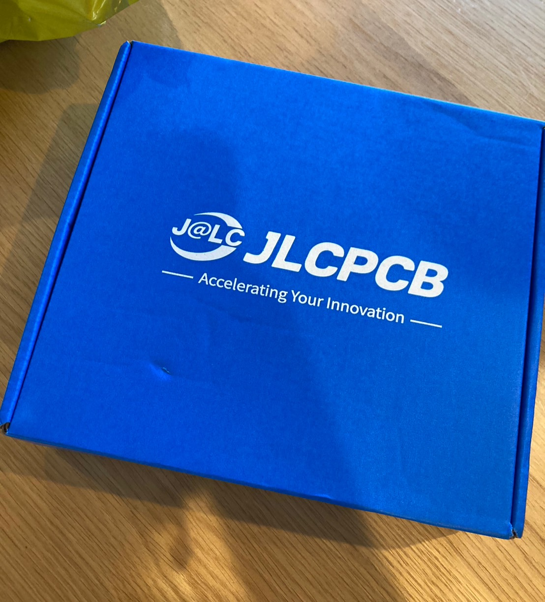
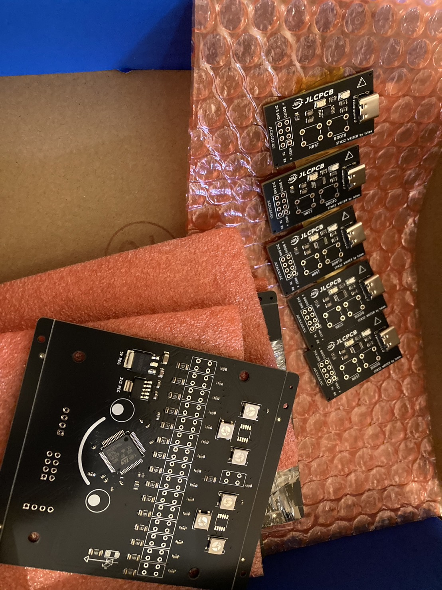
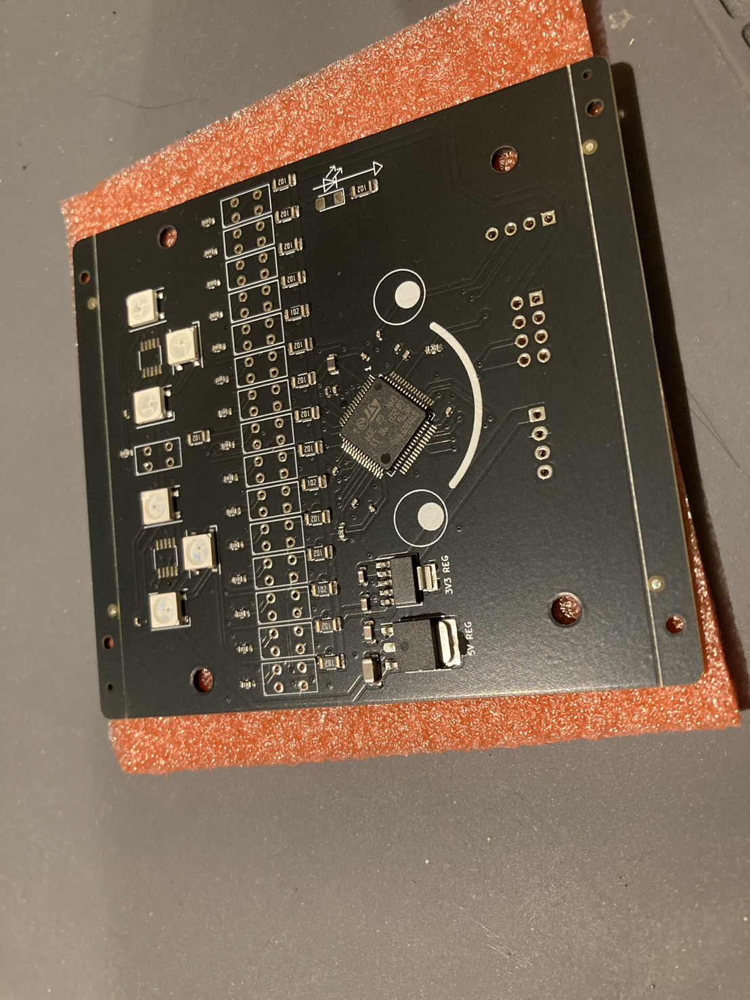
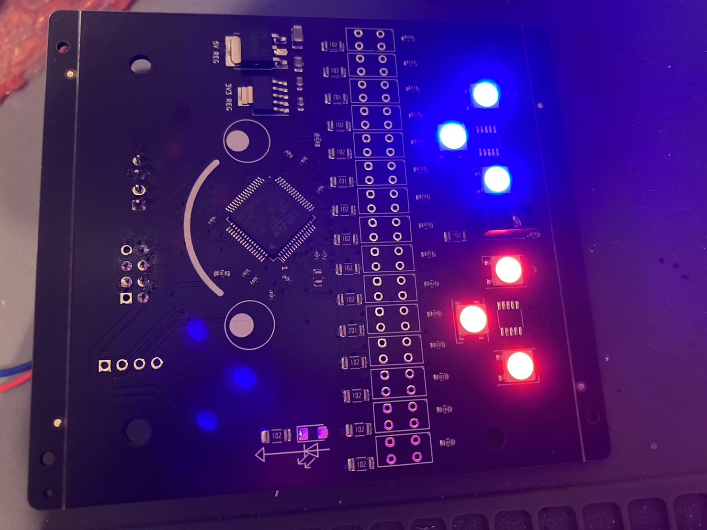
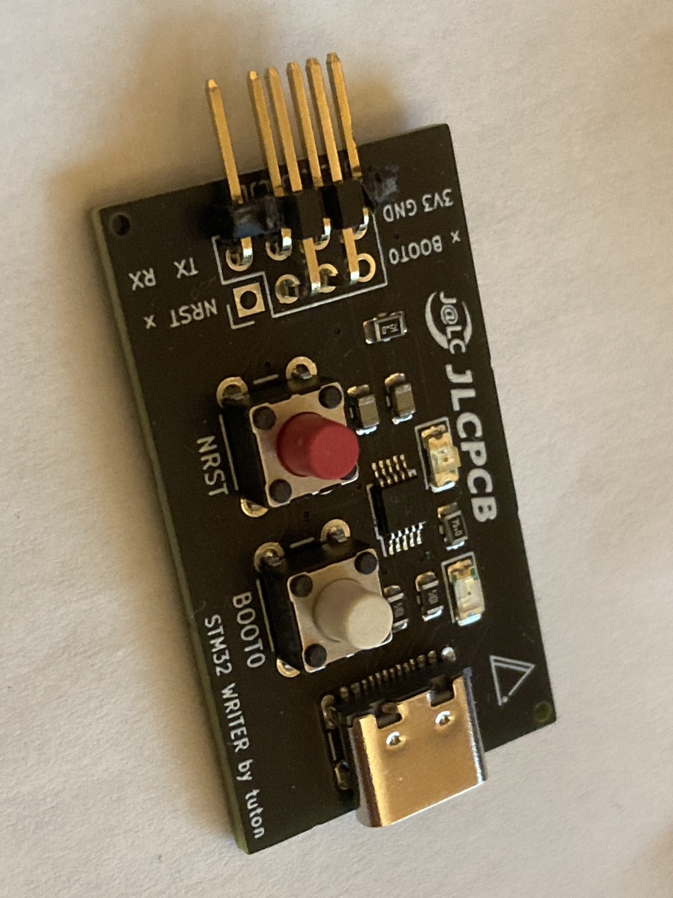
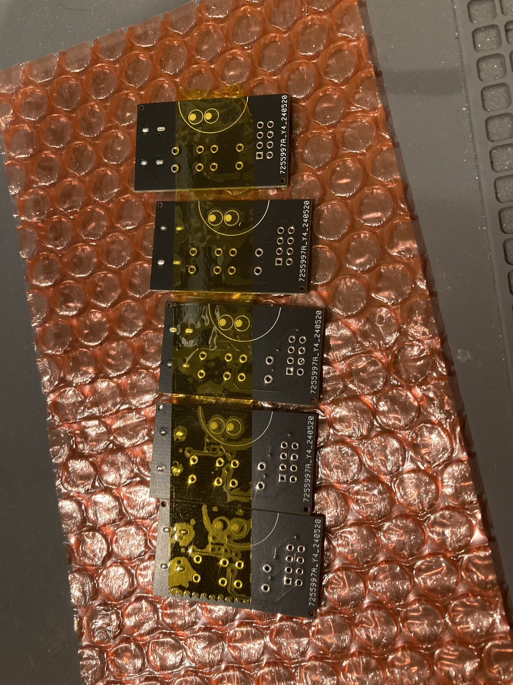
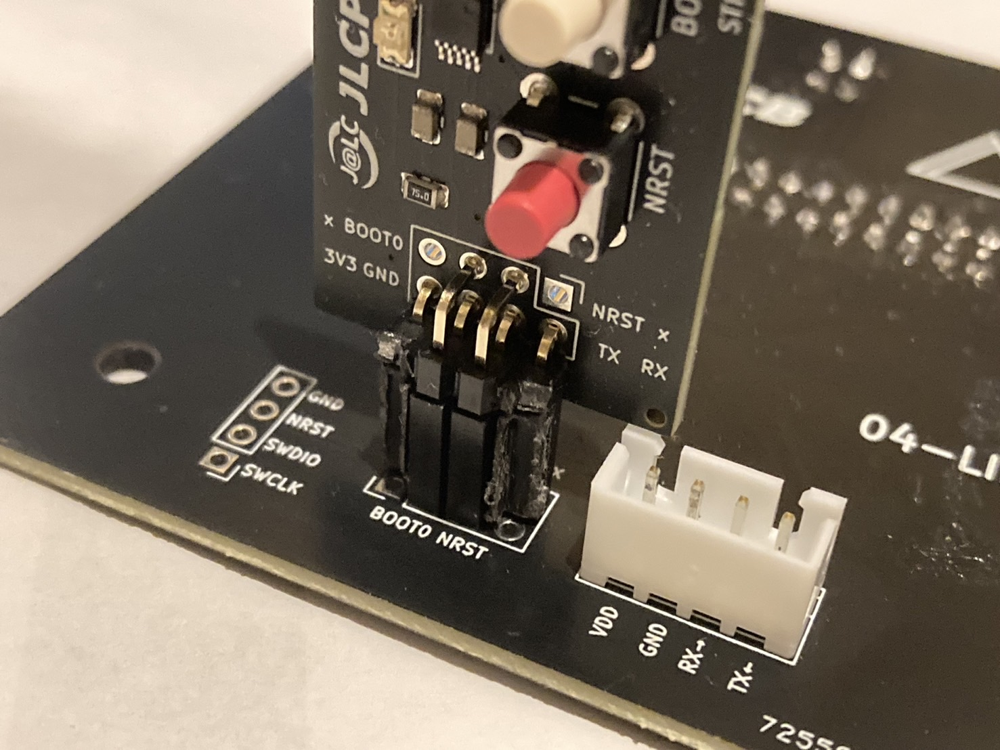
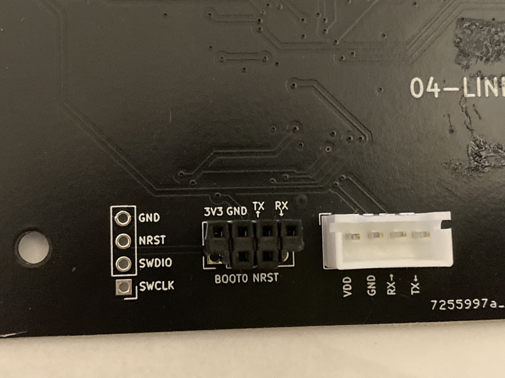

こんにちは。回路担当のshujiです。

今回はライントレースのための基板と書き込み基板をJLCPCBに発注しました！

# JLCPCBの紹介

[JLCPCBさんのホームページはこちら(https://jlcpcb.jp/)](https://jlcpcb.jp/)

JLCPCBは基板やCNCなどを取り扱っている中国の製造会社です。高品質で低価格、そして迅速な配達とすべてにおいて最高な企業です！

私たちのチームはJLCPCB様にスポンサーになっていただき基板やCNC部品などの発注させていただいています。

新規ユーザーは$60ほどのクーポンがもらえるのでぜひ基板はJLCPCBで発注してみてください！

なんと今ならMid-Year Mega Salesで合計$250のクーポンも手に入るようです！

# 基板の紹介
今回は2種類の基板を発注しました。どちらもPCBAでお願いして表面実装までしてもらいました！

 

今までより少し大きな箱で届きました。今回も発注からちょうど一週間で届きました。JLCPCBは届くのが早くてありがたいです。

ちょうど届いたのが中間試験が終わった日だったので気分は最高でした。

## ラインセンサ基板

 

私たちが出場しているレスキューラインという競技において最も重要ともいえる基板です。

横に15個並べたフォトリフレクタと二つのカラーセンサでライントレースや交差点認識をします。

カラーセンサがI2Cなので基板の外に出したくなかったのと、フォトリフレクタの数が多いのでSTM32F446を一つのせています。

F446の16個のADCチャンネルを全て使っています(笑)。

書き込みは独自の基板経由でUART書き込みをします。この基板については後ほど解説します。

カラーセンサ用のLEDにはNeo PixelのWS2812Bを使いました。これはマーカーを認識しやすいように調整できたらいいのかなと思ったためです。

実際に、白よりも黄色（#FFFF00）の方がレスキューラインには適している（読み取らなければいけないのは赤と緑のため）ことが分かったのでネオピクにして正解でした。

この基板にのっている主な部品は以下の通りです。

- STM32F446RE
- LBR127HLD
- S13683-03DT
- WS2812B
- 3.3V 三端子レギュレータ
- 5V 三端子レギュレータ

### 動かしてみた

ちゃんと書き込みもできたので正しく動くか試してみました。

<blockquote class="twitter-tweet">
まだまだ調整は必要だけどいい感じ <a href="https://t.co/VzFUcIC90R">pic.twitter.com/VzFUcIC90R</a>
&mdash; shuji (@shuji_4649) <a href="https://twitter.com/shuji_4649/status/1794704891333759477?ref_src=twsrc%5Etfw">May 26, 2024</a></blockquote> 

 
これは16個のフォトリフレクタと2個のカラーセンサの値を取得してマイコンからPCに送信し、Processingで描画している様子です。

Processingは簡単にGUIを作ることができてシリアル通信などもできるのでロボット作りに愛用しています（ただエディタが使いづらいのが欠点）。

### そして、焼けた

と、ここまでは順調だったのですが、次の日に悲しい出来事が起こりました。

三端子レギュレータの異常な発熱によりレギュレータとマイコンが逝きました。

確かによく考えてみればLipoの7.4Vから3.3Vまで落としていて、しかもフォトリフレクタを欲張って16個もつけていたので1Aほどの電流がレギュレータから流れていたのです。

小さな表面実装の三端子レギュレータがそんな熱に耐えられるわけないですよね。ちゃんと考えておけばよかったです。めちゃくちゃ反省しています。

これからは回路設計が難しそうですがスイッチングレギュレータをメインで使っていきたいと思います。ノイズが不安なのでマイコン関連だけはスイッチングレギュレータで電圧を落とした後LDOを使おうと思います。

無事な基板を少し改造して使うか新しく発注するかは検討中です。

## 書き込み基板

 
僕がめちゃくちゃ気に入っている基板です(笑)。

カプトンテープに5枚の基板が張り付けられて届きました。

STM32マイコンはST-Link経由やUART書き込みなどいくつかプログラムの書き込み方式あるのですが、今回はUART書き込みを採用することにしました。
UART書き込みをするためにはBOOT0のスイッチやType-Cコネクタなどを実装しなければならないのですが、これは場所を取りますし全ての基板にこれらをのせるのはコスト的にもあまり嬉しくはありません。

今回、私たちは3つほどマイコンをのせる基板を作る予定なので、それなら書き込み部分の回路だけ取り出して別の基板にしてしまおうということでこの基板を作ることにしました。

 
接続端子は2列ピンヘッダ・ピンソケットに少し手を加えたものを使っています。
台形みたいな変な形になっているのは逆接防止のためです。

コンパクトにすることができて、完璧に動いてくれたのでとても満足です。

USB-シリアル変換（CH340E）と2つのスイッチがついているだけなので他の用途にも使えます。また、UART書き込みにしたことでPCとデータを送受信することができるようになったので、さきほどのライン基板のようなことも簡単に実現することができます。

# 最後に

これらの基板を含めた私たちの設計中・設計済みの基板はすべて[こちら](https://github.com/tuton-RCJ/2025PCB)のGitHubから見ることができます。
ご参考になれば幸いです。

基板にはこれからもすべて顔をつけたいと思います。

最近ブログをコメントが書けるように改装しようか悩んでいます。あと基板の写真をもっときれいに撮れるようになりたいです。

