こんにちは。回路担当のshujiです。

今回は電源基板やラインセンサ基板などを発注しました。

# JLCPCBの紹介

[JLCPCBさんのホームページはこちら(https://jlcpcb.jp/)](https://jlcpcb.jp/)

JLCPCBは基板やCNCなどを取り扱っている中国の製造会社です。高品質で低価格、そして迅速な配達という素晴らしい企業です！

私たちのチームはJLCPCB様にスポンサーになっていただき基板やCNC部品などの発注させていただいています。

新規ユーザーは$60ほどのクーポンがもらえるのでぜひ基板はJLCPCBで発注してみてください！

# 基板の紹介
今回は電源基板とラインセンサ基板の2種類(基板の種類は4種類)の基板を発注しました。全て表面実装までしてもらったのになんとたったの5日（過去最速）で届きました！
JLCPCBさんとDHLさんに感謝です。

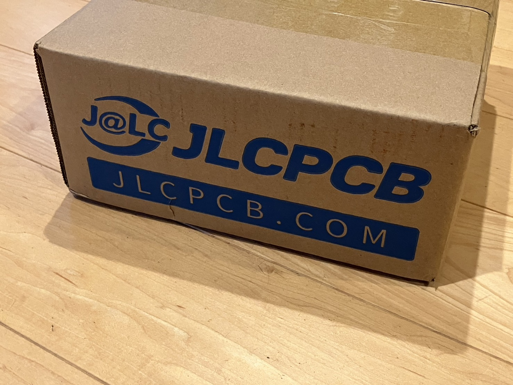
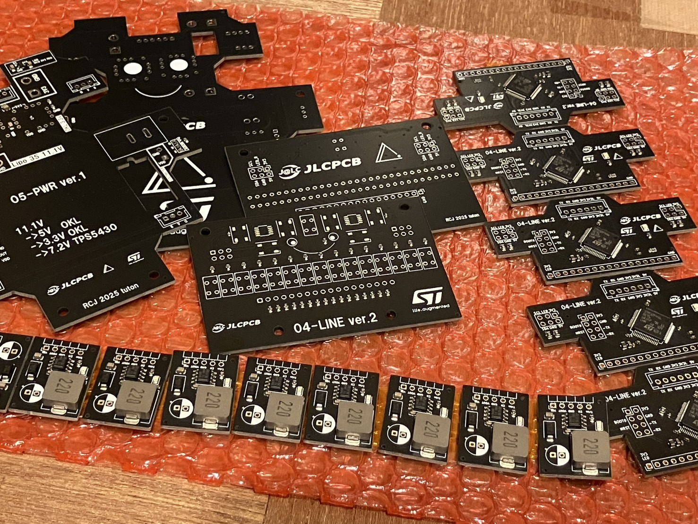

 

初の段ボールです。

今回も前回と同じように定期試験が終わる頃に届くように発注しました。

ところで以下の基板にはすべて何かしらの顔がシルクとして入っていますがこれは僕が好きでやっているだけなので深い意味はありません。

## 電源基板・DCDCモジュール

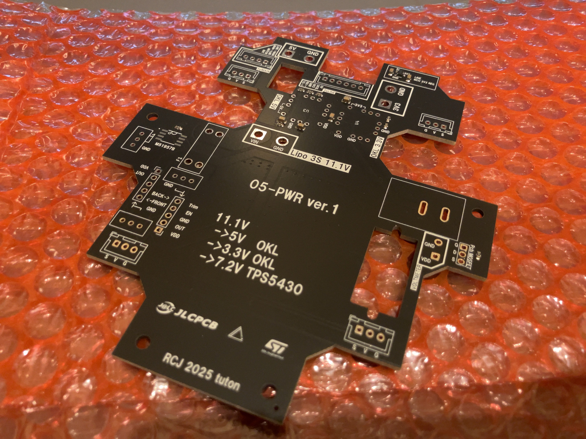
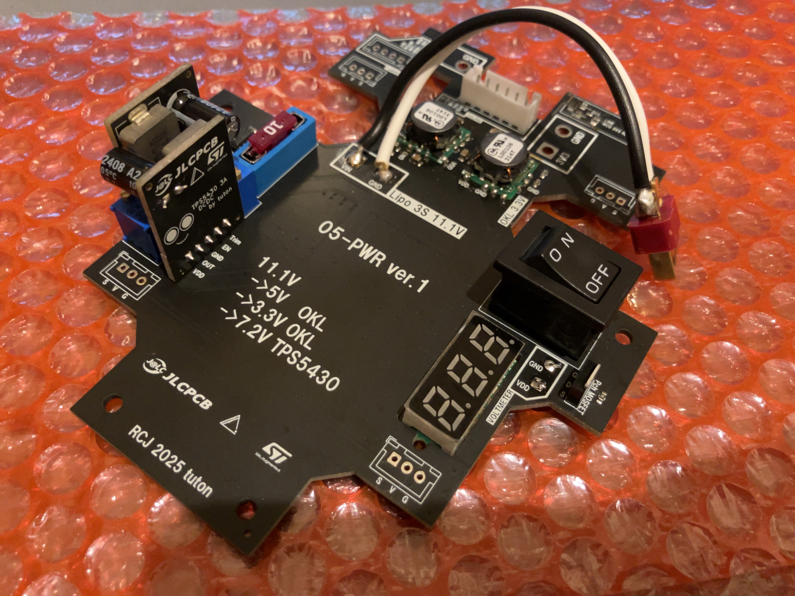

 

前回の三端子レギュレータの失敗から学び、電源周りの構成を大きく変えました。

定電圧の生成には村田製作所のDCDCと自作DCDCモジュール（TPS5430使用）を使用しています。

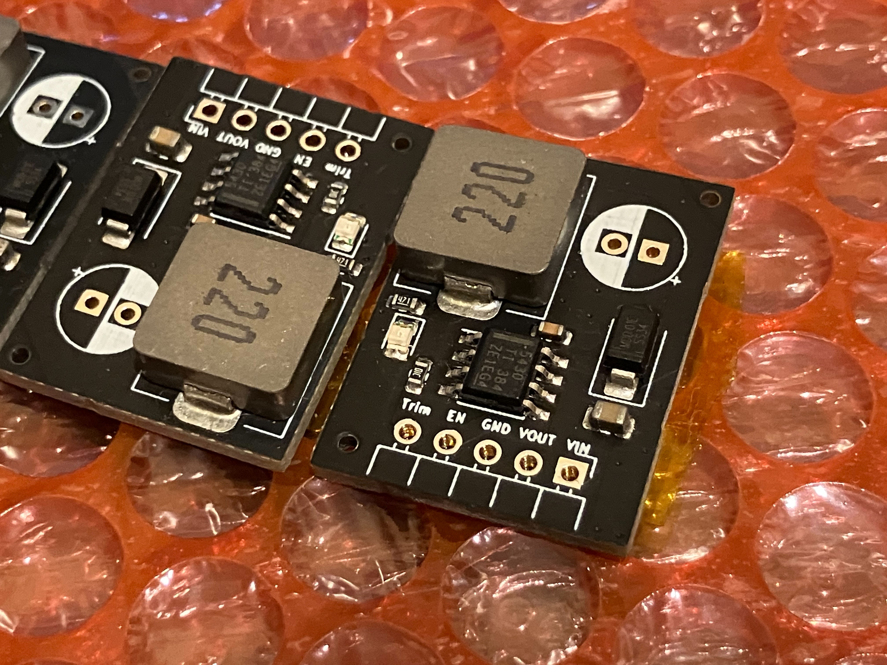
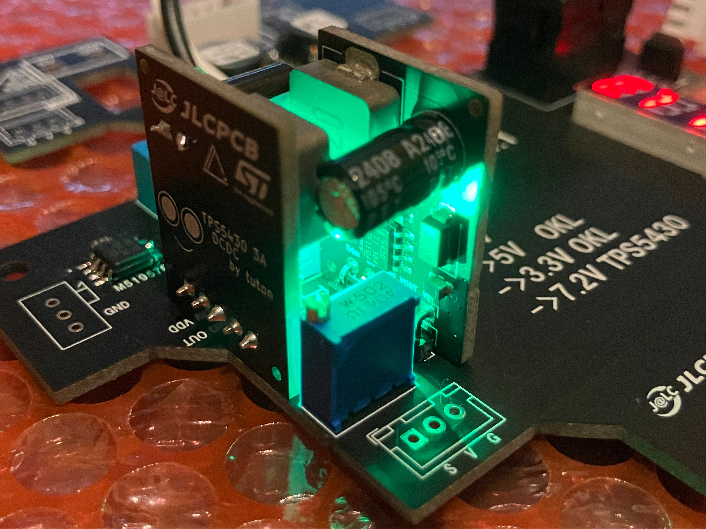

 
電源スイッチはPch MOSFETを使用したハイサイドスイッチにしました。これは使いたかった波動スイッチの定格が5Aで不安だったためです。

電源保護回路としてヒューズと電圧計をのせています。ヒューズはスペースの問題で低背ヒューズを採用しました。

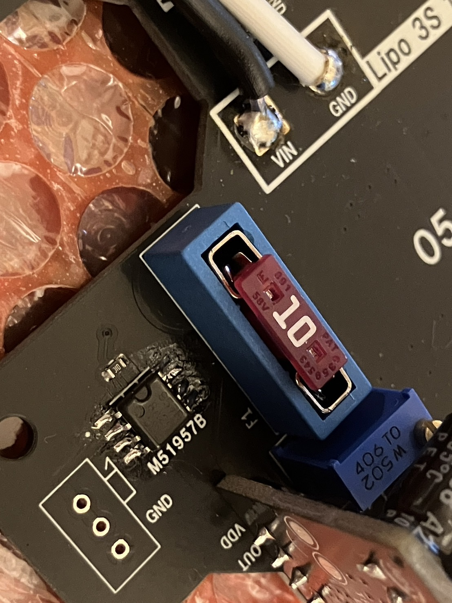
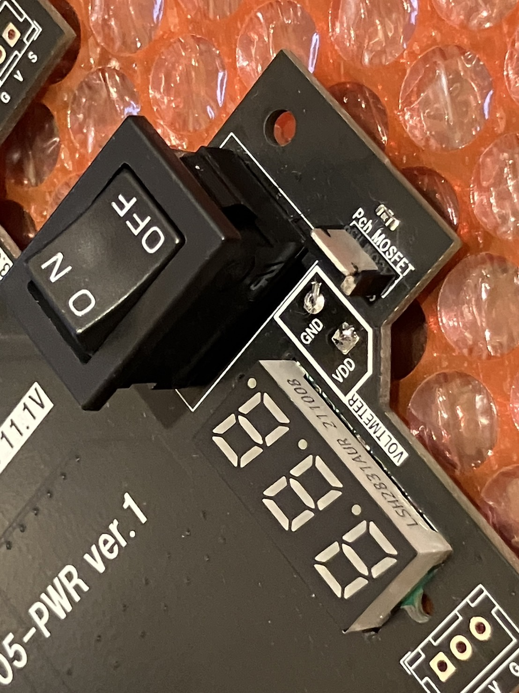

 

また、メイン基板からバッテリ電圧を監視できるように電圧監視ICであるM51957Bをのせています。専用のICを用意したのは抵抗分圧でメインマイコンからアナログ読みすると接触不良の際にマイコンにバッテリの電圧がそのまま流れる可能性があるからです。

ちなみにこの基板はメイン基板とラインセンサ基板・駆動用モータをつなぐ中継基板としての役割もあります。

| 部品                          | 数  |
| ----------------------------- | --- |
| 低背ヒューズ 3557-15、10A     | 1   |
| 波動スイッチ DS-850K-S-ON     | 1   |
| Pch MOSFET MTB060P06I3        | 1   |
| 超小型2線式LEDデジタル電圧計  | 1   |
| 電圧監視IC M51957B            | 1   |
| DCDCコンバータ OKL-T/6-W12N-C | 2   |
| TPS5430使用 DCDCモジュール    | 2   |

## ラインセンサ基板

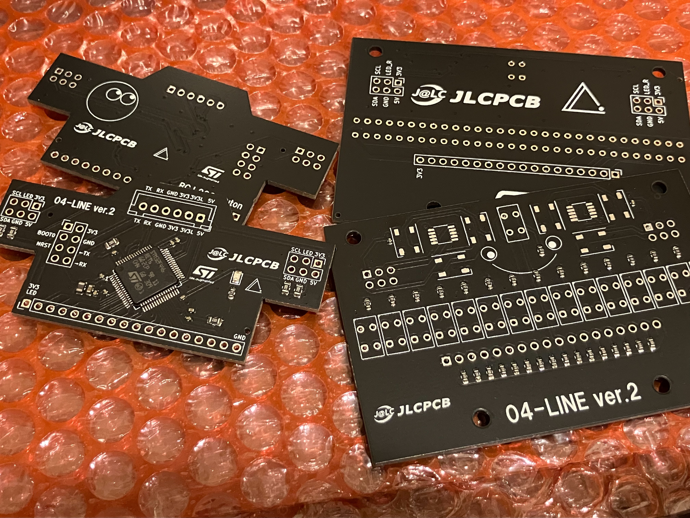
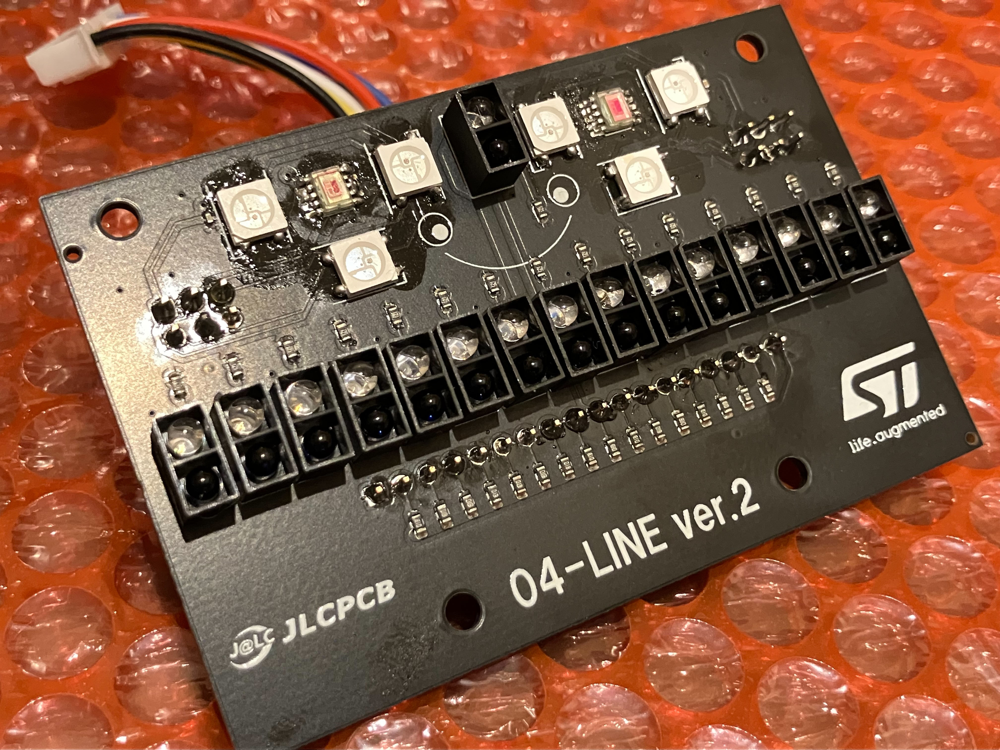

 

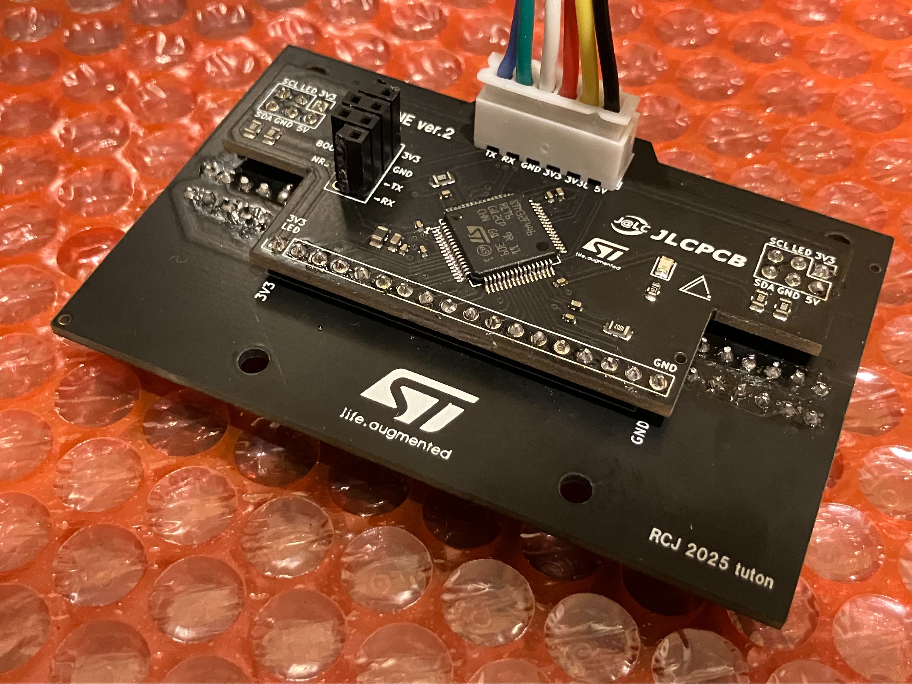

 
前回発注した基板にあったいくつかの欠陥をもとに改善したものです。

ラインセンサ専用のマイコンでセンサの値の処理をし、UARTで信号をメイン基板に送っています。

前回の基板は奥行きが長くダサかったので今回のラインセンサ基板はピンヘッダで二段重ねにしてみました。（実際に基板を動かすときにいくつか不具合があったのですがそのたびにめちゃくちゃ大変だったのでおすすめはしません。もう二度とこのような設計はしないと思います。）

下層にはフォトリフレクタやカラーセンサ、上層にはマイコンを配置しています。

そのほかは基本的に前回と同じです。

| 部品                        | 数  |
| --------------------------- | --- |
| I2Cカラーセンサ S13683-02DT | 2   |
| フルカラーLED WS2812B       | 6   |
| フォトリフレクタLBR127HLD   | 16  |
| STM32F446RE                 | 1   |

## 動作確認

一通り部品をはんだ付けして動作確認を行いました。

いくつかトラブルがあり時間がかかってしまいましたが、結果的に正常に動作させることができました。

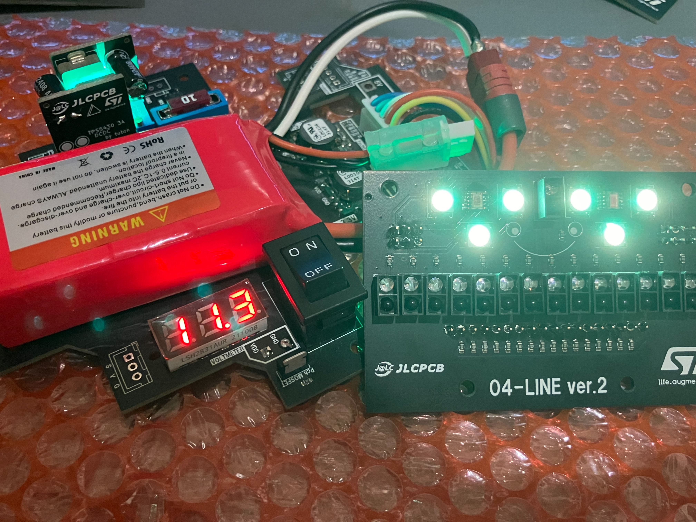

 
# 最後に

これらの基板を含めた私たちの設計中・設計済みの基板は[こちら](https://github.com/tuton-RCJ/2025PCB)で公開しています。
よければご覧ください。

基板はあとメイン基板と正面基板だけです。
9月中の機体の完成を目指して頑張っていこうと思います。

