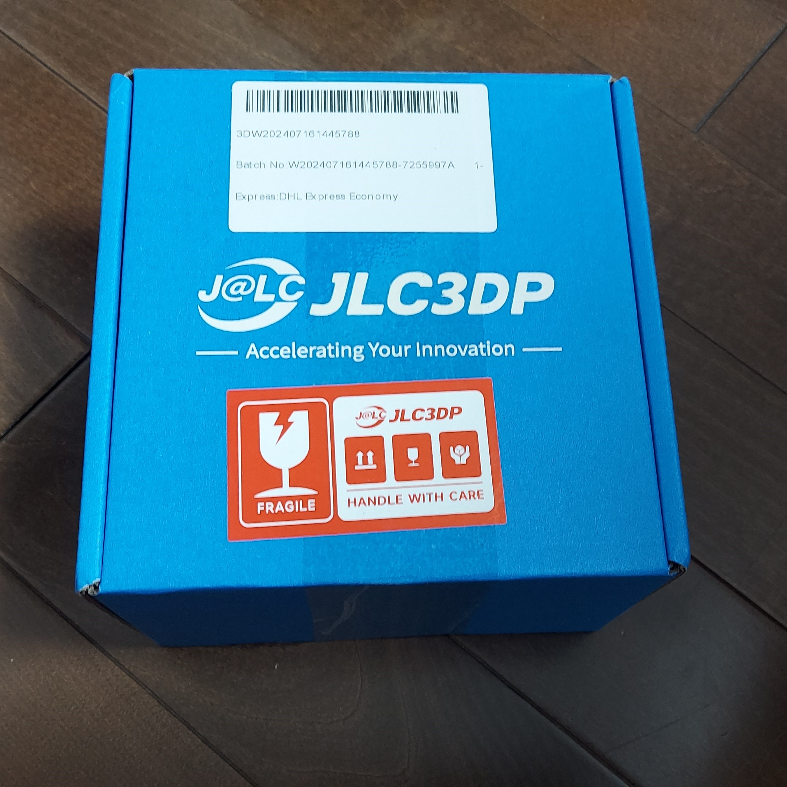
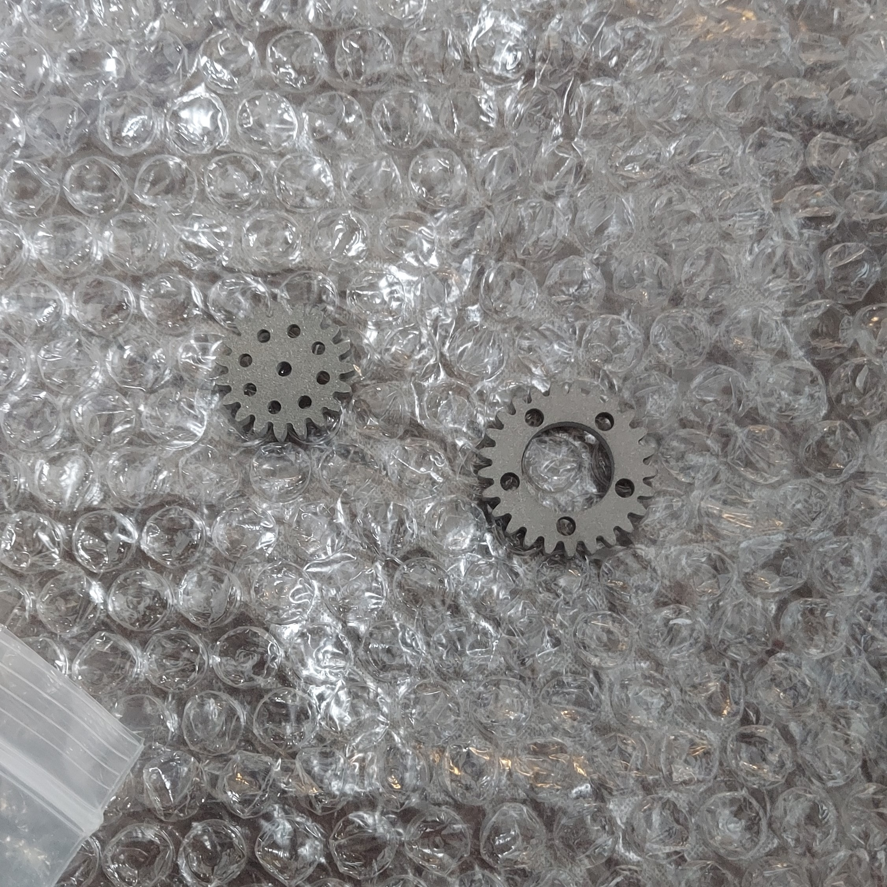
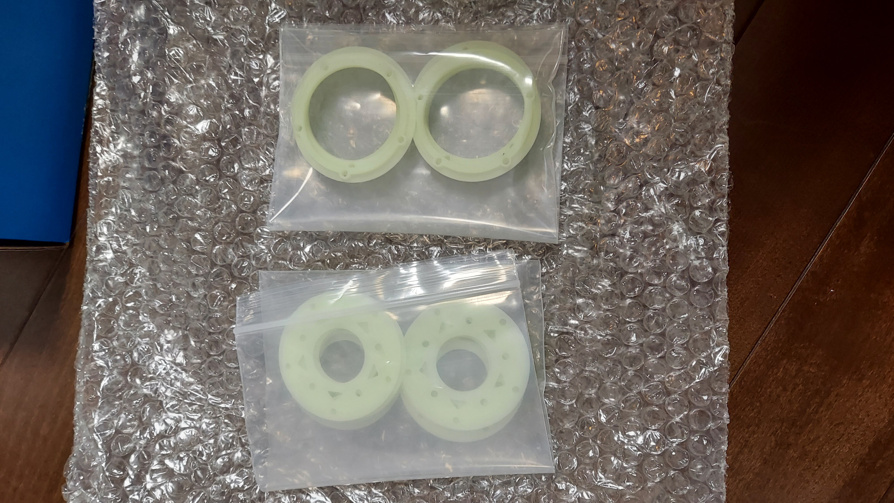
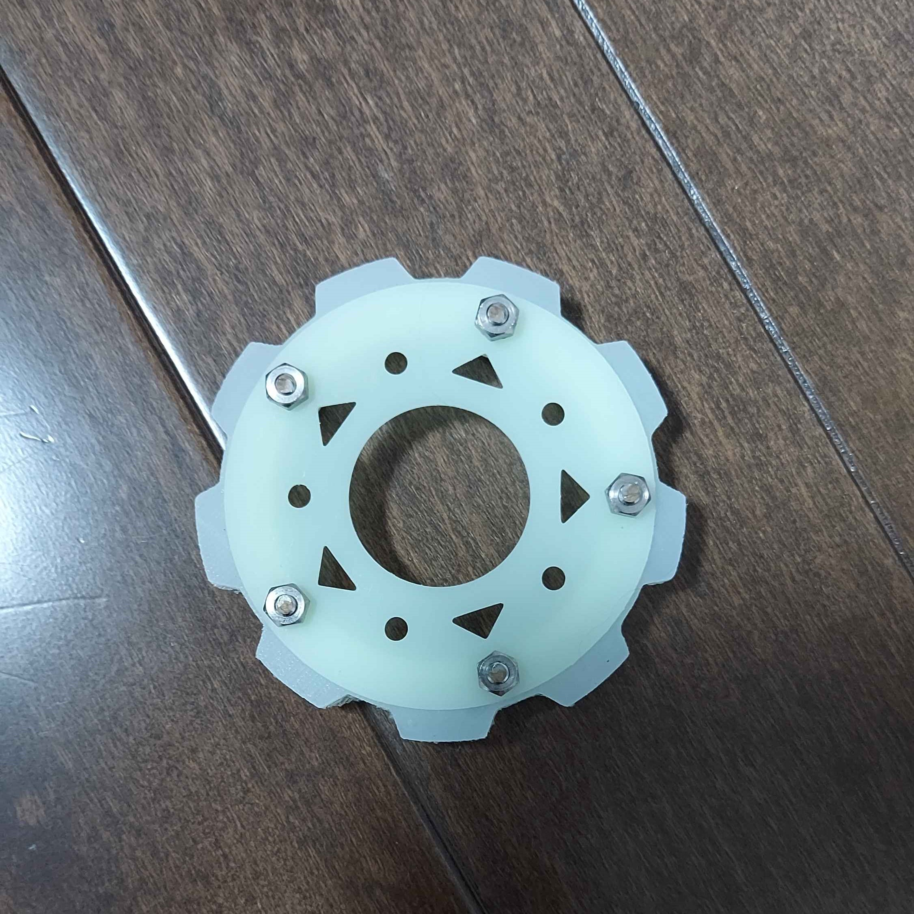

こんにちは！ハード担当のkapiです。   

今回は、JLCPCBさんにギアを発注した話をします。

# JLCPCBの紹介

 
[JLCPCBさんのホームページはこちら(https://jlcpcb.jp/)](https://jlcpcb.jp/)

JLCPCBは基板やCNCなどを取り扱っている中国の製造会社です。高品質で低価格、そして迅速な配達というサービスを提供してくださる企業です！

私たちのチームはJLCPCB様にスポンサーになっていただき基板やCNC部品などの発注をさせていただいています。

私たちのチームTutonでは、スポンサー契約を締結させていただいてから既に5回ほどCNCと3Dプリンターでの加工を依頼させていただきましたが、今まで我々の予想の斜め上の品質と速度で納品してもらいました。

新規ユーザーは$60ほどのクーポンがもらえるのでぜひ基板はJLCPCBで発注してみてください！

# 今回発注したもの紹介

今回はギアを金属製のギアを2種類とタイヤのパーツ2つを発注しました。(造形物の種類は4種類です。) JLCPCBさんに感謝！！

普段の青い段ボール2つ分の大きめの箱で届きました。  
今回もプチプチで保護された状態で届きました!!!
しかも、パーツごとに透明の小袋に分けた状態で届けていただきました。
こういう細かいところからもJLCPCBさんの丁寧さが伝わってきます。

 

## ギア

 

ギアは金属3Dプリンターで作ってもらいました。CNCではないのに金属特有の金属光沢まであります。
さらに見た目は、積層痕などなくすごく綺麗に作ってもらえたのでとてもうれしいです。
もちろん金属製なので十分な強度があります。
これからも、強度が必要なパーツには金属製3Dプリンターを活用させていただきたいなと思っています。 

金属製3Dプリンターは、CNCの2分の1ほどの値段でCNCのような見た目と強度を手に入れることができるのでコスパが非常に高く、我々のようなお金がないロボカッパーなどにぴったしの製造法であるためおすすめです。

## タイヤのパーツ

 

今回はSLAプリンターで8228レジンを使用して印刷してもらいました。
見た目は薄い黄緑と白を混ぜた感じの色で白ではないです。  
ただその分タイヤにアクセントが生まれていいと思います。触り心地としては、サラサラしていてずっと触っていたくなる感じの触感です。

# パーツの組み立て

## ギア編

2種類のギアは、この前記事にしたCNCで作っていただいたパーツと組み合わせて使います。

 
今回作っていただいたギアは、走行用のモーターの回転をタイヤに伝えるためのギアです。 
ギア比は坂道なども楽々登れるように、モータ側：タイヤ側＝2：3になっていてトルクを重視した設計となっています。 
その分速度は、ギア比1：1の場合と比べると3分の2ほどになってしまいますが、トルクがないと坂を上ることができないのでこのような設計にしました。 

ロボットの走行モータにはSTS3032を使おうと思っています.

~~モータ一つで4000円四輪駆動なので4つモーターが必要なので走行モーターだ~~
~~けで、1万6000円ですね財布が死ぬー~~

## タイヤ編

 

このように作ってもらったプラスチックのパーツ二つでタイヤのゴム部分を挟み込むような機構になっています。
機構としてはかなり単純な仕組みですが、整備性はねじの数以外では高い機構なので参考にしてもらえると嬉しいです。
ただ、タイヤの幅が少し細すぎた気がするので、そこは参考にしないでください。

ちなみにこの写真に写っているタイヤのゴムの部分は、HTV-4000という成型用シリコンを3Dプリンター製の型に流し込んで作っています。  
詳しい作り方はたのロボ！の[しろくまさんの記事](https://blog.shirokuma89.dev/20240226/)を参考にさせていただきました。
