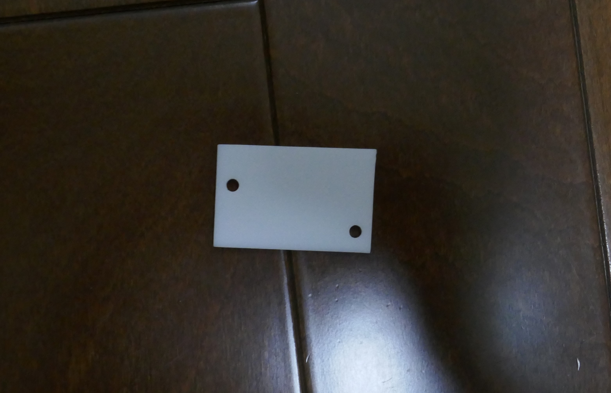
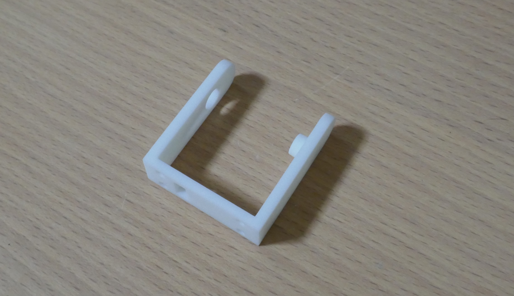
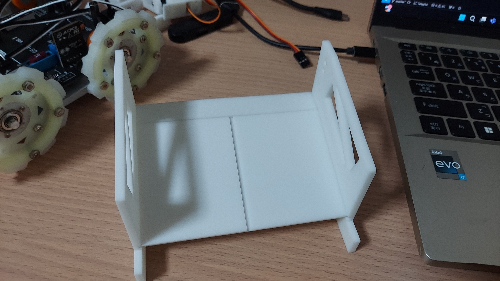

こんにちは、ハード担当のkapiです。  
今回は、JLCPCBさんにロボットのパーツを発注したことについて、と最近の進捗について記事にしました。  

# JLCPCBの紹介

[JLCPCBさんのホームページはこちら(https://jlcpcb.jp/)](https://jlcpcb.jp/)

JLCPCBは基板やCNCなどを取り扱っている中国の製造会社です。高品質で低価格、そして迅速な配達というサービスを提供してくださる企業です！

私たちのチームはJLCPCB様にスポンサーになっていただき基板やCNC部品などの発注をさせていただいています。
新規ユーザーは$60ほどのクーポンがもらえるのでぜひ基板はJLCPCBで発注してみてください！

# 今回発注したもの

| 発注したもの                 | 種類   | 製造方式            |
| ---------------------------- | ------ | ------------------- |
| レスキュー用のアームのパーツ | ３種類 | 光造形3Dプリンター  |
| レスキューのかご             | ４種類 | 光造形3Dプリンター  |
| ロボットのフレーム           | １種類 | CNC（アルミニウム） |
| バンパー                     | １種類 | CNC（ABS）          |
| タイヤの留め具               | １種類 | 光造形3Dプリンター  |

以上の９種類をJLCPCBさんに発注させていただきました。

今回は、普段の段ボールより大きい段ボール２つに分かれて届きました。

どちらの箱もいつものように、箱の中がプチプチで養生された状態に加えて、それぞれのパーツがプチプチでくるまれていて、丁寧さがすごくよく伝わってきます。　　

JLCPCBさんいつも丁寧な配送ありがとうございます。

## レスキュー用のアームのパーツ
   

３つのパーツは、光造形の3Dプリンターで４つずつ作っていただきました。どのパーツもJLCPCBさんの高精度、高品質な印刷のおかげで、サーボモーターがぴったりはまりました。

 

ちなみに組み立てるとこんな感じです。
結構いい感じに組み立てることができたのでうれしいです。

## レスキューのかご
     
  
こんな感じのパーツをそれぞれ１種類ずつ作ってもらいました。素材はレスキュー用のアームと同じでサラサラしていて触り心地がめっちゃいいです。

組み立てるとこんな感じのカゴになります。カゴは、左右に一つずつ合計で２
つの被災者を乗せることができます。
~~レスキューゾーンに３人の被災者がいるので工夫しないと全員をレスキューするのは難しくなるっていう致命的な欠陥がある設計です。~~　
ちなみに、被災者の放出は左右別々にできる設計になっているので銀玉・黒玉を同時にかごにホールドしておくことができます。

## バンパー
 　

バンパーは機体の色に銀色と白色がかなり多いので、アクセントとして黒い素材で作ってまらいました。
触り心地は、他の光造形の素材に比べて、つるつるしている感じがします。
あと他の素材に比べると弾性があってしなやかな素材です。
なので、バンパー向きの素材ですね。個人的には結構好きな素材です。

## ロボットのフレーム
 

ロボットのフレームはアルミニウムをcnc加工してもらいました。　
表面処理はアルマイト加工です。なので、素手で触りまくっても錆びにくいです。
そしてこの部品は400ｇほどありロボットの重心をかなり下げることができているので、フレームにアルミのCNCを選択したのは我ながらよい選択だったと思います。

このあとの最近の活動についての部分でフレームを使って組み立てた写真があるのでよかったら見てほしいです。

# 最近の活動報告

## 8月の活動
### レスキュー部分を除く機体の設計が終了
4月から初めた自作機の設計に一区切りがついたので、今までのように途方のない設計作業に絶望することがなくなると思うのでかなりこれからの設計が心理的に楽になると思うのでこれからは設計を楽しめるようにしたいと思います。

### WROに参加
8月4日に行われたWRO東京予選に参加しました。結果はtweetしたので知ってる方も多いと思うんですけど、36点/215点で大敗したのでロボカップで挽回するために頑張っていきたいと思います。

## 9月の活動報告  

### ロボットの走行機構がほぼ完成
今回の発注で色んなパーツが届いたのでかなりロボットが組みあがってきています。今はこんな感じです。

まだメイン基板などを発注していないためコースで走らせたりすることはできませんが、Nucleoボードを使った即席基板で少し動かしてみました！
はじめての自作機が動いてて感動です。
<iframe width="240" height="240" src="https://www.youtube.com/embed/bgtI8FaYoMU" title="はじめて動いた！" frameborder="0" allow="accelerometer; autoplay; clipboard-write; encrypted-media; gyroscope; picture-in-picture; web-share" referrerpolicy="strict-origin-when-cross-origin" allowfullscreen></iframe>

ちなみにSTS3032サーボはFE-URT-1を使わずMAX485を使った自作回路で動かしてます。

## チーム名の表記を「ツートン」から「Tuton」に変更します！
1月からチーム名は「ツートン」として活動してきましたが諸事情により表記をアルファベットの「Tuton」に変更することになりました。

「とぅーとん」と読みたくなるところですが「つーとん」と呼んでいただきたいです。
ちなみに「つーとん」はモールス信号が由来です。

今回は、これで以上です。最後まで読んでくださりありがとうございました。
