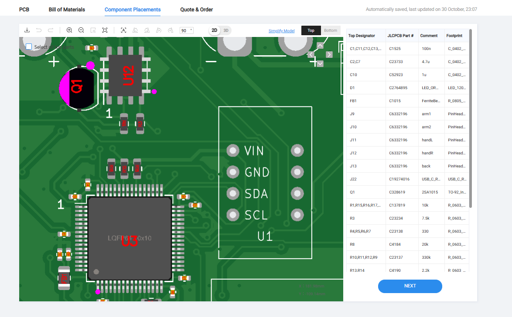

こんにちは、回路担当のshujiです。
いつもお世話になっているJLCPCBさんにメイン基板と正面基板の発注をお願いしました。

そしてついに！！ライントレースをするための体制が整いました！！

# JLCPCBの紹介

[JLCPCBさんのホームページはこちら(https://jlcpcb.jp/)](https://jlcpcb.jp/)

JLCPCBは基板やCNCなどを取り扱っている中国の製造会社です。高品質で低価格、そして迅速な配達というサービスを提供してくださる企業です！

私たちのチームはJLCPCB様にスポンサーになっていただき基板やCNC部品などの発注をさせていただいています。
新規ユーザーは$60ほどのクーポンがもらえるのでぜひ基板はJLCPCBで発注してみてください！
PCBAだと表面実装までしてくれるためとてもおすすめです！

# 着弾！

今回は2層目に置くメイン基板と正面につける正面基板の2種類を発注させていただきました。

 

いつも通りの丁寧な梱包で、基板には傷や不良など一切ありませんでした！（設計時のミスを除く）

## メイン基板

このロボットをつかさどるメインマイコンがのった基板です。

この基板にはメインマイコン、シリアルサーボ駆動回路、ロードセル信号増幅回路、ジャイロセンサ、ToFセンサなどを載せます。

 

 

メインマイコンにはSTM32F446REを使用しており、他のマイコンとはUARTで通信しています。

STS3032とシリアル通信をするためにMAX485を使用したUART-RS485変換回路を使用しています。[秋月電子さんの資料](https://akizukidenshi.com/goodsaffix/feetech_digital_servo_20220729.pdf)を参考にしました。

また、今回バンパーにはロードセルを使用するため、ロードセル用の増幅回路をのせています。

なんだか違法建築がたくさんなされていますがちゃんと動いているので気にしないことにしましょう。

| 部品                            | 数  |
| ------------------------------- | --- |
| メインマイコン STM32F446RE      | 1   |
| 無線通信用マイコン XIAO ESP32C3 | 1   |
| ジャイロセンサ BNO055           | 1   |
| サブジャイロセンサ MPU6050      | 1   |
| 圧電スピーカ PKM13EPYH4000-A0   | 1   |
| オペアンプ LM358                | 1   |
| RS485ドライバ MAX485            | 1   |
| ToFセンサ VL53L0X               | 4   |

## 正面基板

この基板にはカメラ、ToFセンサ、ネオピクセルがついています。

カメラにはOpenMV H7を使用しています。コンパクトに収めるためにカメラのレンズが基板の穴からのぞくような設計にしてみました。

Neo Pixel（WS2812B）はマイコンが内蔵されているフルカラーLEDで、1つのピンですべてのLEDを操作できます。とても便利なのでロボットのいろいろなところに使用しています。

正面基板のWS2812Bは状態表示LEDとしての役割とカメラのための明るさの確保の役割があります。

ToFセンサと組み合わせてみた動画がこちらです。
<iframe width="560" height="315" src="https://www.youtube.com/embed/2gAK-b2ALLQ?si=R_t_R60wGpn5Ry8A" title="YouTube video player" frameborder="0" allow="accelerometer; autoplay; clipboard-write; encrypted-media; gyroscope; picture-in-picture; web-share" referrerpolicy="strict-origin-when-cross-origin" allowfullscreen></iframe>
 
しっかり距離を測れています！

| 部品                       | 数  |
| -------------------------- | --- |
| サブマイコン STM32F446RE   | 1   |
| カメラモジュール OpenMV H7 | 1   |
| ToFセンサ VL53L0X          | 5   |
| フルカラーLED WS2812B      | 12  |

# JLCPCBでPCBAを発注しよう
私たちのロボットではいままでJLCPCBのPCBAサービス（基板実装サービス）を大いに活用させていただきました。
今回はとっても便利なJLCPCBのPCBAのやり方についてご紹介します。

基板設計ソフトはKiCADを対象としています。

## 1.JLCPCB toolsを導入しよう
JLCPCB toolsとはJLCPCBで発注するためのファイルを自動で生成してくれるKiCAD向けのプラグインです。

これは、プラグインマネージャーの「管理」から以下のURLを追加することでインストールできます。

[https://raw.githubusercontent.com/Bouni/bouni-kicad-repository/main/repository.json](https://raw.githubusercontent.com/Bouni/bouni-kicad-repository/main/repository.json)

## 2.回路図を作ろう
いつも通りEeschemaで回路図を作成します。

## 3.部品決め&フットプリント割り当て
自分で実装する部品はそのフットプリントを割り当てるだけでよいですが、JLCPCBに実装してもらう場合は部品番号とその部品に一致したフットプリントを登録する必要があります。

JLCPCBで取り扱いのある部品は[こちら](https://jlcpcb.com/parts)から検索できます。10kΩの抵抗であれば検索窓に「10kΩ」などと入力して検索します。

JLCPCBの部品はBasic Parts、Preffered Extended Parts、Extended Partsの3種類に分けられます。Extended Partsを選択するとパーツ1種類あたり3$の手数料が発生します。そのためできる限りBasic PartsまたはPreffered Extended Partsを選択することがコストダウンのために重要です。

基本的にBasic Partsは取り扱いの数が多いです。そのためStockを降順に並べると目当てのものを見つけやすいと思います。また、JLCPCBのサイトがリニューアルされてBasic Partsだけの絞り込みもできるようになったようです。

 

ほしいパーツを見つけたら、「JLCPCB Part #」で示されているCから始まる部品番号とパッケージサイズ(0402や0603)などをメモしてください。

 

この部品の情報を回路図に登録します。Eeschemaのツールバーの右から4つ目あたりにある表のアイコンをクリックしてください。

 
するとこのような表が表示されます。ここですべての部品の情報を一括管理できます。

 
Footprintの欄に適切なフットプリントを、LCSCの欄に部品番号を入力してください。
LCSCの欄がない場合は左下の「フィールドを追加」から追加してください。
これをPCBAしてもらいたいすべての部品に対して行います。

## 4.パターン設計
フットプリントが決まったらPcbnewでぐりぐり設計していきましょう

## 5.エクスポート
Pcbnewのツールバーの右の方にJLCPCBのロゴのアイコンがあると思います。それをクリックしてJLCPCB toolsを開いてください。

 
部品の設定等は3.部品決め&フットプリント割り当てで行っているので、左上の「Generate」を押すだけでJLCPCBに提出する用のデータを生成してくれます。
データの出力が完了するとプロジェクトフォルダの中にjlcpcbというフォルダができると思います。
jlcpcb/production_files/の中に発注に必要なデータが入っています。

## 6.JLCPCBにアップロードしよう
それではJLCPCBにデータをアップロードしていきましょう。
JLCPCBのオーダー画面で、ガーバーのzipファイルをアップロードします。
そしてPCB Assemblyをオンにしてもろもろ設定したらNEXTを押して進みます。

 
そしてこの画面でBOMとCPLのcsvファイルをアップロードします。

 

するとこのような位置の確認をする画面にくるのですが、見て分かる通り90°ずれて配置されていることが多いです。必ずすべての部品を確認し、角度が違うのであれば正しい向きに回転させてください。（Spaceキーで90°ずつ回転できます。）

 

全ての部品について確認出来たら次にすすんでSAVE TO CARTして支払いをすれば発注完了です！

JLCPCBのPCBAはとてもクオリティがよいのでぜひPCBAサービスを使ってみてください！

# 最後に
やっとライントレースができる状態まできました！
あと2週間くらいで東東京ノードの大会なので頑張ります！

同じノードの人はぜひ大会で交流しましょう♪