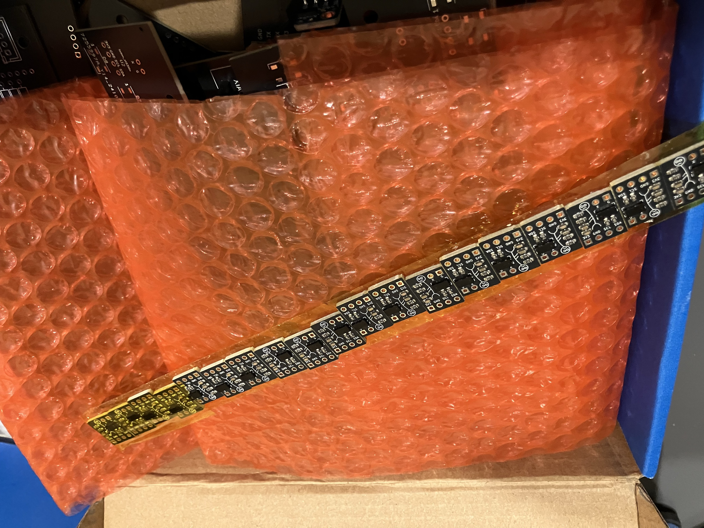
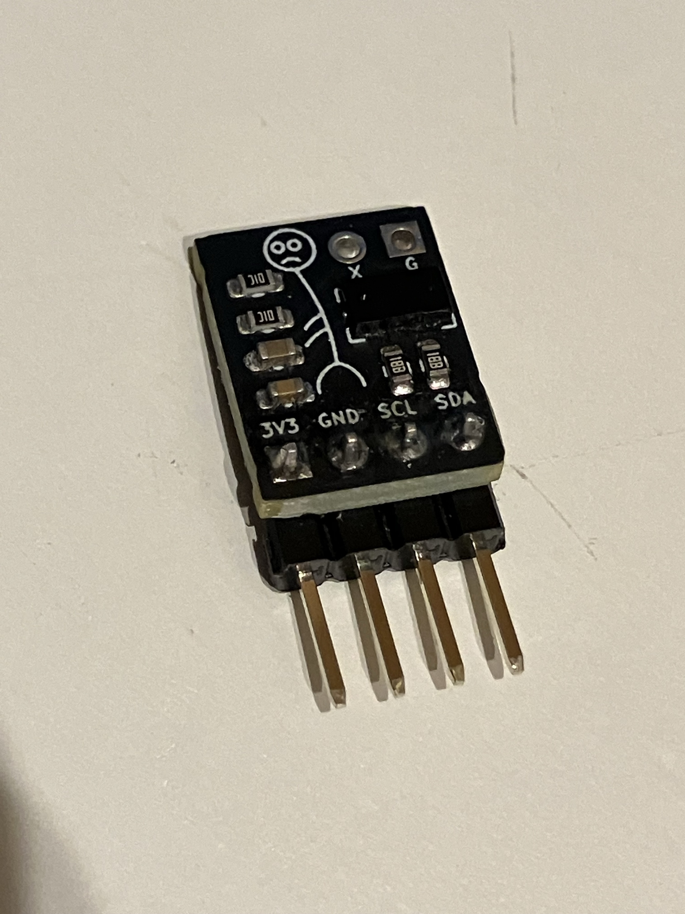
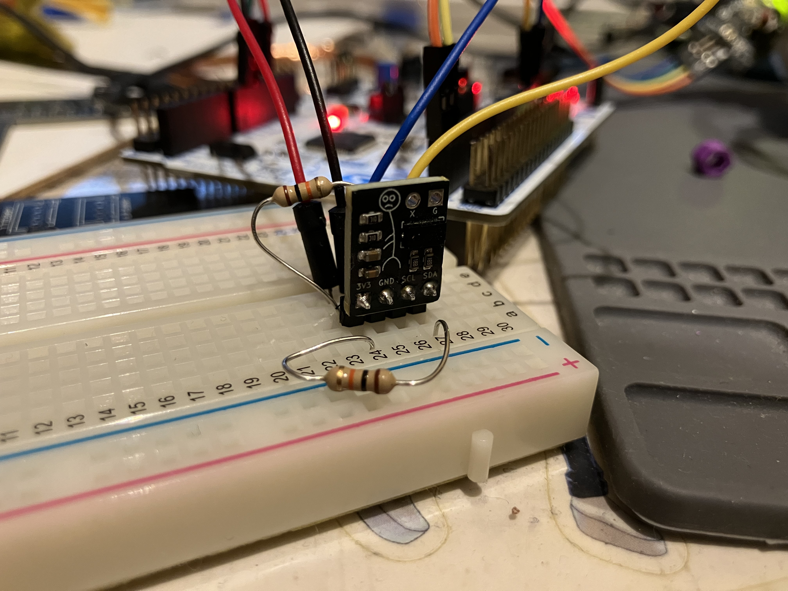
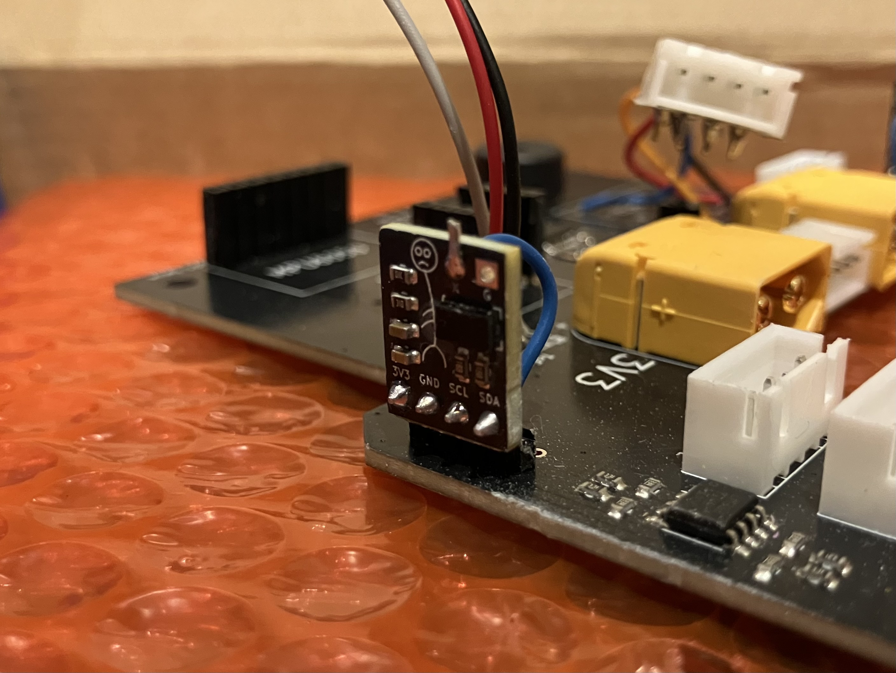
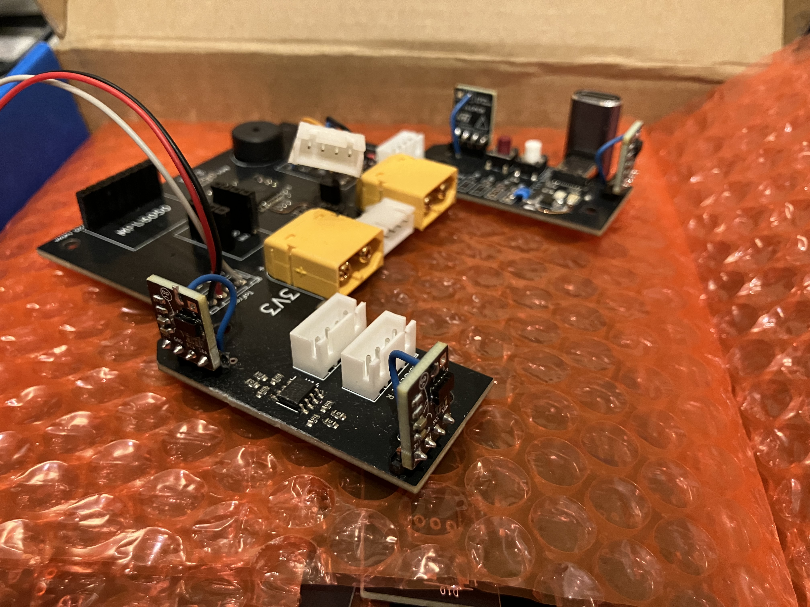
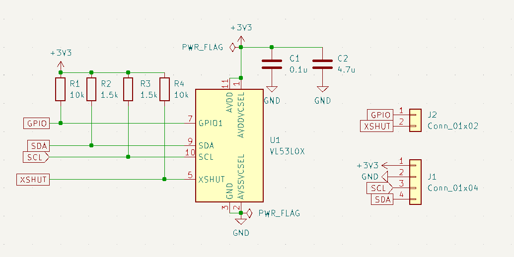

こんにちは、回路担当のshujiです。
大会前に発注したToF基板について解説します。

## JLCPCBの紹介

[JLCPCBさんのホームページはこちら(https://jlcpcb.jp/)](https://jlcpcb.jp/)

今回発注したものを含む私たちのロボットの基板やCNC部品は全てJLCPCB様にスポンサーとして無償で提供いただいています。

JLCPCBは基板やCNCなどを取り扱っている中国の製造会社です。高品質で低価格、そして迅速な配達というサービスを提供してくださる企業です！

JLCPCBでは非常にたくさんの部品から選んで表面実装までしてもらうことができるため高性能なロボットを作るのにとても役立っています。

新規ユーザーは$60ほどのクーポンがもらえるのでぜひ基板はJLCPCBで発注してみてください！

表面実装で発注する方法は[こちらの記事](https://tuton-rcj.github.io/20241030/)で解説しています！

CNCを発注する方法は[こちらの記事](https://tuton-rcj.github.io/20240419/)で解説しています！

## ToFとは
ToF:Time of Flightとは、レーザーを放出してそれが物体に反射して返ってくるまでの時間を読み取ることで物体までの距離を測定するセンサのことです。

超音波センサは超音波（音速）を使用しているのに対しToFはレーザー（光速）を使用するため高速に読み取ることができます。

レスキューラインではレスキューゾーンでの探索や障害物の回避などに使用します。

ロボカップジュニアではクラス1またはクラス2のレーザーのみ使用可能です。今回はクラス1を使ったToFであるVL53L0Xというチップを使用したToFモジュールを設計し、発注させていただきました。

## 着弾！
今回は30個発注しました。関東大会以降の機体にも使えるように多めに発注しました。

カプトンテープに30個並べて貼り付けられた形で届きました。とても小さい基板ですが傷などは全くなく正常に動きそうです。

このToFには怪しげな棒人間がシルクに印刷されています。
~~盗んで使われてもTutonのものだとすぐにわかります~~

## 使ってみた

実装する前にブレッドボードで動作確認してみました。

問題なく動作してくれました。距離をcmで取得しているのですが精度もよいです。

VL53L0XにはXSHUTピンがありセンサをシャットダウンさせることができます。このピンを用いて1つずつ電源を入れていきI2Cアドレスを変更していくことで1つのI2Cバスで複数のセンサを使用することができます。

## メイン基板に実装

私たちの東東京ノード機体ではメイン基板に4つ、正面基板に5つのToFセンサをのせます。

正面基板にはすでに前に購入した既製品を実装していたのでメイン基板に実装しました。

Ｌ型ピンヘッダでメイン基板に対して垂直にはんだ付けしました。XSUHTは上にあるのでワイヤーで引っ張ってきてメイン基板にはんだ付けしています。

このような小さいセンサモジュールを作る時には、全部のピンを一列に並べるのではなくあまり使用しないピンは分けるとスペースを節約できていいかもしれないですね。

メイン基板に搭載したToFは障害物回避に使用しました。

## 回路とプログラム

回路は抵抗とコンデンサをつけているだけです。データシートを参考にしました。

ソフトウェアはPololuのVL53L0Xライブラリを使用しました。

## 最後に

11/16に東東京ノード大会が行われました！ノード大会については次回の記事で振り返ろうと思うので楽しみにしていてください！

関東ブロックで満点取れるように頑張ります！！！
