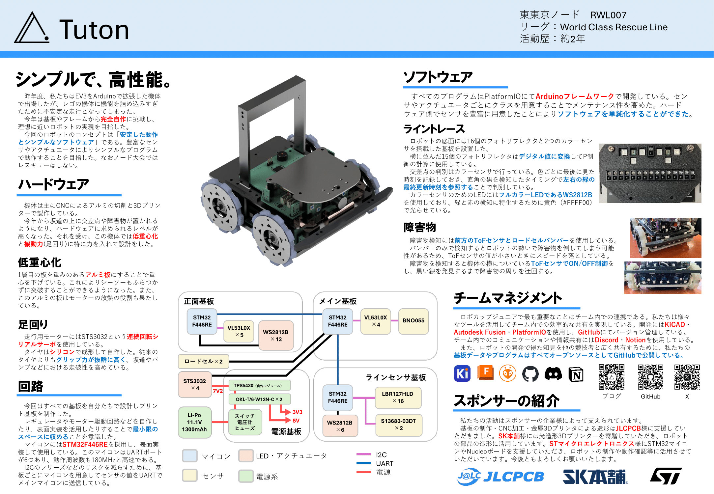

こんにちは、キャプテン・回路担当のshujiです。
Tutonは11/16に行われた東東京ノード大会（神奈川・西東京ノード共同開催）に参加しました。その結果等についてご報告します。

# 結果報告

RWL07 Tuton

一回目 286点

二回目 345点

合計631点で準優勝でした。関東ブロック大会に進出します！

また、昨年に引き続きベストプレゼンテーション賞を獲得しました。

# 当日の様子

## 調整

競技の前に2時間弱調整の時間がありました。この時間はコートが開放され、ロボットの調整をすることができます。また、この時間中に車検を通すこととなっていました。

### 問題発生 

コートが開放されてまず走らせてみたところ、黒い線をうまくたどれませんでした。
閾値を調整すればよいと思ってパドックに戻りラインセンサの値をパソコンに垂れ流すプログラムを書き込みました。
すると通信が何秒かおきに停止することに気づきます。このままではリアルタイムにセンサの情報を得られないためライントレースができません。

ラインセンサからメイン基板に送られた値をメイン基板がPCに送信しているため、どちらの基板が不調なのかを調べるためにラインセンサを取り外してラインセンサから直接読み取ってみました。
すると同じ現象が起きました。
カラーセンサが壊れて通信を妨げているのではないかと思い、カラーセンサの処理をすべてコメントアウトしましたが、それでも直りませんでした。
予備のラインセンサ基板を持ってきていたので交換してみましたが、また全く同じ現象が怒りました。
そこでラインセンサ基板ではなく電源基板が電源をうまく生成できていないのではないかと思い、持ってきていたNucleoボードから電源を取ってみましたが、それでも直りませんでした。
もうどうしようもないと絶望していると、PCがおかしいのではないかという疑惑が浮かんできます。
そこでPCを再起動してみました。
すると正常に値を読み取るようになりました！！！

この問題の対処におよそ1時間かかりました。
トラブルがおきたらPCを再起動しましょう。

### 車検

トラブルが解決して自作機を出せることになったので車検に行きました。
特に問題なく車検は通過しました。
リポバッテリの書類もここで出しました。今年初めてだったので少し不安でしたが大丈夫だったようで安心です。

### いろいろ調整

しきい値を調整したら完璧にライントレースするようになりました。
障害物検知のパラメータを調整しました。

カラーセンサの誤検知が時々あったのですが、調整が残り10分ほどだったので下手にパラメータをいじって動かなくなったらまずいと思い、そのままで一走目は望むことにしました。

## 一走目
チーム番号がRWL07だったのでちょうど真ん中あたりでした。
走行動画はこちらです。
<iframe width="560" height="315" src="https://www.youtube.com/embed/mHmy6ow2aJI?si=rj23Jrcz1jkAU1NT" title="YouTube video player" frameborder="0" allow="accelerometer; autoplay; clipboard-write; encrypted-media; gyroscope; picture-in-picture; web-share" referrerpolicy="strict-origin-when-cross-origin" allowfullscreen></iframe>

結果は5回（レスキューゾーン3回 + ライントレース2回）進行停止で完走しました。

直角が連続するところで緑マーカーを誤検知したのと障害物回避でうまく復帰できなかったので2回進行停止してしまいました。

## お昼

お昼ご飯はちゃんと食べました。

## 調整

二走目の前に1時間ほど調整する時間がありました。
二走目で満点を取るためにカラーセンサと障害物の調整をしました。

カラーセンサは判定を厳しくしたら誤検知がなくなりました。
障害物回避も少し値を調整しました。

10回ほど通しで走らせてみましたがほぼ毎回完走していました。

唯一ミスがあったのがカーブにあるバンプです。ラインセンサが一層目のアルミの板から少しでていて、3分の1くらいの確率でスタックしてしまいました。
これは今からはどうしようもないのでうまく動くことを願って二走目に臨みました。

## 二走目
カーブのバンプ以外は絶対に失敗しないと確信していたのでかなり自信はありました。
走行動画はこちらです。
<iframe width="560" height="315" src="https://www.youtube.com/embed/BrIag7j284c?si=B0at9nWEhcvNURyM" title="YouTube video player" frameborder="0" allow="accelerometer; autoplay; clipboard-write; encrypted-media; gyroscope; picture-in-picture; web-share" referrerpolicy="strict-origin-when-cross-origin" allowfullscreen></iframe>

交差点・障害物は問題なくクリアしました。
カーブバンプもクリアしました。
そして3分でライントレースをミスゼロで完走し、ライントレースだけでとれる最高点数345点を取りました。

## 交流
試合が終わった後少しだけ他のチームとお話しできました。

これは優勝したBoeingDGKさんのロボットと一緒に撮った写真です。リンク機構がかっこよすぎる！！

 
関東ブロックでもたくさんお話ししましょう♪

解散後は近くのフードコートで同じ学校のチームと夜ごはんに行きました。

# ノード機体「ポチ」

今回の機体にはレスキュー機構がついていません。これはハードウェアの設計が間に合わなかったためです。
急いで作れば間に合っていたのかもしれませんが、時間的にプログラムまで完成する見込みがないうえ、重心が高くなって坂道が登れなくなったりするのが怖かったのでつけないことにしました。
その代わりにライントレース部で満点を取ろうということでノード大会は臨みました。

結果的に一走目で2回進行停止をしてしまったこと以外は完璧に走行できたので良かったなと思います。
レスキュー競技なのにレスキューをしないとは何事だという意見は本当にその通りだと思うのですが、1年でEV3から完全自作機体へ移行したのはかなりの挑戦だったのでライントレースを完走できただけで十分大きな成長だと思います。関東では絶対にレスキューもするので楽しみにしていてください。

今回の機体は「ポチ」と名づけられました。これは大会会場でノリで決まりました。

 
ノード機体の詳しい解説は時間の都合上ブログではしません。
プレゼンテーションポスターやGitHubで公開している回路図・プログラムをご覧ください。
何か質問があればお気軽にX(Twitter)等でご連絡ください！基本的に何でもわかる範囲でお答えします。

 

# 決死の12時間ミーティング

おそらく準優勝ということで関東ブロックに進出できることとなりました。
関東ブロックでの目標は「ライントレース完走＋3人救助」、つまり満点です。

満点を取るには坂道やバンプを突破できる性能を保ちながらレスキュー機構を搭載しなければなりません。
そのために基板やハードウェアの大幅な作り変えが必要となるのですが、関東ブロックまでは2カ月もありません。早く取り掛からなければ機体が完成しないということに気づきました。

そこで大会の翌日のモチベーションが一番高いときにチームで集まって、関東機体の構想を固める12時間ミーティングを行いました。

ノード機体「ポチ」は解体され、何をどう作り変えるか部品を動かしながら考えていきました。

様々なことを検討し、レスキュー機構、基板の構成・配置等がおおよそ決まりました。現在はすでに新しい機体の設計に取り掛かっています。

12時間もロボットの話し合いをしているとだんだんメンバーのテンションがおかしくなっていきます。
頻繁にはやらないほうがよさそうです。
<blockquote class="twitter-tweet">
12時間チームで集まってミーティングして分かったこと ・12時間あれば機体の仕様が大体固まる ・9時間たったあたりからメンバーのテンションがおかしくなる
&mdash; shuji (@shuji_4649) <a href="https://twitter.com/shuji_4649/status/1858151830389473584?ref_src=twsrc%5Etfw">November 17, 2024</a></blockquote> 

# 最後に
ノード大会で仲良くしてくれたみなさん、ありがとうございました。関東でもよろしくお願いします！！

関東ではレスキューします！

