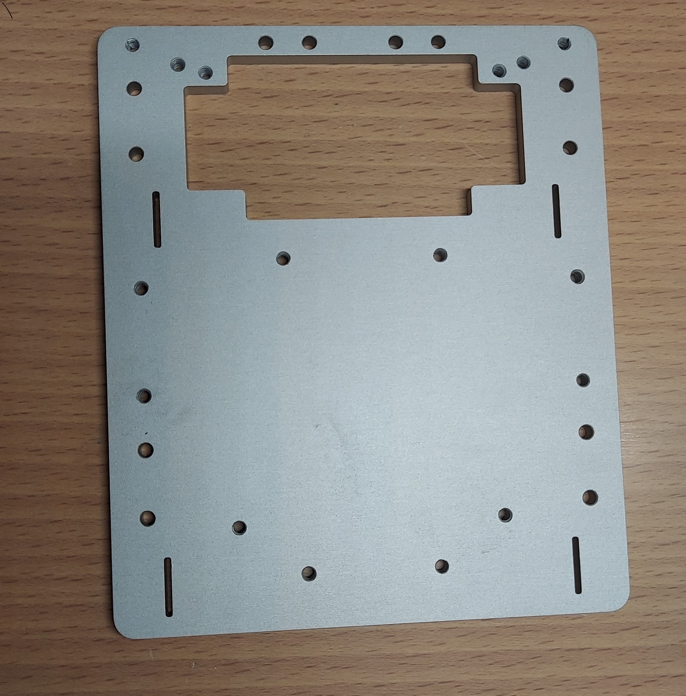

## スポンサー紹介

前回の内容と重複してしまいますがスポンサーの紹介をさせていただきます。

[JLCPCBさんのホームページはこちら(https://jlcpcb.jp/)](https://jlcpcb.jp/)

JLCPCBさんは、中国に拠点を持つPCB（プリント基板）のプロトタイプ製作を中心に、CNC加工や3Dプリントなど幅広い製造サービスを提供する企
業です。
特に、標準サイズの基板を5枚でわずか$2から製作可能という、非常にリーズナブルな価格設定が大きな魅力です。また、経済的な送料プランも用
意されており、日本への配送も迅速かつ確実です。

さらに、低価格ながら製品の品質は申し分なく、個人での電子工作や競技ロボット制作に最適なサービスを提供してくださいます。今後もJLCPCBさ
んにお世話になりたいと思います。　

# 今回発注したもの

　発注から２週間ほどで届きました。ねじを切ってもらったり複雑なことをしてもらったのにとても早くて感謝です。
今回もいつも通りの青い箱でプチプチにくるまれて丁寧に梱包された状態で届きました。

今回発注したものは、以下のものを発注しました。
| 発注したもの| 種類 |個数|製造方式|
| ---- | ---- | ---- | ---- |
| ロボットの底板 | 1種類 |1枚|CNC(アルミ)|
| ロボットのギア | 1種類 | 5個 | 3Dプリンター(金属フィラメント)|

次の章では、それぞれのパーツについて詳しく説明したいと思います。

# ロボットの底板について
　　
## 仕様
　底板は、東東京ノード大会（神奈川・西東京ノード共同開催）で使用した、機体[ポチ]と同じようにCNCでアルミの削りだしていただきました。
表
面加工は毎度おなじみのアルマイト加工です。

左の写真のようにしっかりと梱包された状態で届きました。
アルマイト加工をすることで、アルミの周りに薄い酸化被膜を張ることができるので錆びにくくなる
とともに触り心地もよくなるので、おすすめです。個人的なおすすめは、Beadblassing + Anodizingで見た目はナチュラルです。

　　
## 再発注した理由
　今回、底板を再発注した理由は主に二つあります。

1つ目は、ねじ穴が不足していたことです。具体的には、レスキュー機構などを固定するためのねじ穴を前回の発注時には意識していませんでし
た。今後は、将来を見越して設計する能力を身につけて、できるだけ一つのパーツを長い間使い続けられるようにしたいと思います。

2つ目は、前回のノード大会で見つかった回路の欠陥を修復するためには、どうしても電子基板の大きさを大きくしなければならず、その結果、底
板と干渉してしまうことが分かったからです。これらの理由から今回、底板を再発注することにしました。
  
  ## 前回の底番との変更点
  

　左側にあるのがノード大会で発注させてもらった低版、右側にあるのが今回新しく発注させてもらった底板です。
見ていただくと分かるように、前章で上げた反省点を生かしてねじ穴を少し多めに作って、設計に余裕を持たせてみました。
また、反省点２つを生かすために、底板のライントレースセンサーがついていた部分をを少し削って広げてみました。かなり余裕を持たせているの
で、今後に備えて拡張性がかなり残っています。ほかの部分は前回の底板と同じ設計になっているので、前回の機体に対しての後方互換性を保った
まま機能性を向上させることができました。   

  <s>
  多分後方互換性が生かされることはないと思うけど...
</s>

# ロボットのギアに関して
   

## 仕様
　ギアは金属3Dプリンターによる造形にすることにしました。理由としては、前回使用していたということと、cncなどに比べるとかなり安く強度
のあるパーツを作ってもらうことができるので、コスパ面において優れているからです。金属3Dプリンターは強度が必要だけどcncをするほどのお
金がないときなどにおすすめの製作方法です。  
触り心地としては、金属3Dプリンターで作っているのでヒヤッとするとともにつるつるしていて非常に触り心地がいいです。  

  <s>
  JLCPCBさんの製品はどれも触り心地がいいのがうれしいです
</s>

## 作り直した理由
　ギアは、この前の東東京ノード大会（神奈川・西東京ノード共同開催）で使用した、機体[ポチ]の時は、車輪とギアでパーツを分けてそれぞれの
パーツをネジによる摩擦固定で固定していました。しかし、練習している際にロボットのタイヤとギアの摩擦固定が外れるという重大な事故が何度
か起きていたので、車輪とギヤの二つを一つのパーツとして作ることでタイヤが外れるという事故が起きないようにしたいと思いました。

左側が前回大会で使っていたギア。右側にあるのが今回発注させてもらったものです。見てわかるように、タイヤと一体化したので整備性、安全性が共に向上しています。

# 関東大会に向けて
　最後に少しだけ関東大会に向けた目標を書きたいと思います。
### 100%動くようにする_
 いくらすごい機体を作っても大会で動かなかったら悲しいです。そんな思いをしたくないので100%動く機体を作りたいたいと思います。
### 小さくて整備性が高い
　小ささと整備性という言葉は相反するものかもしれませんが機構を単純化することで、大会当日の調整時間を有効に使えるようにしたいです。

最後まで読んでいただきありがとうございました。
