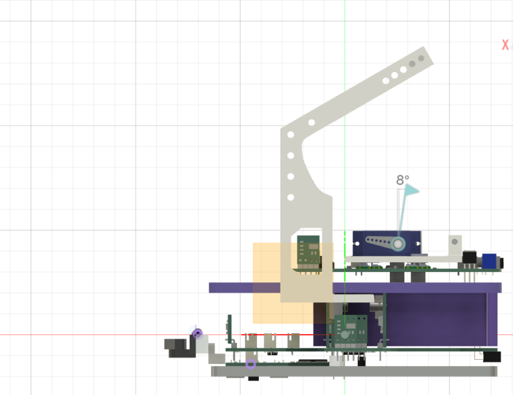

回路担当・キャプテンのshujiです。
去る1/12に関東ブロック大会が行われました。
今回の記事はその振り返りとロボットの基板の紹介です。

# スポンサー紹介

スポンサーとして支援していただいているJLCPCBさんのご紹介です。私たちのロボットの全ての基板はJLCPBさんに発注させていただいています。

[JLCPCBさんのホームページはこちら(https://jlcpcb.jp/)](https://jlcpcb.jp/)

JLCPCBさんは、中国に拠点を持つPCB（プリント基板）のプロトタイプ製作を中心に、CNC加工や3Dプリントなど幅広い製造サービスを提供する企業です。
特に、標準サイズの基板を5枚でわずか$2から製作可能という、非常にリーズナブルな価格設定が大きな魅力です。また、経済的な送料プランも用意されており、日本への配送も迅速かつ確実です。

さらに、低価格ながら製品の品質は申し分なく、個人での電子工作や競技ロボット制作に最適なサービスを提供してくださいます。ぜひみなさんもJLCPCBさんをご利用してみてはいかがでしょうか。　

表面実装（PCBA）で発注する方法は[こちらの記事](https://tuton-rcj.github.io/20241030/)で解説しています！

CNCを発注する方法は[こちらの記事](https://tuton-rcj.github.io/20240419/)で解説しています！

こちらが今回発注させていただいた基板です。3種類ともPCBAでSTMマイコン等を実装していただきました。

 

# 関東大会について

## 結果

RWL11 Tuton

一回目 389点

二回目 420点

合計809点で準優勝でした。

[こちらから結果を見ることができます（関東ブロックHP）](https://rcjj-kanto.org/kanto/archives/2049)

また、プレゼンポスターロボカッパー賞を獲得しました。

## 準備期間
期末考査などの影響で開発が遅れてしまい、全体的に開発が遅れてしまいました。

基板を発注したのが遅くなり、年末年始の関係で1/7に基板が届くことになってしまいましが、発送業者であるDHLさんに問い合わせたところ12/31に届けていただくことができました。もし1/7に届いていたら関東大会には間に合っていなかったと思います。本当にありがとうございました。今後は余裕をもって発注できるように頑張ります。

あらかじめ必要な部品を買っておき、12/31に届いたその日中にはんだ付けをしました。
基板は特に大きな問題なく動作しました。

1/1に家で集まって組み立てを行いました。レスキュー機構等はその前に作ってあったのですぐ組み立てを行うことができました。

<blockquote class="twitter-tweet">
あけましておめでとうございます。 本日新機体「ミケ」の組み立てが終わり、正常に動作することが確認できました！ これからプログラム作ります💪 関東勝ちます。 <a href="https://t.co/Nib3TXQygL">pic.twitter.com/Nib3TXQygL</a>
&mdash; Tuton (@tuton_RCJ) <a href="https://twitter.com/tuton_RCJ/status/1874383541301342212?ref_src=twsrc%5Etfw">January 1, 2025</a></blockquote> 

そこからソフトウェアの開発が始まりました。ノード機体と互換性があったためライントレースの実装ははすぐに終わりました。

1週間ほどレスキューの準備を重ね、いくつかトラブルもありましたがなんとか大会までに動くロボットが整いました。

## 当日

関東ブロック大会は都立産業技術高専で行われました。

 
埼京線の遅延がありましたが無事に集合時間に間に合うことができました。

### 調整

ライントレースの調整を主に行いました。

始めに走らせたときは直角が上手く曲がれませんでしたが、フォトリフレクタの閾値を調整すると走れるようになりました。

また、ToFの調子が悪く、ToFを利用しての障害物のON/OFF制御がうまくいかなかったので、定数制御に切り替えました。

<blockquote class="twitter-tweet">
12:30から第一走行です！ <a href="https://t.co/rw9P8wI7e9">pic.twitter.com/rw9P8wI7e9</a>
&mdash; Tuton (@tuton_RCJ) <a href="https://twitter.com/tuton_RCJ/status/1878280501435502965?ref_src=twsrc%5Etfw">January 12, 2025</a></blockquote> 

 

### 一走目
ライントレースは交差点検知をミスって一回だけ進行停止してしまいました。

レスキューをするつもりだったのですが、ToFが上手く動かず被災者を拾い上げることができませんでした。

こちらが走行動画です。

<iframe width="560" height="315" src="https://www.youtube.com/embed/uhHvAZY3oSU?si=Wr-zOtbB88KA_Pvs" title="YouTube video player" frameborder="0" allow="accelerometer; autoplay; clipboard-write; encrypted-media; gyroscope; picture-in-picture; web-share" referrerpolicy="strict-origin-when-cross-origin" allowfullscreen></iframe>

 

### お昼・調整

緑検知の閾値を調整しなおしました。これで交差点を誤検知することはなくなりました。
この時間はレスキューの調整にも時間をかけました。
後述しますが、前方のToFがうまく動かず、半分くらいの確率しか被災者を拾うことはできない状態でした。
ライントレースは完璧、レスキューは上手くいけばいいなという感じで二走目に臨みました。

<blockquote class="twitter-tweet">
15時30分から2走目です。 今回はレスキューもします <a href="https://t.co/hgB0N47y4E">pic.twitter.com/hgB0N47y4E</a>
&mdash; Tuton (@tuton_RCJ) <a href="https://twitter.com/tuton_RCJ/status/1878319029074457021?ref_src=twsrc%5Etfw">January 12, 2025</a></blockquote> 

 

### 二走目
ライントレースは満点でした。
レスキューはすることができず、スキップしました。

こちらが走行動画です。
<iframe width="560" height="315" src="https://www.youtube.com/embed/EKjE-MT_gL4?si=gUHUmTlgxOQb5EYz" title="YouTube video player" frameborder="0" allow="accelerometer; autoplay; clipboard-write; encrypted-media; gyroscope; picture-in-picture; web-share" referrerpolicy="strict-origin-when-cross-origin" allowfullscreen></iframe>

 

## 表彰式
レスキューライン準優勝、プレゼンポスターロボカッパー賞を頂きました。

## 夜ごはん
前回と同じフードコートで夜ご飯を食べました。

## 決死の12時間ミーティング
前回同様、翌日に次の機体の仕様を固める12時間のミーティングをやりました。私（shuji）は数オリがあったので6時間ほど抜けました。

## プレゼンテーションポスター

こちらからご覧ください。

<blockquote class="twitter-tweet">
こちらが関東ブロック大会で掲示したポスターです！ プレゼンポスターロボカッパー賞を頂きました。 PDFファイルはGitHubで公開しています↓↓<a href="https://t.co/i5Uhpu3Ucu">https://t.co/i5Uhpu3Ucu</a> <a href="https://t.co/4g2p7xDMPp">pic.twitter.com/4g2p7xDMPp</a>
&mdash; Tuton (@tuton_RCJ) <a href="https://twitter.com/tuton_RCJ/status/1879517285167337869?ref_src=twsrc%5Etfw">January 15, 2025</a></blockquote> 

 

# 関東機体「ミケ」

関東大会に向けて作った「ミケ」という機体について、基板を中心に解説します。

## コンセプト
前回機体の「ポチ」は小型かつ低重心で安定した機体でしたが、レスキュー機構を搭載していませんでした。「ミケ」は、そんなポチの小ささと重心の低さを保ったまま、レスキュー機構を搭載することを目指した機体です。その実現のために、できる限り一層目にライントレースの機能を集中させ、二層目にレスキュー機構を搭載するスペースを確保するようにしました。

<em>ポチとミケ</em>

 

アームとかごをのせるとどうしても重心が高くなりがちですが、できるだけシンプルな機構にし、軽い3Dプリント部品を使用し、サーボモータをできるだけ低いところに設置したことで重心が高くなるのを防ぎ、ポチと同程度の重心の低さを保つことができました。

## Overview

 

ミケは3枚の基板で構成されています。
できるだけ基板とケーブルの数を減らし、シンプルな構成にすることを目指しました。

 

これらの基板は全てJLCPCBさんにPCBAで作っていただきました。

## メイン基板

 

| 部品                          | 数  |
| ----------------------------- | --- |
| メインマイコン STM32F446RE    | 1   |
| ジャイロセンサ BNO055         | 1   |
| ジャイロセンサ MPU6050        | 1   |
| 圧電スピーカ PKM13EPYH4000-A0 | 1   |
| オペアンプ LM358              | 1   |
| RS485ドライバ MAX485          | 1   |
| ToFセンサ VL53L0X             | 7   |

メイン基板です。メインマイコンであるSTM32F446REがのっています。

ジャイロセンサがBNO055とMPU6050の2つついていますが、BNO055しか使ってないです。片方が使えなくなった時用の予備として2つつけてあります。

前方と両サイドにはToF距離センサがついています。ToFセンサは通信トラブルのリスクを減らすため基板に直接はんだ付けしています。

電源基板と金属スペーサで接続されていて、スペーサにはモータのための電源を流しています。前回電源用のケーブルが太くて邪魔だったのでスペーサに電気を通す方法に変えました。

後方に書き込み口をもってきています。Tuton専用のWRITER（ただのシリアル変換ですが）を使って書き込みます。

## ライン基板

 

ライントレース用の基板です。

前回の機体ではアルミの板の下につけていたのですが、バンプにひっかかりそうであぶなかったため板の中に入るようにしました。

 

また、書き込み口を下向きにつけたのでロボットを分解することなくプログラムを書き込めるようになりました。

16個のフォトリフレクタと2つのカラーセンサでライントレースを行います。カラーセンサ用のLEDにはNeo Pixelを使用しています。RGBで指定して色を決められるので、私たちは緑と赤の検知精度をあげるために黄色で光らせてます。

この基板は全国もそのまま使おうと思います。

| 部品                       | 数  |
| -------------------------- | --- |
| サブマイコン STM32F446RE   | 1   |
| フォトリフレクタ LBR127HLD | 16  |
| デジタルカラーセンサ S9706 | 2   |
| フルカラーLED WS2812B      | 6   |

## 電源基板

 

電源系の回路と二層目の部品をまとめる役割を持つ基板です。

サーボモータとToFセンサをまとめるためにサブマイコンSTM32F303K8を置いています。
DCDCコンバータで5Vと3.3Vを生成しています。ムラタのOKL-T/6-W12N-Cは可変出力で6Aまで流せる高性能なDCDCコンバータです。

ToFセンサをはんだ付けする時に失敗して違法建築がされています。

また、LoPスイッチに以下のような回路を組んでしまいました。これはスイッチを切り替えるときに一瞬ショートしてしまいます。
プルダウンorプルアップ回路に変更するべきですね。今回は違法建築が楽なプルアップ回路に変更しました（Xではプルダウンと言っていますがプルアップです）。

<blockquote class="twitter-tweet">
こういう回路だとスイッチがショーティングタイプの時3V3とGNDがショートして危ないってこと初めて知った プルダウンに変えます <a href="https://t.co/OglnBJLZbQ">pic.twitter.com/OglnBJLZbQ</a>
&mdash; shuji (@shuji_4649) <a href="https://twitter.com/shuji_4649/status/1874418284516540891?ref_src=twsrc%5Etfw">January 1, 2025</a></blockquote> 

| 部品                          | 数  |
| ----------------------------- | --- |
| サブマイコン STM32F103C8      | 1   |
| ToFセンサ VL53L0X             | 2   |
| DCDCコンバータ OKL-T/6-W12N-C | 2   |

## 反省点
ミケの反省点です。

### ToFとの干渉
前方のToFがバンパーと、横のToFがタイヤと近い距離にあり、距離を正しく測れなくなってしましました。
障害物回避を定数制御に変えたこととレスキューが上手くいかなかったのはこれが原因です。
ToFは直線ではなく広がりを持った空間で物体を認識する（VL53L0XのFoVは25°）ということを意識して設計できていませんでした。

<em>ロボットの断面図。左下を見るとバンパーの高さがToFに対してぎりぎりなことが分かると思います</em>

 

次回はこのようなことがないように設計したいと思います。

### 分解が大変
毎回、二層目をねじ4本だけで簡単に外せるようにしようとしているのですが、レスキュー機構を色々載せた結果、かごをとってからでないと二層目がとれない設計となってしまいました。

次回こそは整備性のいいロボットを作りたいと思います。

# 全国大会に向けて
私たちTutonは、全国大会でレスキューまで含めた満点走行をすることを目指します。

ポチとミケでの経験を活かし、高性能で整備性のいいロボットを作りたいと思います。

それでは、全国大会でお会いしましょう！強いロボットをお見せできるようにあと2カ月頑張ります！