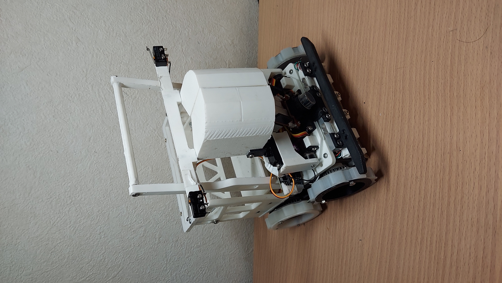
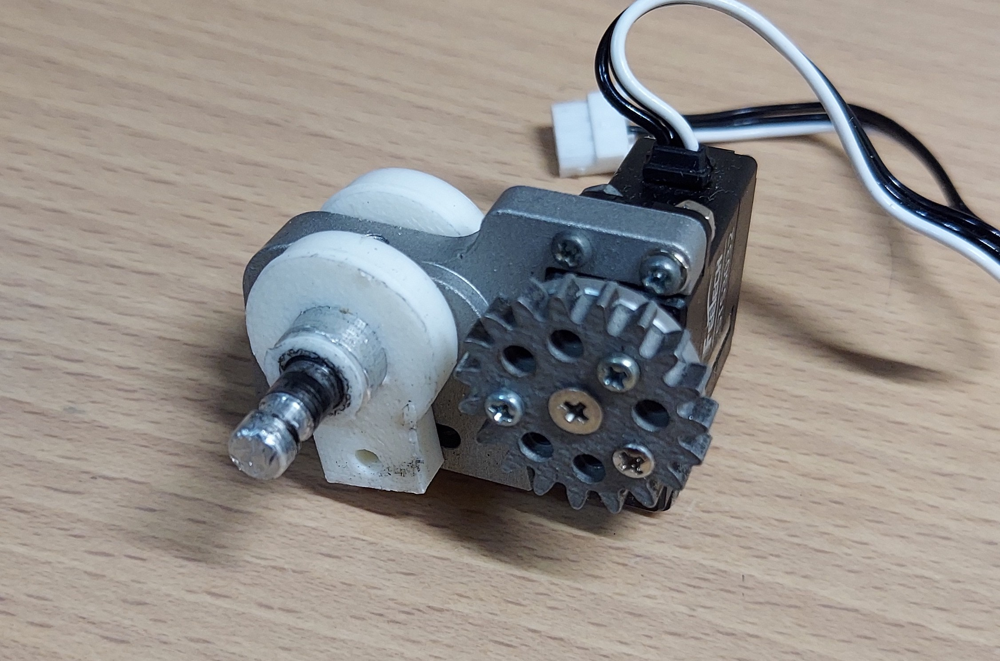
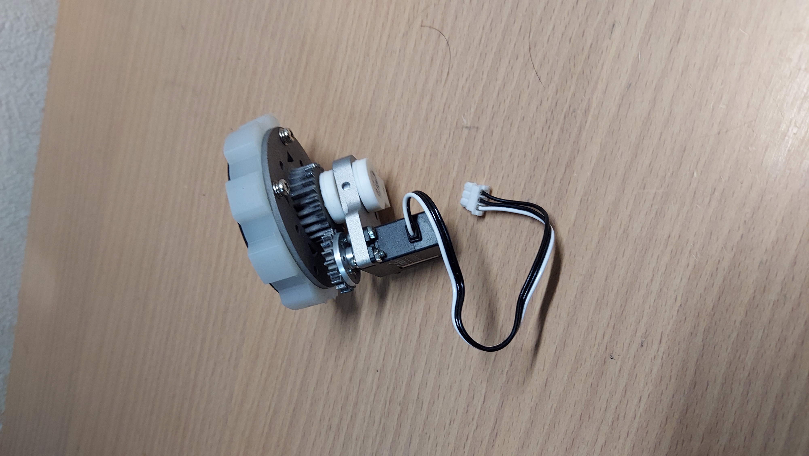
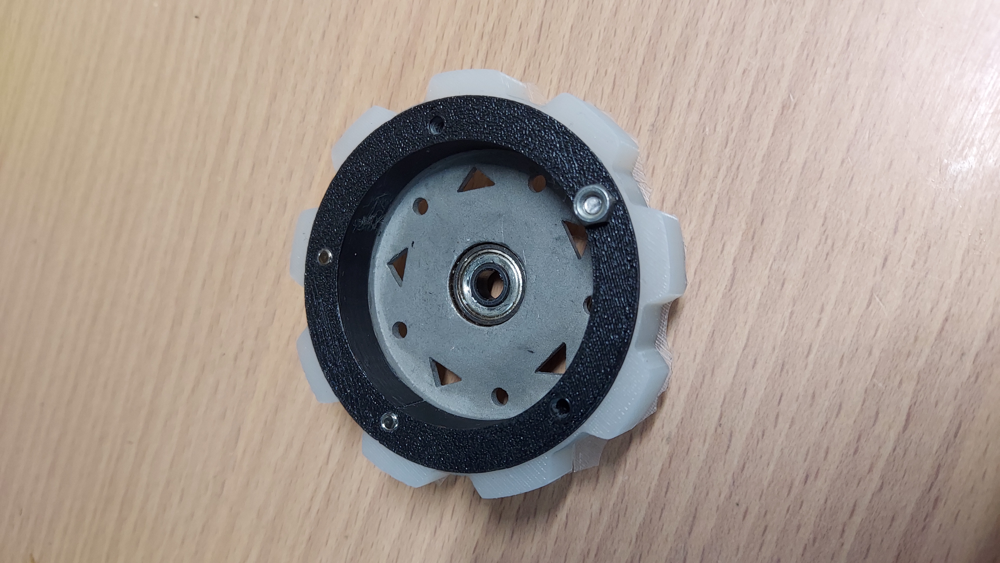
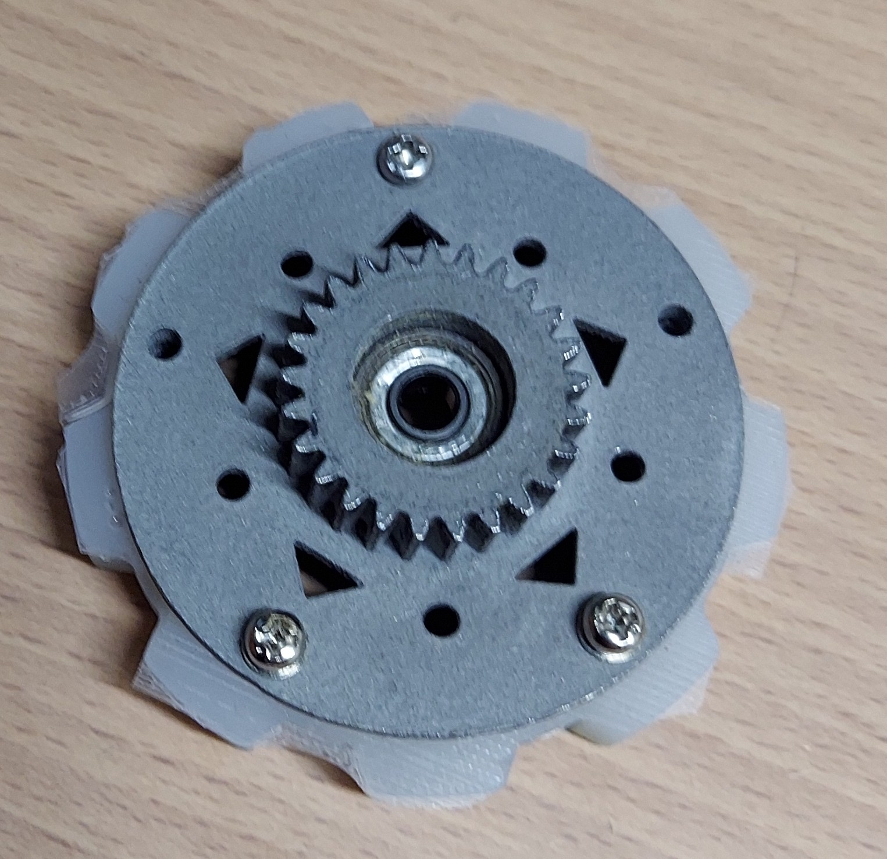
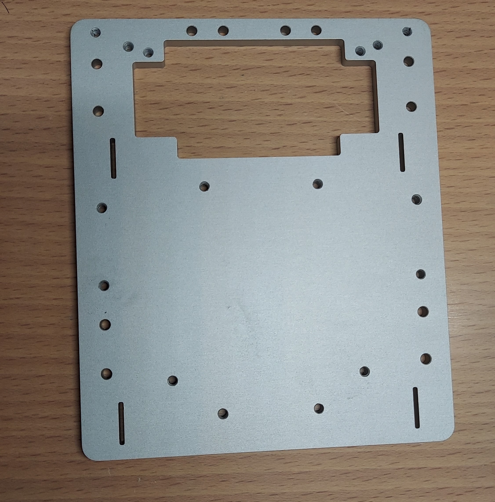
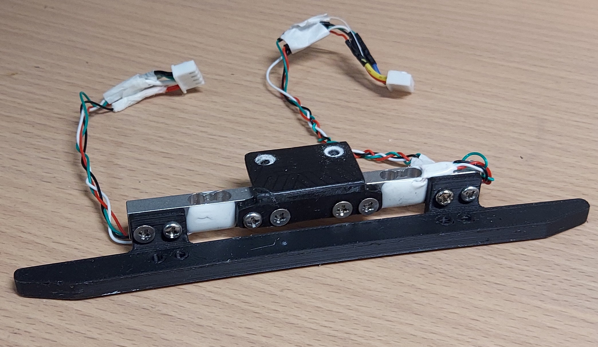
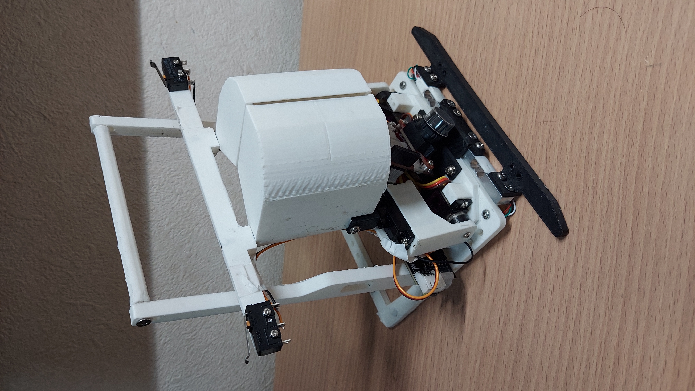
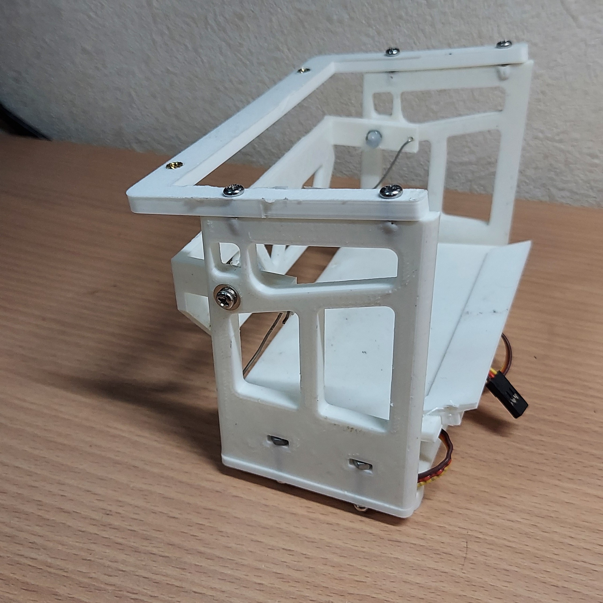
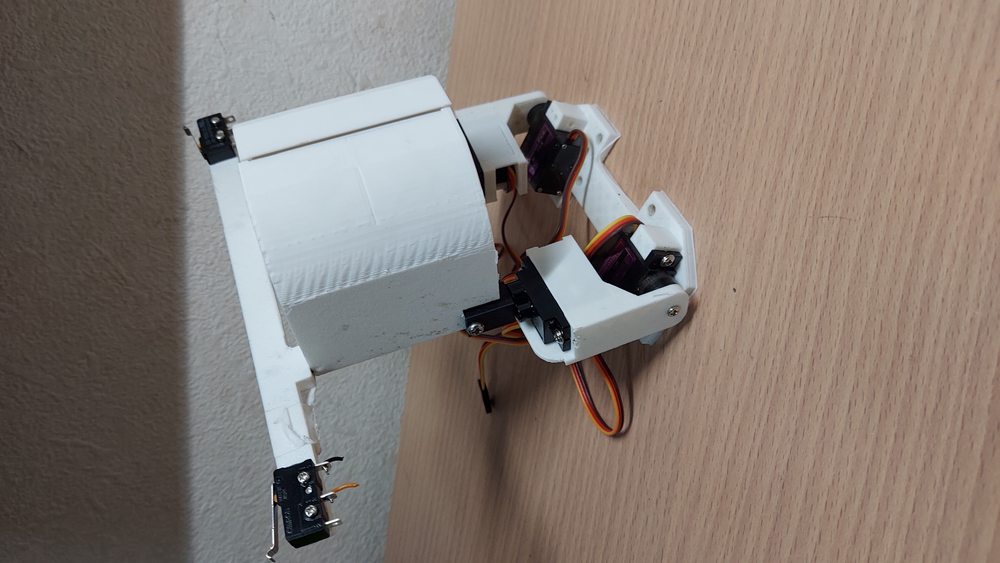

ハードウェア担当kapiです。
去る3/28~30にポートメッセ名古屋でロボカップジュニア全国大会が行われました。
今回の記事は、ロボットの機体解説です。

# 全国機「シロ」
全国大会に向けて作った「シロ」という機体について、ハードウェアを中心に解説します。

## コンセプト
前回機体の「ミケ」は小型かつ低重心で安定した機体でしたが、レスキュー機構がうまく作動しませんでした。「シロ」は、そんなミケの小ささと重心の低さを保ったまま、安定して動くレスキュー機構を搭載することを目指した機体です。その実現のために、機体の下半分にライントレースを集中させ、上半分にレスキュー機構をまとめて搭載することで、整備性を高くすることを目指しました。

 

　レスキューラインのロボットは、アームとかごを上にのせないといけないので重心が高くなりがちです。しかし、「シロ」は、上構造物を3Dプリンタ部品を使用した軽くてシンプルな機構にしながら、サーボモータをできるだけ低いところに設置したうえで、足回りのパーツに金属を多用することによって重心が高くなるのを防ぎ、今までの機体と同じような低重心を実現しました。

## 一層目
　下半分である一層目は、ライントレースをすることに特化した機構になっています。足回りには4つの独立した走行機構を前後左右に一つずつ搭載しています。これらの走行機構はアルミニウムをCNC加工した底板とネジ2本で固定しているため、壊れても、ねじを2つ外せば交換できる仕様になっています。

### 走行機構

STS3032を走行用のモーターとして採用しています。また、バンプやシーソーなどからの衝撃がモーターに伝わることを防ぐために、車輪は車軸に固定し、モーターの動力はギア(車輪：モーター＝3：2)を用いて車輪に伝達しています。ギアとホイールの一部は、摩耗が心配だったので強度のある金属3Dプリンターを採用しています。「シロ」にはこの走行機構を4つ独立した状態で搭載しています。そのため、バンプなどで機体が浮いてしまっても、最低2輪以上の独立した駆動輪が地面に接するようになっています。これにより、力強い走行を可能としました。

### タイヤ

足回りに金属製のパーツを多用してしまい機体重量が1.3kg程になってしまったので、坂道などでも走れるレベルのグリップ力を求めてタイヤは造形用シリコンを用いて自作しました。シリコン製のタイヤは既製品のゴム製のタイヤの数倍もグリップ力があり、好きに形を決めることができるのでレスキューライン競技に出てる人にはおすすめです。私は、HTV-4000という名前の造形用シリコンを使っています。

### その他足回り

 

前述した走行機構をがっしりと機体に固定するために、底盤にはアルミニウムをCNC加工した板を採用しています。アルミニウムを底盤に採用したことにより、ロボットの低重心化を実現しました。←普通に触り心地がいいのでおすすめ

### バンパー

 

　正確に言うと二層目に付随しているものなのですが、ライントレースでの障害物回避の際に利用しているので,この部分で解説します。私たちのロボットはバンパー部分にロードセル(電子ばかりとかに入ってるやつ)を搭載しています。ロードセルを搭載することのメリットは、ロボットの可動部を減らすことができるので設計を単純化、コンパクト化することができます。ちなみに、最大の目的は機体の見た目がかっこよくなります。

## 二層目
　二層目には、レスキュー用のアームと籠を搭載しています。低重心化のために2層目は基本的に全て3Dプリンタで作っており、１層目に比べるとかなり軽くなっています。

 

### かご

 
<iframe width="560" height="315" src="https://www.youtube.com/embed/EM6KxKVscSE?si=-l5nbA1qoHk8aN8p" title="YouTube video player" frameborder="0" allow="accelerometer; autoplay; clipboard-write; encrypted-media; gyroscope; picture-in-picture; web-share" referrerpolicy="strict-origin-when-cross-origin" allowfullscreen></iframe>

　かごはかなり工夫していて、整備性を向上させるために機体本体との接続は磁石とsg-90の配線のみになっており、簡単に着脱できる設計になっています。なのでバッテリー交換の際にかごを簡単に取り外すことができます。この機構はチームメンバーからかなり好評です。~~磁石最高~~
また、籠にはリンク機構を搭載しており、一つのモーターで①籠の蓋を開閉する②籠の底を傾ける、の2つの動作を制御することができるようになっています。

### アーム

　アームは、単純な仕組みで整備性をあげることを目指して設計しました。ボールをつかむ手部分+手部分を持ち上げる部分の二つから構成されていて、モーターを左右に一対ずつ搭載して重いボールを持ち上げられるような機構になっています。

一応解説としてはこんな感じです。気になるところがあれば連絡いただければ追加で記事を書きます。