回路担当のshujiです。

2025全国大会の機体「シロ」に使われている基板の解説をします。

# はじめに
今回の基板は全てスポンサーのJLCPCB様に発注させていただきました。

[JLCPCBさんのホームページはこちら(https://jlcpcb.jp/)](https://jlcpcb.jp/)

JLCPCBさんは、中国に拠点を持つPCB（プリント基板）のプロトタイプ製作を中心に、CNC加工や3Dプリントなど幅広い製造サービスを提供する企業です。
特に、標準サイズの基板を5枚でわずか$2から製作可能という、非常にリーズナブルな価格設定が大きな魅力です。また、経済的な送料プランも用意されており、日本への配送も迅速かつ確実です。

さらに、低価格ながら製品の品質は申し分なく、個人での電子工作や競技ロボット制作に最適なサービスを提供してくださいます。ぜひみなさんもJLCPCBさんをご利用してみてはいかがでしょうか。　

表面実装（PCBA）で発注する方法は[こちらの記事](https://tuton-rcj.github.io/20241030/)で解説しています！

CNCを発注する方法は[こちらの記事](https://tuton-rcj.github.io/20240419/)で解説しています！

# 全体像
こちらの図が今回の基板の構成を示したものです。

 

今回は全部で6枚の基板を使用しました。
各基板間はUARTで通信しています。

- 一層目
  - LINE基板
  - MAIN基板
  - PWR基板
  - FRONT基板
- 二層目
  - RESCUE基板
  - UI基板
  - (OpenMVシールド)

 

<blockquote class="twitter-tweet">
全国大会用の基板のはんだ付けが全て終わりました 全部で基板は6枚（OpenMV用のシールドを入れたら7枚）です <a href="https://t.co/7WxPXwkqQm">pic.twitter.com/7WxPXwkqQm</a>
&mdash; shuji (@shuji_4649) <a href="https://twitter.com/shuji_4649/status/1891168873505865736?ref_src=twsrc%5Etfw">February 16, 2025</a></blockquote> 

 

# 基板紹介
## LINE基板
これは関東機「ミケ」と同じものです。
フォトリフレクタを16個、カラーセンサを2個搭載しています。
赤・緑・黒・白が分かればよいので、LEDは#FFFF00の黄色で光らせています。どれだけ意味があるかはよく分かりませんが。

MAIN基板と距離が近くなってしまったので裏側はマスキングテープで絶縁しています。

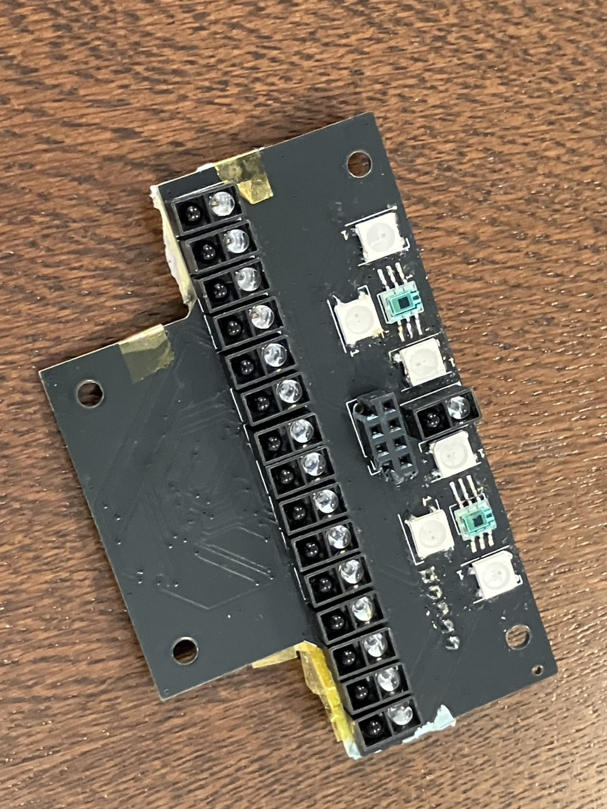
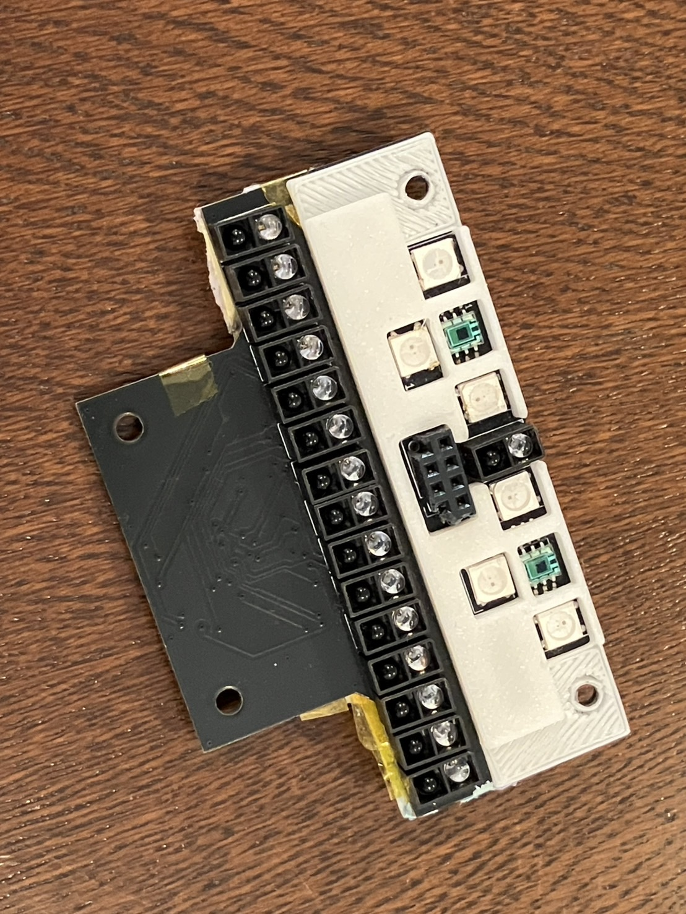

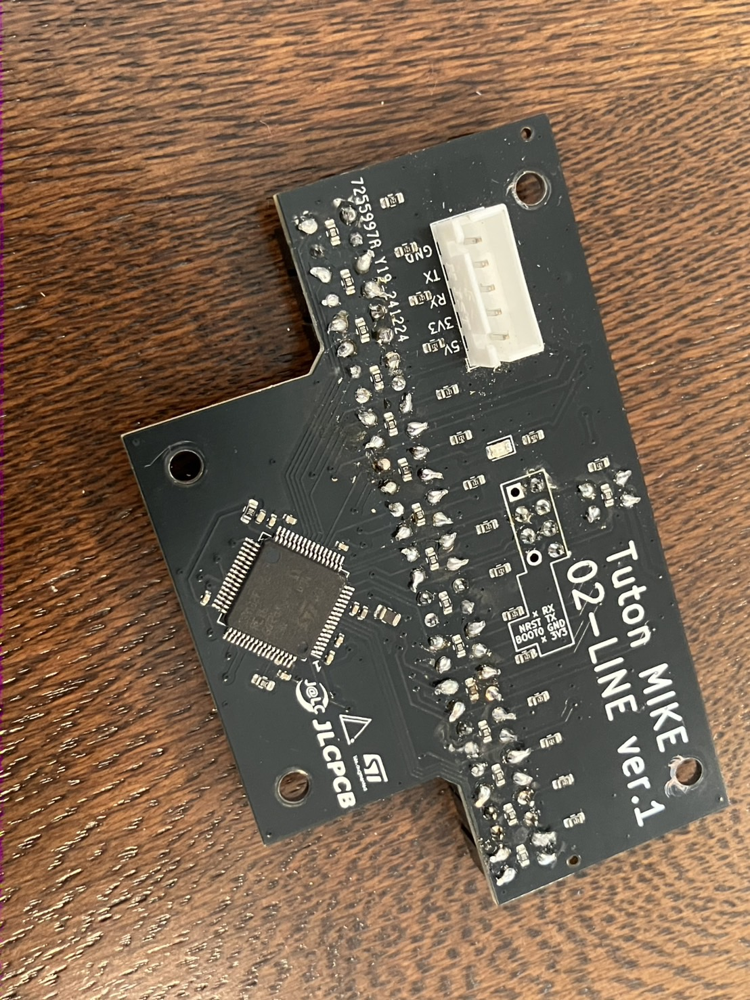
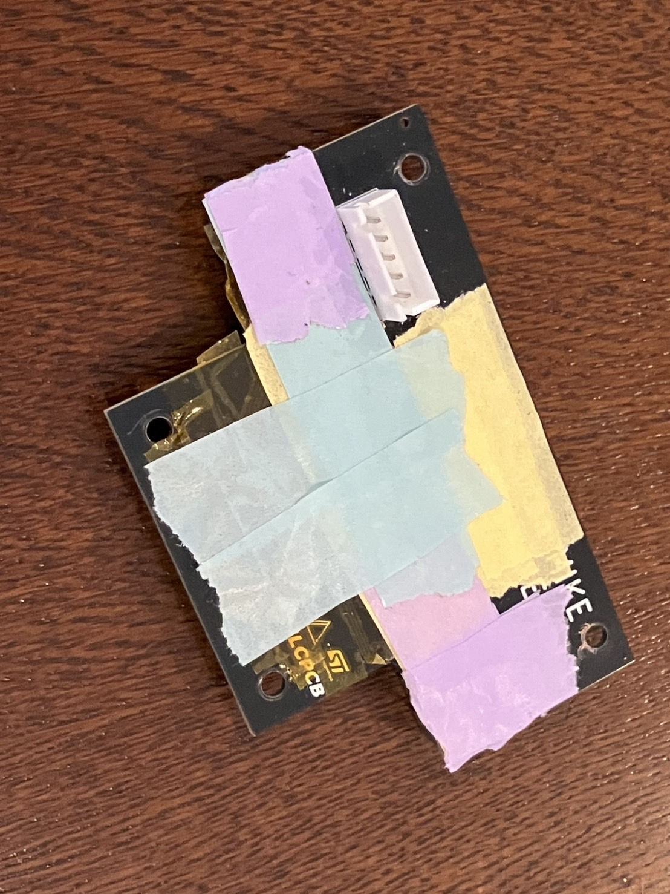

 

| 部品                       | 数  |
| -------------------------- | --- |
| サブマイコン STM32F446RE   | 1   |
| フォトリフレクタ LBR127HLD | 16  |
| デジタルカラーセンサ S9706 | 2   |
| フルカラーLED WS2812B      | 6   |

## MAIN基板
メインマイコンなどを搭載した基板です。

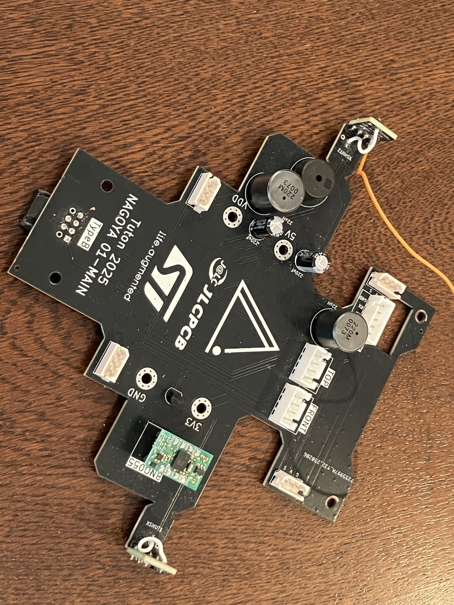
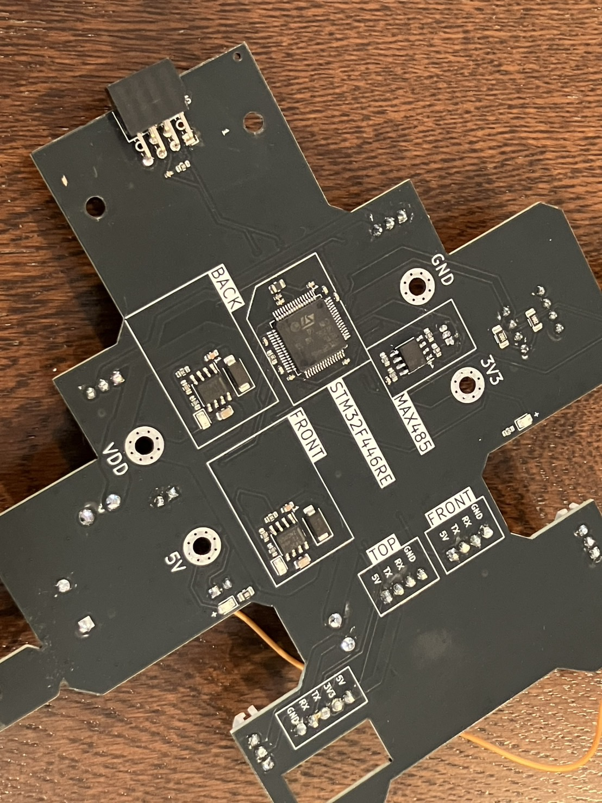

 

電源基板とスペーサで接続されており、スペーサを介して11.1V、5V、3.3V、GNDを受け取っています。

<blockquote class="twitter-tweet">
立体的でテンション上がる <a href="https://t.co/ow0Z18tEHJ">pic.twitter.com/ow0Z18tEHJ</a>
&mdash; shuji (@shuji_4649) <a href="https://twitter.com/shuji_4649/status/1891132369265905966?ref_src=twsrc%5Etfw">February 16, 2025</a></blockquote> 

 

UARTをMAX485でRS485みたいなものに変換してSTS3032と通信しています。
この変換回路は[秋月電子さんの資料](https://akizukidenshi.com/goodsaffix/feetech_digital_servo_20220729.pdf)を参考にしました。

| 部品                          | 数  |
| ----------------------------- | --- |
| メインマイコン STM32F446RE    | 1   |
| ジャイロセンサ BNO055         | 1   |
| 圧電スピーカ PKM13EPYH4000-A0 | 1   |
| RS485ドライバ MAX485          | 1   |
| ToFセンサ VL53L0X             | 2   |

## PWR基板
電源基板です。
ヒューズ・電圧計・電源スイッチに加え、5Vと3.3Vのレギュレータを搭載しています。
各種電源はMAIN基板にスペーサを介して送っています

この基板の上に銀のボールが落ちてきて一回基板が燃えたので、大会当日はマスキングテープで絶縁していました。

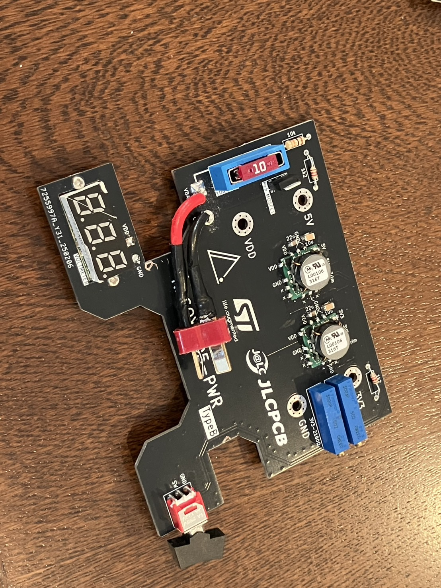
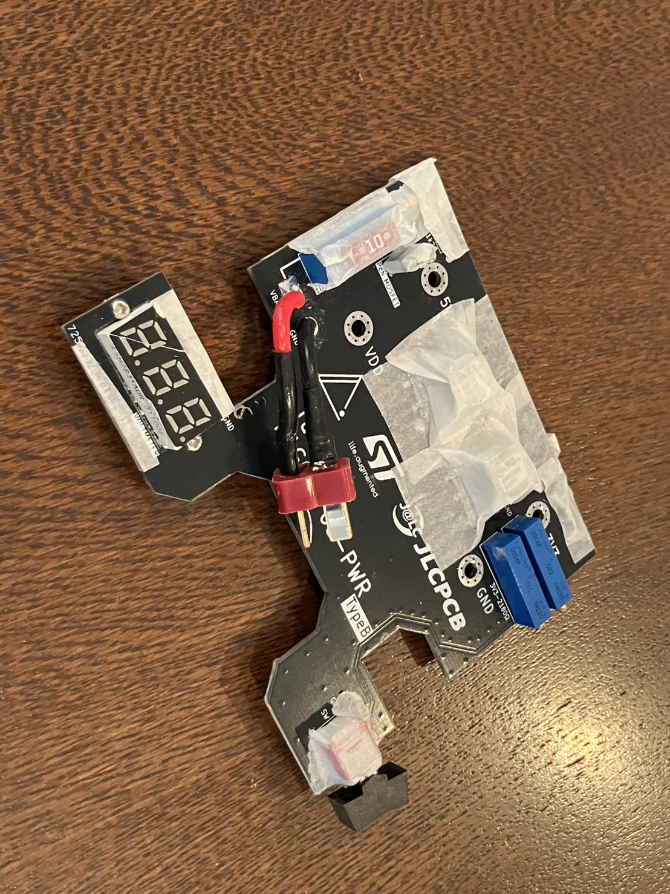

 

| 部品                          | 数  |
| ----------------------------- | --- |
| DCDCコンバータ OKL-T/6-W12N-C | 2   |

## FRONT基板
ロボットの正面についている基板です。
ToFセンサを5つと、それらの状態表示のためのフルカラーLED5つを搭載しています。

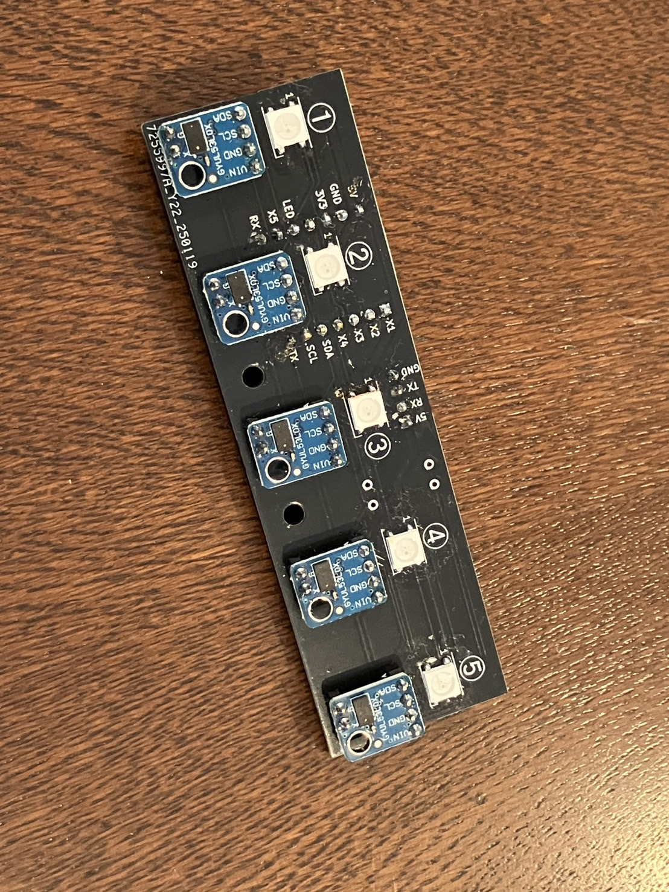
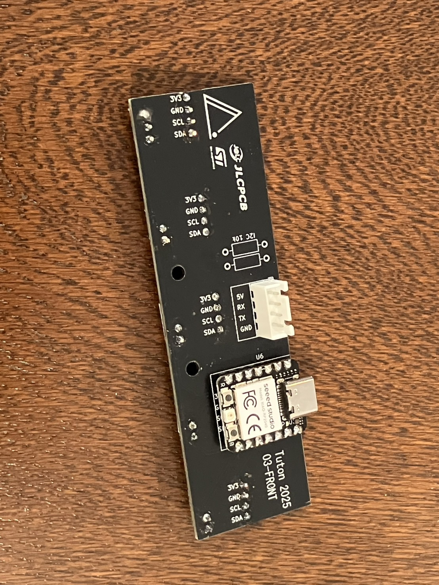

 

この基板のせいで色々と問題が発生しました。
MAIN基板へToFの値をUARTで垂れ流しているのですが、時々それが止まるのです。
I2Cがフリーズしたのかマイコンにリセットがかかったのか、原因は未だ不明です。
ノイズ対策でコンデンサを載せたりしましたがあまり効果は見られませんでした。

ソフトウェアを工夫して何とか発生頻度を抑えることができましたが、大会直前の準備時間の多くをこれの対策に取られてしまったことは大きな敗因の一つかもしれません。

予算削減のためにSTM32ではなくXIAO RP2040を使用したのが良くなかったのかもしれないです。

| 部品                     | 数  |
| ------------------------ | --- |
| サブマイコン XIAO RP2040 | 1   |
| ToFセンサ VL53L0X        | 2   |
| フルカラーLED WS2812B    | 5   |

## RESCUE基板
二層目と一層目を接続するための基板です。
二層目の基板と、サーボモータ等を集約し、メイン基板と通信します。

左右にToFセンサをつけたのですが、結局使いませんでした。

オレンジと黒の配線は、後から付け足したものです。アームの先にタッチセンサを取り付けるために大会直前につけました。

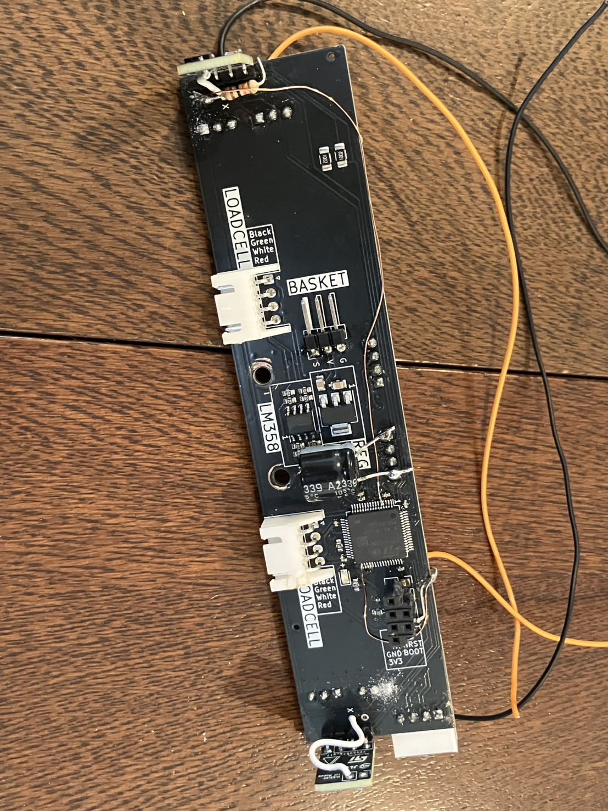
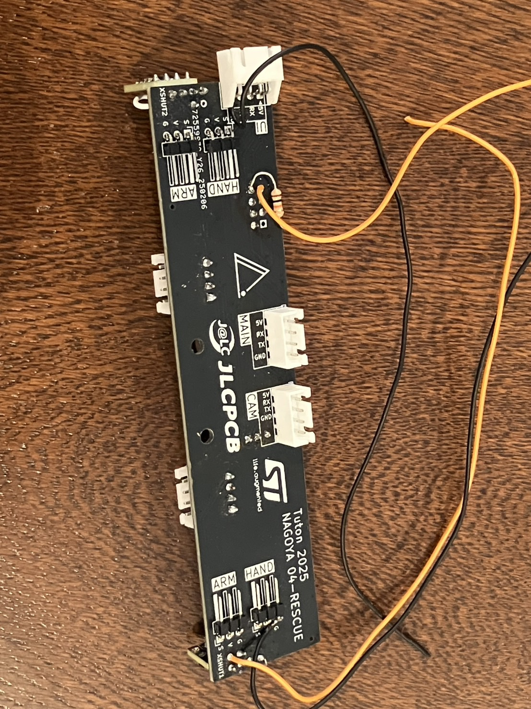

 

| 部品                     | 数  |
| ------------------------ | --- |
| サブマイコン STM32F103RC | 1   |
| ToFセンサ VL53L0X        | 2   |

## UI基板
ディスプレイ、フルカラーLED、タクトスイッチを搭載しています。

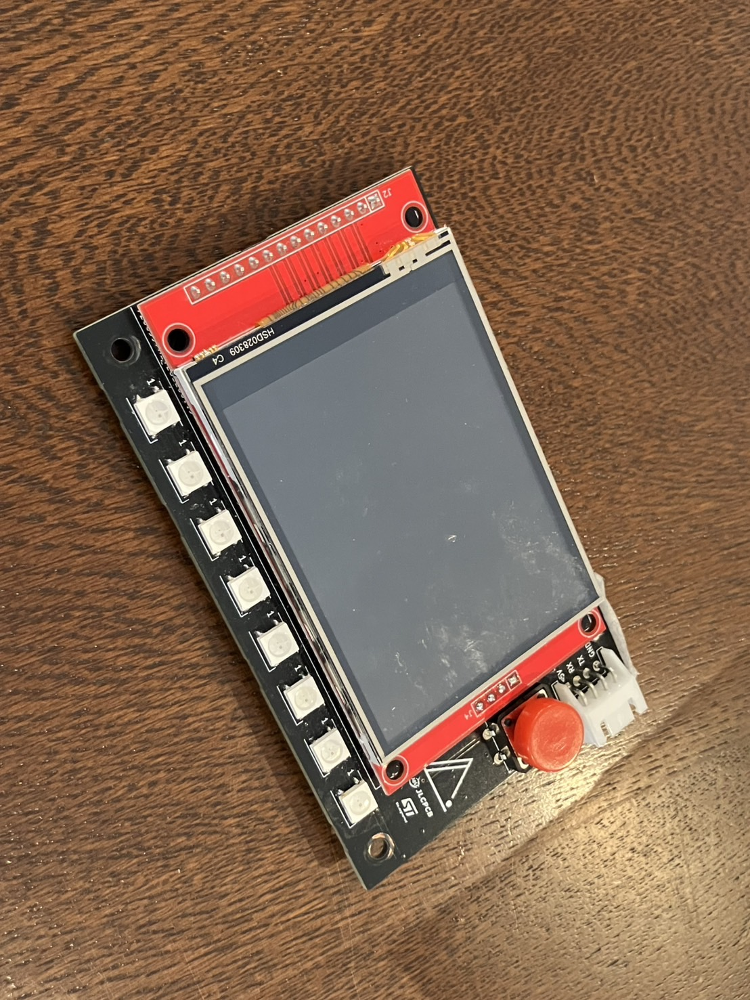

開発を後回しにしていて、会場に向かう新幹線の中でプログラムを書いたのですが、会場についてロボットに接続してみると動作が不安定だったので練習含め大会では一切使用しませんでした......
<blockquote class="twitter-tweet">
新幹線でUI作ってる <a href="https://t.co/ZNHK84N0OR">pic.twitter.com/ZNHK84N0OR</a>
&mdash; shuji (@shuji_4649) <a href="https://twitter.com/shuji_4649/status/1905436496175530360?ref_src=twsrc%5Etfw">March 28, 2025</a></blockquote> 

 

| 部品                       | 数  |
| -------------------------- | --- |
| サブマイコン XIAO RP2040   | 1   |
| タッチディスプレイ MSP2807 | 1   |
| フルカラーLED WS2812B      | 8   |

## OpenMVシールド
OpenMVにはめます。
基板と言えるほどの機能はないです。
UARTをXHに引き出しています。

# 基板の特徴
CMSに記入した内容をこちらで紹介します。
今年1年間、基板の開発を行う上で考えたことはかなり書いたつもりです。

## コンセプト
- 私たちのロボットは15cm×15cmほどの大きさなので、スペースにあまり余裕がありません。

- さらに、私たちのロボットは2層構造となっているのですが、重心を下げるためにライントレースのための機構はすべて1層目に詰め込むことにしました。

- そのため、スペースをできる限り削減するために、以下のような工夫を行いました。

### マイコンボードではなく、チップを表面実装する
- 当初は、Raspberry Pi PicoやTeensy4.1、ESP32C3などのマイコンボードの使用を予定していたのですが、このサイズに収めるにはマイコンボードは大きすぎました。
- そこで、STM32マイコンを表面実装することにしました。回路設計の知識がほとんどないところから始めたので、STM32の周辺回路の設計などには苦労しましたが、データシートを見たりインターネットで調べたりしながら、なんとか技術を身に着けることができました。

### 配線を最小限にする
- レスキューラインではたくさんのセンサーがそれぞれ離れた位置で必要となるため、配線の数が多くなりがちです。しかし、配線が多いとスペースが必要となるだけでなく、整備性の低下や故障可能性の増加など多くのデメリットがあります。
- 私たちは、センサを基板に直接実装したり、基板やセンサの配置を適切に考えることによって、配線の数を減らす努力をしました。
- 最終的に、モータやバッテリを除いた配線の数は7本まで抑えることができ、1層目と2層目の間は1本のケーブルで済むところまで簡略化することができました。
- ロボットの配線において最も厄介なのは電源線です。多くの電流が流れるため、太いケーブルや大きなコネクタを使用する必要があります。私たちはできる限りコンパクトにするために、電源基板からメイン基板に金属スペーサで直接電流を流す方式をとりました。

### 無いものは作る。
- 私たちが必要としてた性能のDCDCコンバータは、市販の製品では大きすぎました。そこで、TPS5430を使用したDCDCモジュールを自ら作成することにしました。これによって、7.2V・3Aという私たちが求めていたDCDCコンバータを、コンパクトなサイズで搭載することができました。
- 入手しやすいToFセンサはケーブルでつないで使用するものでしたが、私たちは安定性・省スペース化のために基板に直接実装できるものを求めていました。そこで、ピンヘッダを介して直接基板に実装できるToFセンサモジュールを自ら設計し、作成しました。

また、私たちはロボットの安定性や整備性を高めるために、以下のような工夫を行いました。

### 配線は全て5V・RX (TX)・TX (RX)・GND。
- 基板間の配線は、ラインセンサ基板・メイン基板間を除いて全てこのピン配置のXH4線ケーブルとなっています。
- マイコンやセンサ等に必要となる3.3Vは、それぞれの基板に搭載しているLDOで生成しています。そのため、1つの基板がショートなどの原因で壊れても、他の基板に影響が及びにくくなっています。また、このピン配置で統一すれば、もし誤って別の基板と接続してしまった場合でも基板が壊れることはありません。
- ラインセンサは3.3Vが1A程度必要なため、電源基板で生成した3.3Vを含めた5本線で接続しています。

### I2Cセンサは基板に直接実装する。
- I2Cはフリーズのリスクがあるため、ケーブルを介して通信することはしません。全て基板に直接実装しました。

### 基板内の配線にも気を配る。
- 当たり前のことですが、基板は多少の不具合では壊れないように設計されなければなりません。設計する際には、流れる電流の量を常に意識し、余裕を持ったパターン幅を保ちました。また、ノイズへの対策のため、すべての基板にベタGNDを施し、ビアも適切に配置しました。

### 状態表示
- ロボットが何を検知していて、どんな制御をしているかを開発者は把握できなければなりません。私たちは状態表示用に計13個のフルカラーLEDとディスプレイを搭載しており、ロボットのセンサの値や、現在進行中の処理などが一目で分かるようになっています。これは開発中はもちろん、大会中に戦略を考える際にも有効です。

### 基板のシルクに情報を載せる
- 基板にはシルクといって文字や画像を印刷することができます。
- 私たちは、ピンアサインやICの名前、1ピンの位置など、部品実装やプログラミングの際に必要となる情報をあらかじめ基板に印刷しています。
- これによって、コネクタの挿し間違えを防止したり、ソフトウェアの開発の効率を上げたりすることができました。
  

### 設計段階でミスをしない。
- ミスのある基板を発注してしまうと、後から基板を無理やり修正する必要があり、安定性の観点から望ましくありません。
- 絶対にミスをしないために、以下のような工夫を行いました。
  -  回路図をきれいに書く
     - ラベル機能を用いながら機能ごとにスペースを区切り、後から見やすい回路図を心がけました。
  - 何度も見直す
     - 回路図が完成した後、基板設計が完成した後は、必ず1日以上ミスがないか点検してから次のステップへと移ります。
     - これを実践することで、設計ミスを格段に減らすことができました。

### 必ずDRC（デザインルールチェッカー）を回す
- 過去に一度、部品のフットプリントを修正した後DRCを回さずに発注してしまい、後から修正を加えることになってしまいました。
- そのようなミスを防ぐため、発注直前に最新版の基板設計でDRCを回し、エラーがないか確認するようにしています。

以上の工夫を行うことで、安定性と機能性の高い基板を開発することができたと思います。

# さいごに

初めてプリント基板を設計してからちょうど1年間となりました。
人生初の基板発注でいきなりPCBAをしたり、STM32の回路設計に挑戦したり、フォトリフレクタを大量に搭載したりと無茶なことを繰り返してきましたが、1年間でここまで回路設計ができるようになれて良かったです。

部品の角度を90°間違えたり、フットプリントのピン配置を間違えたり、三端子レギュレータの発熱でマイコンを壊したり、電源の+と-を間違えたり、ショートして基板を燃やしたり、色々とやらかしてそのたびに違法建築をしてきましたが、今回の基板は致命的なミスを生むことなく制作することができました。

しかし、それでも今回も回路に由来する問題はゼロではありませんでした。
引き続き、いつでもどこでも安定して動作する回路を目指して基板制作に取り組んで行きたいと思います。

また、私はロボカッパーの先輩方の情報が無ければこれらの基板を作ることはできませんでした。積極的に技術を公開してくださったロボカッパーのみなさんに深く感謝しております。

私たちTutonの基板のデータはノード大会機から全国大会機まで全てこちらのGitHubで公開しています。ぜひご覧ください。

[https://github.com/tuton-RCJ/2025PCB](https://github.com/tuton-RCJ/2025PCB)

何か質問があれば私([@shuji_4649](https://x.com/shuji_4649))にDMください！できる限りお答えします。

それでは、Tutonの2026シーズンをお楽しみに。