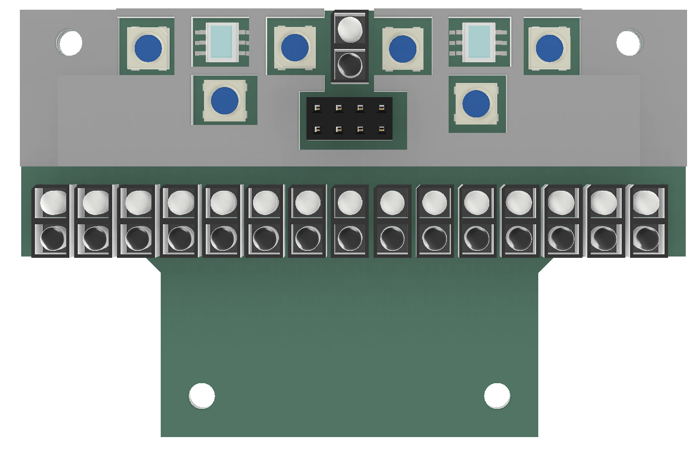

ライントレース部のソフトウェアを担当していたshujiです。

2025全国大会の機体「シロ」のライントレース部のソフトウェアの解説を行います。

レスキュー部は次回の記事で解説します。

# はじめに
ハードウェアについては、[ハードウェア解説](https://tuton-rcj.jp/20250405/)及び[基板解説](https://tuton-rcj.jp/20250427/)の記事をご覧ください。

OpenMVはOpenMV IDEにてMicroPythonで、その他のマイコンはPlatformIOにてArduino言語（C/C++）で開発しています。

私たちのソフトウェアは以下の通りGitHubで公開しています。

東東京ノード：[https://github.com/tuton-RCJ/Tokyo2025Software](https://github.com/tuton-RCJ/Tokyo2025Software)

関東ブロック：[https://github.com/tuton-RCJ/Kanto2025Software](https://github.com/tuton-RCJ/Kanto2025Software)

全国：[https://github.com/tuton-RCJ/NagoyaSoftware](https://github.com/tuton-RCJ/NagoyaSoftware)

センサ、アクチュエータはそれぞれクラスにしています。
また、メインのプログラムはmain.cpp、ライントレースのコード、レスキューのコードに分けています。

# ライントレース
純粋に黒いラインの上を走るアルゴリズムについて解説します。

ライントレースには16個のフォトリフレクタ（[LBR127HLD](https://akizukidenshi.com/catalog/g/g104500/)）を使用しています。

それぞれの値はAnalogReadで取得するのですが、その値を使うのではなく、閾値を設定しておき0と1のデジタル値に変換して使用します。このようにすることで、センサの個体差や環境による変動があったとしても、ロボットの動作が安定するようになります。

黒を認識したフォトリフレクタの位置の平均を求め、それをもとにP制御を行います。
ラインセンサの幅が長くコースアウトしづらいこともあり、簡略化するためにPID制御にはしていません。

このアルゴリズムでは黒の位置の平均を求めるため、直角の時に大きく曲がらなければいけないのにゲインが弱くなってしまいます。そのため、端のフォトリフレクタが反応している際には重心が端にくるようにしています。

1つ前に取り付けられているフォトリフレクタはトの字検知に使用しています。
普通にライントレースをしていると、直進しなければいけないトの字で曲がってしまいます。
そのため、このフォトリフレクタが黒を読んでいるときには直進するという制御を入れています。

該当コードは[こちら](https://github.com/tuton-RCJ/NagoyaSoftware/blob/90e95ef26de0b2b371477f2cff6409af109c27ff/01-MAIN/src/linetrace.cpp#L99C1-L221C1)

# ギャップ
特に何もしていません。
先ほど述べた通り、ライントレースはデジタル値で行うので、全て白を読んでいる際には直進します。

# バンプ
特に何もしていません。
バンプとラインセンサの距離が近くなって交差点などと誤認識するというチームもいると聞きましたが、私たちはタイヤが地面に接する位置にラインセンサを配置しているため、地面との距離が一定になっており、そのような問題は発生しないようになっています。

# 交差点

交差点は2つのカラーセンサで行います。
カラーセンサはデジタルカラーセンサの[S9706](https://akizukidenshi.com/catalog/g/g102493/)を使用しています。

カラーセンサ用のLEDにはフルカラーLED・NeoPixelの[WS2812B](https://akizukidenshi.com/catalog/g/g107915/)を使用し、白（#FFFFFF）ではなく黄色（#FFFF00）を使用しています。
これは、RescueLineでは緑・赤・黒・白のみを判別できればよく、青成分は不要だからです。
（青があるのと無いのとでどれだけ精度に差が出るのかは正直よくわかりません）

交差点は、カラーセンサが黒を読み取った際に時刻情報をもとに判断しています。緑・赤・黒・白の最終更新時刻を保存しておく配列を用意しておき、カラーセンサの値を取得するたびに、読み取った色の最終更新時刻を現在時刻に更新します。黒を読み取った際に、緑の最終更新時刻が決められた時間（400ms）以内であれば緑マーカがあると判断します。

緑を読み取った際に処理を行う方法だと、両緑や交差点の置くにある緑を判別するためにコードが複雑になってしまいますが、このアルゴリズムなら全てのケースを簡単に処理できます。

- [センサの値を処理するコード](https://github.com/tuton-RCJ/NagoyaSoftware/blob/90e95ef26de0b2b371477f2cff6409af109c27ff/01-MAIN/src/device/sensor/LineUnit.cpp#L91-L142)
- [センサの情報をもとに交差点を判別するコード](https://github.com/tuton-RCJ/NagoyaSoftware/blob/90e95ef26de0b2b371477f2cff6409af109c27ff/01-MAIN/src/linetrace.cpp#L231-L369)

# 障害物

障害物は前方に取り付けられたロードセルバンパーで行います。
ロードセルは500gを使用しましたが、おそらく1000gの方が良いです。

障害物を検知すると、側面に取り付けられたToFセンサを用いて黒線を読み取るまで回避します。

ToFセンサの値に応じた4種類の動作を用意してあり、障害物に沿って走るようにしました。

この動作の調整はとても大変でした。うまく調整しないとその場で回転し続けたり、障害物から遠く離れていったりしてしまいます。直進と旋回をうまく組み合わせることで成功率を高めることができました。

また、黒線を発見した際には、復帰する前に少し下がるようにしています。この処理を入れることで、黒線に復帰できる確率がかなり高くなります。

<iframe width="560" height="315" src="https://www.youtube.com/embed/07-pMuRYd20?si=PlpPBblXWjEOWYpS&amp;start=361" title="YouTube video player" frameborder="0" allow="accelerometer; autoplay; clipboard-write; encrypted-media; gyroscope; picture-in-picture; web-share" referrerpolicy="strict-origin-when-cross-origin" allowfullscreen></iframe>

 

該当コードは[こちら](https://github.com/tuton-RCJ/NagoyaSoftware/blob/90e95ef26de0b2b371477f2cff6409af109c27ff/01-MAIN/src/linetrace.cpp#L371-L442)

# 坂

基本的には低重心なハードウェアの力で坂道は突破できます。
しかし、坂道上の交差点処理などはどうしても滑ってしまうため、ジャイロセンサで坂道の向きを検知し、処理を行っています。

また、下り坂が滑って大きく振動するので、スピードとゲインをかなり下げています。

# シーソー
スピードを上げたらシーソーの勢いで転がってしまうことがありました。
そのため、角度が急に上りから下りに変わった際には一時停止するようにプログラムしました。

<iframe width="560" height="315" src="https://www.youtube.com/embed/07-pMuRYd20?si=FQ6ZyNt7Lvx_V6k3&amp;start=385" title="YouTube video player" frameborder="0" allow="accelerometer; autoplay; clipboard-write; encrypted-media; gyroscope; picture-in-picture; web-share" referrerpolicy="strict-origin-when-cross-origin" allowfullscreen></iframe>

 

# ゴール
カラーセンサが赤を読んだら止まるだけです。

# おわりに

今回の機体のコンセプトとして、「ソフトウェアのことを考えたハードウェア設計をし、ソフトウェアをできる限り単純にする」というものがありました。

実際に、センサの数を増やしたり、配置を工夫することで、ライントレースや交差点などは本当に単純なプログラムで処理できるようになりました。

かつてLEGOのカラーセンサ2つだけでやっていた頃は、交差点の処理などがかなり複雑になってしまっていました。それはそれで楽しいのですが、ハードウェアを工夫することでソフトウェアをシンプルにするというアプローチはRescueLineにおいて重要なものなのではないかと思います。

次の記事ではレスキューのソフトウェア解説を行う予定です。お楽しみに！

質問などはTwitterのDMでお待ちしております。

# おまけ

個人的な意見なのですが、最近の世界大会のコースを完走するにはライントレースをカメラで行わないといけないような気がしています。
ルール上、バンプが片方側のみにあったり、黒線が引いてあるところだけバンプが置かれたり凹んでいたりする可能性があり、ラインセンサから地面までの距離は±1cmの幅で変化します。このような状況で、ラインを反射光の強さだけで検知するのはかなり厳しいと思います。実際に世界大会ではバンプが無作為に置かれていたり、坂道に斜めに入っていくコースが多く見られ、フォトリフレクタでは一筋縄では行けないのではないかと思います。

海外のチームを見ると、ドイツを中心にカメラでライントレースを行っているチームが多く見られます。

Overengineering²（2024世界大会優勝）
[https://youtu.be/x7Rn8mP2tpE](https://youtu.be/x7Rn8mP2tpE)

BioBrause（2025GermanOpen準優勝）
[https://youtu.be/2sUwoBTTuJk](https://youtu.be/2sUwoBTTuJk)

BitFlip
[https://youtu.be/bpvtpoIt90E](https://youtu.be/bpvtpoIt90E)

日本でもカメラでライントレースするチームが増えていくといいなと思います。

関東ブロック大会に出場していたテクノトルクス（[https://techno-robocup.github.io/](https://techno-robocup.github.io/)）はカメラでライントレースとレスキューを行っていました。
来年も出場するようなので頑張ってほしいなと思います。