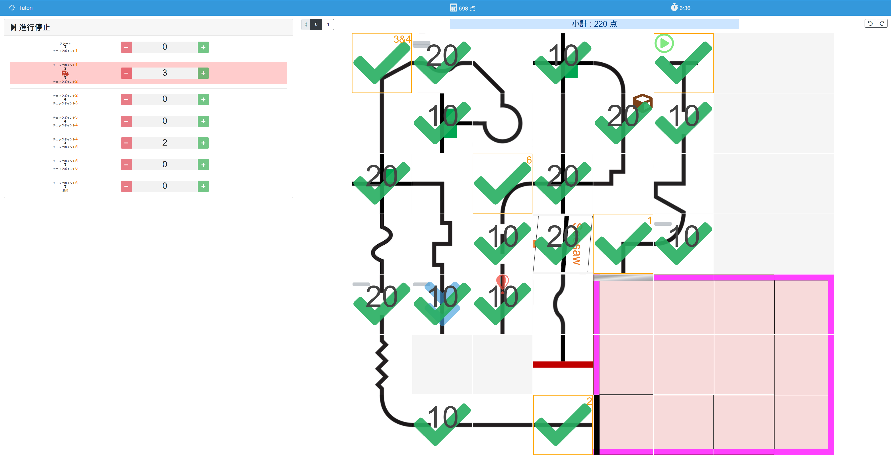
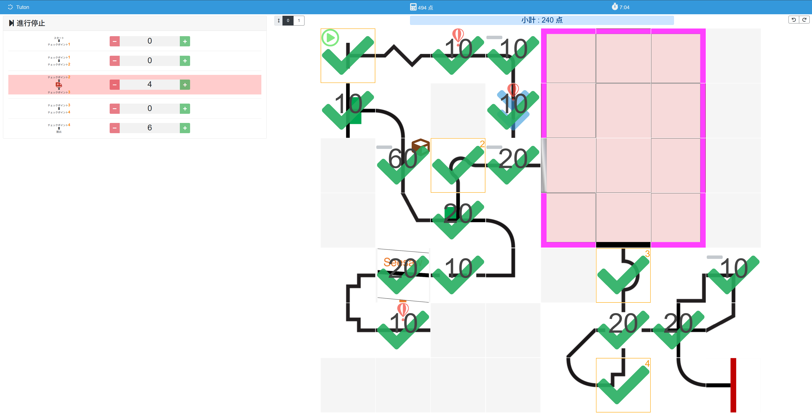
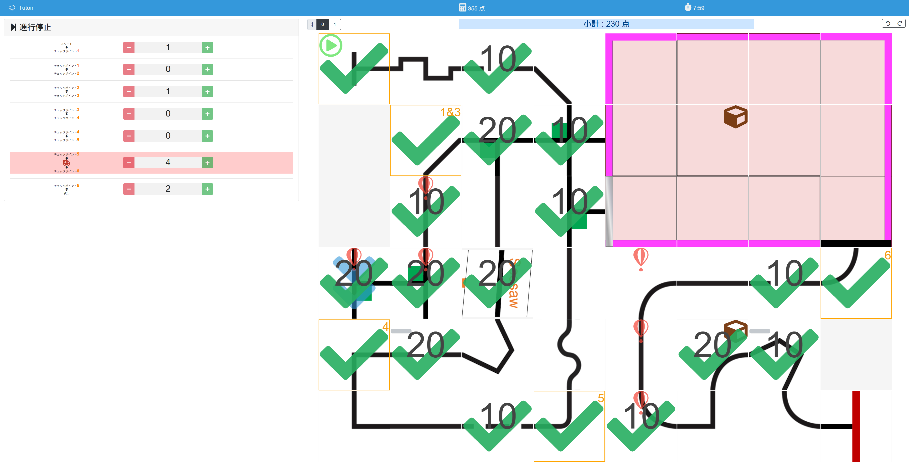
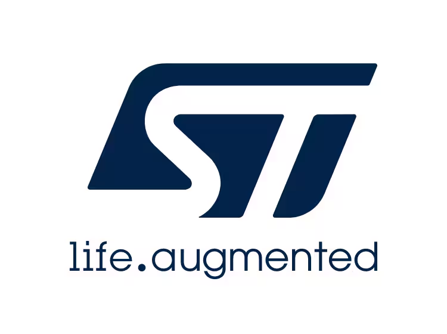

こんにちは。キャプテンのshujiです。
私たちTutonは、3/28~30にかけて行われたRoboCupJunior Japan Open 2025 Nagoyaに出場しました。
この記事では、全国大会と、1年間の活動について振り返りをします。

# 結果

| 走行   | 点数   | 救助 | 時間  | 進行停止 |
| ------ | ------ | ---- | ----- | -------- |
| 一走目 | 698点  | 2人  | 6:36  | 5回      |
| 二走目 | 494点  | 1人  | 7:04  | 10回     |
| 三走目 | 355点  | 0人  | 7:59  | 8回      |
| 合計   | 1547点 | 3人  | 21:39 | 23回     |

- 順位:2位🥈
- ハードウェア奨励賞
- 秋月電子通商賞

# 機体について
今回、私たちは「シロ」と名付けたこの機体で大会に出場しました。

機体の解説は、以下の記事をご覧ください。

- [ハードウェア解説記事](https://tuton-rcj.jp/20250405)
- [基板解説記事](https://tuton-rcj.jp/20250427)
- [ソフトウェア解説記事①ライントレース編](https://tuton-rcj.jp/20250507)
- [ソフトウェア解説記事②レスキュー編](https://tuton-rcj.jp/20250511)

今回のコンセプトは、「優秀なハードウェアでソフトウェアを単純に」です。

センサが適切な数だけ適切な位置に配置されていれば、ロボットは無駄な動きをする必要がなく、ソフトウェアをシンプルにすることができます。
ロボットを小さなサイズ（16cm四方程度）に収めれば、ライントレース中に壁にぶつかる心配などが無くなり、ソフトウェアで考えることが少なくなります。

このようなことを意識することで、無駄のないソフトウェアを実現することを目指しました。

また、私たちはオープンソースを心がけ、プログラムや基板データなどをGitHubにて公開しています。 
ぜひ[こちら](https://github.com/tuton-rcj)からご覧ください。

ポスターやエンジニアリングジャーナルには載っていない、直前に修正した箇所がいくつかあるので紹介します。
（大会中のロボット画像がこれしかなく、大会後すぐにロボットは分解されたので写真がこれしかありません、ごめんなさい）

 

- とにかく基板にマスキングテープを貼りました。一度銀ボールが電源基板の上に落ちて燃えたので、ショート対策です。
- 大会3日前くらいにアームの先にタッチセンサをつけました。これは壁際にボールがある時でも回収できるようにするためのものです。
- 大会1日目にバンパーにグルーガンを塗りました。後述しますが、壁にぶつかっても乗り上げないようにするためのものです。
- 一走目のあとに前にガムテープで作ったほうきを取り付けました。つまようじ対策です。

# 大会の様子

## 調整
全国大会は調整日、競技一日目（一走目・二走目）、競技二日目（三走目・表彰式）の3日間で行われます。

調整日は、まず車検を行いました。
基本的に問題なく通過しました。（VL53L0Xが本当にVL53L0Xなのか聞かれました、部品に印字されていないので大きさを測ってもらって認めていただきましたが、これに関してはどうしようも無い気がします......）

車検後はフィールドで調整を始めます。
カメラを分離し、ライントレースの閾値の調整とカメラの物体検出の調整を同時並行で行いました。

私たちのロボットは壁に正面からぶつかることで壁の検知や角度の修正をするのですが、レスキューの壁がすべりやすく、乗り上げてしまう事が判明します。
そこで、バンパーにグルーガンを塗り、摩擦力を上げることで対応しました。

夜はねるねるねを作ったりしながら、細かい調整をしていました。

<blockquote class="twitter-tweet">
みんなでねるねるねるね <a href="https://t.co/AO209TJLbe">pic.twitter.com/AO209TJLbe</a>
&mdash; shuji (@shuji_4649) <a href="https://twitter.com/shuji_4649/status/1905596570411958308?ref_src=twsrc%5Etfw">March 28, 2025</a></blockquote> 

 
## 一走目

<iframe width="560" height="315" src="https://www.youtube.com/embed/07-pMuRYd20?si=jzgdxdoRBsh8rKba" title="YouTube video player" frameborder="0" allow="accelerometer; autoplay; clipboard-write; encrypted-media; gyroscope; picture-in-picture; web-share" referrerpolicy="strict-origin-when-cross-origin" allowfullscreen></iframe>

 

 

一走目は13:20〜 Hフィールドでした。

走行の様子について詳しく見ていきます。

レスキューゾーンまでは問題なくたどり着きました。

レスキューゾーンでは、1人目の被災者は救助できましたが、2人目の被災者の際にカメラが上手く動作せず、進行停止を行いました。

進行停止後、2人目の被災者を救助し、黒の被災者を発見できましたが、前方のToFセンサが誤作動を起こしたために救助を行えず、2回目の進行停止を行いました。

リスタートさせましたが、黒は向きが良くなかったのか認識できませんでした。本来は銀も黒も見つからなかった際は壁伝いに脱出するはずでしたが、カメラがチェックポイントのマーカーを赤コーナーと誤認識したために脱出できず、3回目の進行停止を行いレスキューゾーンをストップしました。

(全くボールが見つからなかった際は、赤コーナーに直進した後に黒ボールを放出した後と同じ動作をするようにしていました。
プログラムを使いまわそうとしてこのような動作にしたのですが、今思えば普通にその場から壁伝いに走るべきでした。)

レスキューゾーンの後はスムーズに走行していたのですが、つまようじが撒かれていた所でライントレースができずコースアウトしてしまいました。

進行停止を繰り返し、うまくつまようじの位置が動いたのか3回目で走り抜けることができました。

関東ブロック大会では瓦礫はなく、練習していた時もうまく動いていたのであまり意識をしていなかったのですが、絶対にdebris対策はつけておいたほうがよいです。一走目のあとにガムテープでほうきをつけました。

その後は進行停止無しでゴールまで走りました。

結果は698点。Tutonの歴史からすると間違いなく最も良い結果でしたが、決して納得のいく点数ではありませんでした。

## 二走目

<iframe width="560" height="315" src="https://www.youtube.com/embed/kEg0Ikslxp0?si=LqsVT7zb0h_xr1mb" title="YouTube video player" frameborder="0" allow="accelerometer; autoplay; clipboard-write; encrypted-media; gyroscope; picture-in-picture; web-share" referrerpolicy="strict-origin-when-cross-origin" allowfullscreen></iframe>

 

 

二走目は15:30〜 Gフィールドでした。

レスキューゾーンまでは進行停止無しでたどり着きました。

1人目は救助できたのですが、2人目が壁際にあったためにうまく回収できず、進行停止を行います。

（壁際でも回収できるような対策をしていたつもりなのですが、壁とかなり平行に入ってしまって取り損ねてしまいました。）

2回目・3回目は別の原因で銀被災者を回収できず、レスキューゾーンをスキップします。入口から銀被災者を探す際、周りの風景を誤認識しないように後ろ180°は判定しないようにしていました。
しかし被災者がちょうどロボットから見て右90°付近にいたため、カメラでは検出できていたのに見逃してしまった可能性が高いです。

スキップした後何事もなくゴールすると思ったのですが、ここで直角が曲がれないというハプニングが起こります。今まで一回もこのようなことが起きたことはありませんでした。

6回の進行停止を経て、何とかゴールすることができました。

結果は494点。満点の取れるコースのはずだっただけにかなり悔しい結果となりました。

このあと実験すると、左に曲がる直角が怪しいことが分かりました。スピードを下げたらおさまったので三走目ではスピードを落としました。
ラインセンサの調子が悪くなったのでしょうか？

また、入り口で後ろを見ない条件をゆるくしました。

## 夜

例年の傾向から三走目はレスキューゾーンに障害物が置かれると予想していました。
障害物ありのレスキューゾーンのプログラムはまともに書いていなかったため、徹夜で書くことになりました。

私はこの日人生で初めての完徹をしたのですが、徹夜は良くないですね。普段なら10分で書けるプログラムが1時間かかります。

ねるねるねるねを作ったりしながらプログラムを書き、どうにか障害物があってもレスキューできるようなプログラムを完成させました。

<blockquote class="twitter-tweet">
<a href="https://t.co/hf7qb9t265">https://t.co/hf7qb9t265</a> <a href="https://t.co/qhxHGihD4Z">pic.twitter.com/qhxHGihD4Z</a>
&mdash; shuji (@shuji_4649) <a href="https://twitter.com/shuji_4649/status/1905978639843525014?ref_src=twsrc%5Etfw">March 29, 2025</a></blockquote> 

## 準備
さて、徹夜してプログラムを書いたわけですが、徹夜で頭が半分動いていない状態で書いたプログラムなので、とことんバグり散らかします。

結局、夜に書いたプログラムはすべてコメントアウトし、その場で単純だが万能ではない手法に切り替えました。

そんなこんなであっという間に三走目の時間になりました。

## 三走目

<iframe width="560" height="315" src="https://www.youtube.com/embed/eSvQA8VTNMM?si=9iHClkgYWrb5njKO" title="YouTube video player" frameborder="0" allow="accelerometer; autoplay; clipboard-write; encrypted-media; gyroscope; picture-in-picture; web-share" referrerpolicy="strict-origin-when-cross-origin" allowfullscreen></iframe>

 

 

2日目の競技後に、成績順に時間を指定することができたので、一番最後の枠を選択していました。1位のEV3おばけと同時に走行しました。

最初の方でラインセンサがフリーズして止まります。これに関しては原因がわかりません。UARTの通信で不具合が起きたのでしょうか。練習の時も1,2回発生した覚えがあります。

坂上交差点は無事に通過します。ここは自信があったので嬉しかったです。

しかし下り坂から降りるところでライントレースができず、進行停止をしてしまいました。坂道と平地の移り変わりのところのラインが曲がっていると、ラインセンサの片方が浮いてしまってうまくライントレースができません。
上り坂については対策プログラムを書いていたので上れたのですが、下り坂のプログラムを書いていなかったので対応できませんでした。これを対策しようとするとメイズでみられるような車体を前後でひねる機構などが向いているのでしょうか。

二回目はうまくラインにのってくれました。
その後はレスキューゾーンまでノーミスでたどり着きます。

ここで問題が発生します。
アームが引っかかって降りません。
ボールが回収できません。
三回目の進行停止でアームが降りましたが、今度は距離センサがバグります。
四回目、またアームが降りません。
泣く泣くレスキューゾーンはスキップしました。

その後、障害物を通過したところでまたラインセンサが暴走し、進行停止をしたりしているとタイムオーバーとなってしまいました。

結果は355点。レスキューゾーンは何とか上手く救助できそうな配置だったのに、アームが引っかかって降りないという単純なミスによって機会を失ってしまったことが悔やまれます。

ぎりぎりまでプログラムを書いていて、走行前にロボットを落ち着いて点検できなかったことが原因です。

合計は1547点、1位に212点足りず2位で終わってしまいました。

小さなミスが点数を大きく左右することを、この三回の走行を通じて痛感しました。

# 反省

今回の失敗は、どれもロボットが全く対応できないものではなく、むしろ普段の練習であれば高確率で対応できていたものでした。

1年間、安定性を追求して開発してきたつもりでしたが、まだまだそれが足りていないことを突きつけられました。

ハード、回路、ソフトのそれぞれの反省を踏まえ、さらに強い、そして安定したロボットを作れるように精進して参ります。

# 1年間の活動について

エンジニアリングジャーナルは以下の通りGitHubで公開しています。
43ページありますが、ほとんど画像なのでそこまで多くは無いと思います（世界大会に出場しているチームだと余裕で100ページを超えてきます...）
かなり雑ですが、なんとなく開発の雰囲気はわかると思うのでよければご覧ください。

- [エンジニアリングジャーナル](https://github.com/tuton-RCJ/document/blob/main/Nagoya2025/Tuton2025EngineeringJournal.pdf)

エンジニアリングジャーナルを見ると、設計のやり直しがかなり頻繁に起きていることが分かると思います。初めての自作機体だったこともあり、いろいろと無茶な挑戦をしたり作ってみて初めて分かることが多かったりして、その都度設計を大きく変えていました。

# ポスターについて

ポスターはこちらになります。

エンジニアリングジャーナルとCMSのフォームに時間をかけていたら、ポスターを作る時間が無くなってしまいました。
あまり作り込めず最優秀プレゼンポスター賞が取れなかったのは悔しいです。

PDF版はGitHubで公開しています。

- [ポスター](https://github.com/tuton-RCJ/document/blob/main/Nagoya2025/Nagoya2025Poster.pdf)

# スポンサー紹介
Tutonの活動を支えて頂いたスポンサー企業様を紹介します。

## JLCPCB
今回の基板及びCNC加工は全てスポンサーのJLCPCB様に発注させていただきました。

[JLCPCBのホームページはこちら(https://jlcpcb.jp/)](https://jlcpcb.jp/)

JLCPCBは、中国に拠点を持つPCB（プリント基板）のプロトタイプ製作を中心に、CNC加工や3Dプリントなど幅広い製造サービスを提供する企業です。
特に、標準サイズの基板を5枚でわずか$2から製作可能という、非常にリーズナブルな価格設定が大きな魅力です。また、経済的な送料プランも用意されており、日本への配送も迅速かつ確実です。

さらに、低価格ながら製品の品質は申し分なく、個人での電子工作や競技ロボット制作に最適なサービスを提供してくださいます。ぜひみなさんもJLCPCBさんをご利用してみてはいかがでしょうか。　

表面実装（PCBA）で発注する方法は[こちらの記事](https://tuton-rcj.github.io/20241030/)で解説しています！

CNCを発注する方法は[こちらの記事](https://tuton-rcj.github.io/20240419/)で解説しています！

## STマイクロエレクトロニクス

[STマイクロエレクトロニクスのホームページはこちら(https://www.st.com/content/st_com/ja.html)](https://www.st.com/content/st_com/ja.html)

STマイクロエレクトロニクスは、スイスに本社を置く、STMマイコンやセンサなどの半導体製品を販売している企業です。

このたび、[ユニバーシティ・プログラム](https://www.stmcu.jp/university/)にて、NucleoF446RE、NucleoF303K8、STM32F446REなどを提供していただきました。

私たちのロボットにはSTM32F446REをはじめとする多くのSTM32マイコンを使用しています。基板の制作や試作・実験などで、大いに活用させていただきました。

STM32に関する初心者向けの記事を公開しております。STM32の使用を検討している方はぜひご覧ください。全てQiitaです。

- [PlatformIOでArduino言語を使ってNucleoボードを動かす](https://qiita.com/shuji4649/items/deaafcbbcd064dc9000a)
- [使いたいSTMマイコンがPlatformIOにないときに。](https://qiita.com/shuji4649/items/6f86d65fc1442101d06d)
- [Nucleo-F446REを使ってみよう](https://qiita.com/shuji4649/items/f62686b81231221fe21c)
- [Nucleo-F303K8を使ってみよう](https://qiita.com/shuji4649/items/e0ff84c6e8c93a1ff5c7)
- [STM32マイコンの選択](https://qiita.com/shuji4649/items/bb5a30f0cea2839f9439)
- [STM32F446REの回路設計](https://qiita.com/shuji4649/items/97c04d6bb28ea41e71ba)
- [STM32のUART【Arduinoフレームワーク】](https://qiita.com/shuji4649/items/19dbf2c1587a0ab71121)

## SK本舗

[SK本舗のホームページはこちら(https://skhonpo.com/)](https://skhonpo.com/)

SK本舗は、光造形方式を中心とした3Dプリンターを販売している企業です。

このたび、[学生支援事業](https://skhonpo.com/pages/school-support-3dprinter)にて、光造形3Dプリンターを提供していただきました。

積層型3Dプリンタとうまく使い分けながらロボットの部品製作に活用させていただきました。

いつか光造形3Dプリンターについての記事も公開したいと思います。

# おわりに

残念ながら世界大会への出場は叶いませんでしたが、大会を通じて多くのことを学ぶことができました。
大会を支えてくださったスタッフのみなさま、交流してくださったロボカッパーのみなさま、スポンサーのみなさま、顧問の先生、ありがとうございました。

これにてTutonの2025シーズンは終了です。2026年、Tutonはさらに強くなって帰ってきます。全国大会でみなさまとまたお会いできることを楽しみにしています。

これからもよろしくお願いします。

質問は[XのDM](https://x.com/tuton_RCJ)や[マシュマロ](https://marshmallow-qa.com/wvxcgdpm90lzfzr)にお願いします。可能な限りお答えします。