お久しぶりです！回路担当のshujiです。

ついに！メイズの初号機が完成しました！！

ここでは基板についての紹介に加えて、機体の様子を少しだけお見せします！

## JLCPCBの紹介

[JLCPCBさんのホームページはこちら(https://jlcpcb.jp/)](https://jlcpcb.jp/)

今回発注したものを含む私たちのロボットの基板やCNC部品は全てJLCPCB様にスポンサーとして提供いただいています。

JLCPCBは基板やCNCなどを取り扱っている中国の製造会社です。高品質で低価格、そして迅速な配達が特徴で、個人や学生チームのロボット開発にとてもぴったりな企業です！

JLCPCBでは非常にたくさんの部品から選んで表面実装までしてもらうことができるため、高性能なロボットを作るのにとても役立っています。

新規ユーザーは$60ほどのクーポンがもらえるので、初めての方もぜひJLCPCBで発注してみてください！

表面実装で発注する方法は[こちらの記事](https://tuton-rcj.github.io/20241030/)で解説しています！

CNCを発注する方法は[こちらの記事](https://tuton-rcj.github.io/20240419/)で解説しています！

## 発注した基板
今回は3つの基板を作っていただきました。

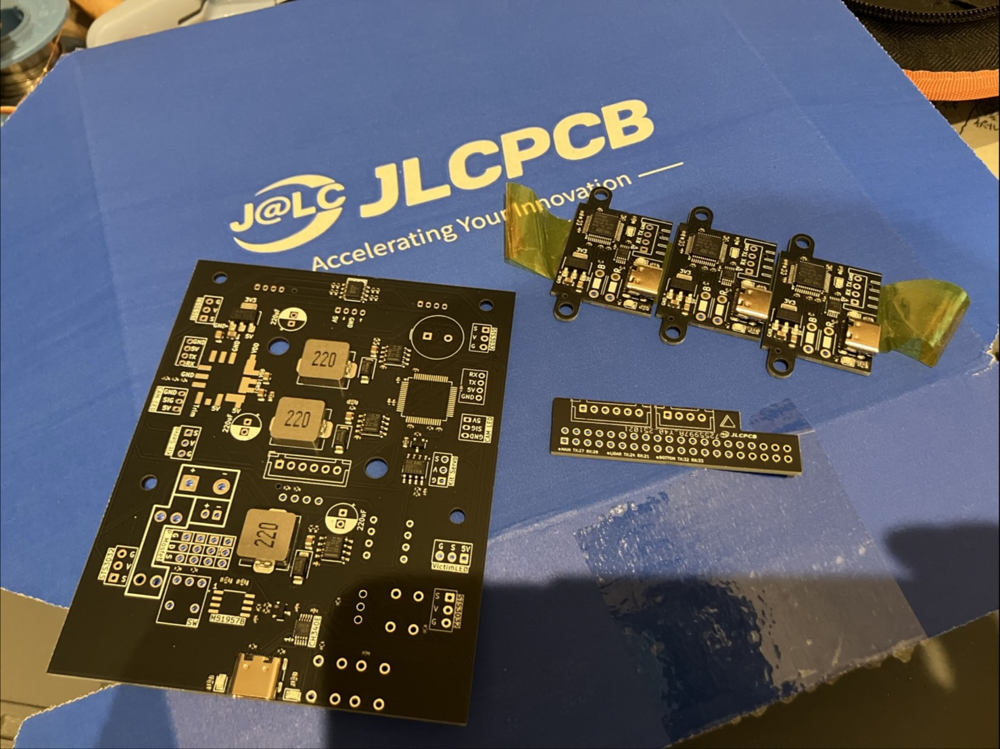

 

- 01-MAIN基板
  - メイン基板。各種センサやアクチュエータをまとめ、RaspberryPiとやり取りする。
- 02-BOTTOM基板
  - ロボット底面に取り付ける基板。カラーセンサを搭載し、床の色の判別を行う。
- 04-RPi基板
  - RaspberryPiに取り付ける基板。02-BOTTOM基板、01-MAIN基板とRaspberryPiを繋げる。

（当初は03-CAM基板も作る予定でしたがなくなりました）

01-MAIN基板、02-BOTTOM基板はPCBAまでしていただきました。

## 01-MAIN基板

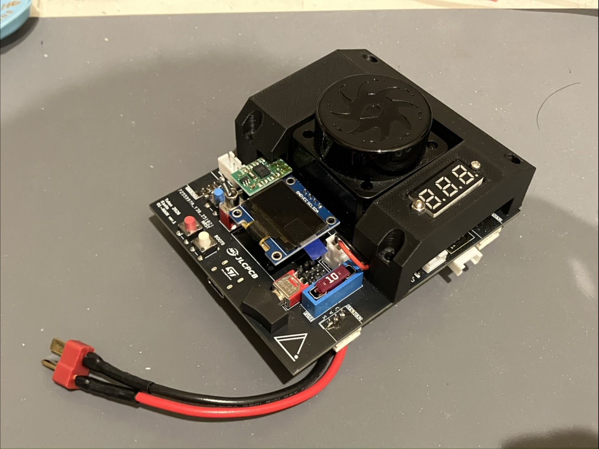
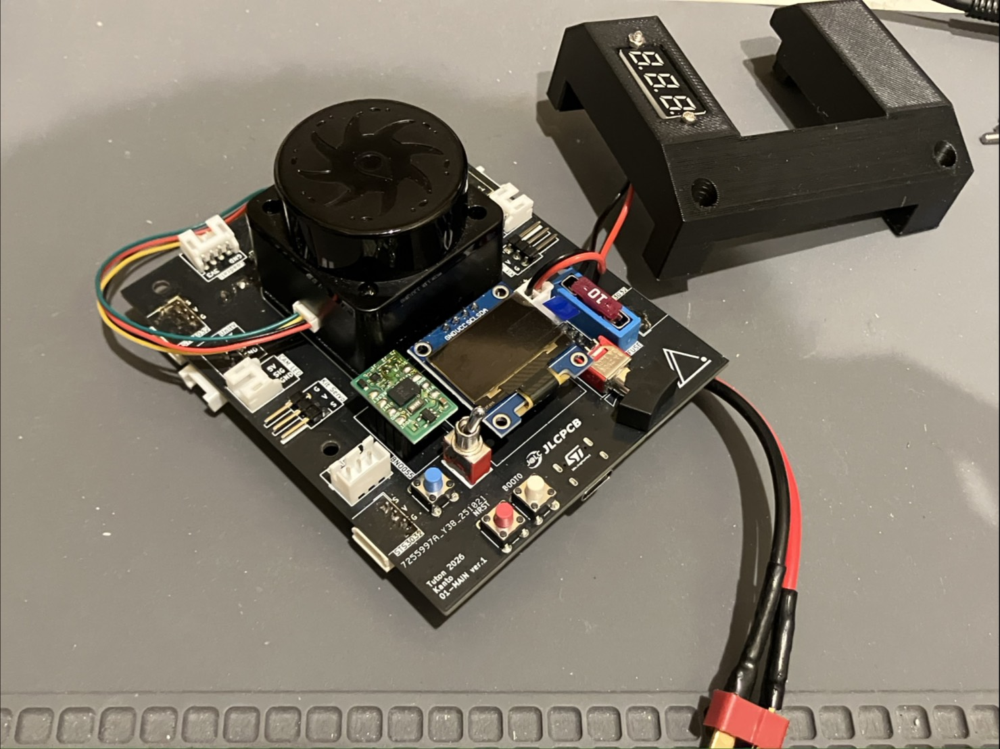

 

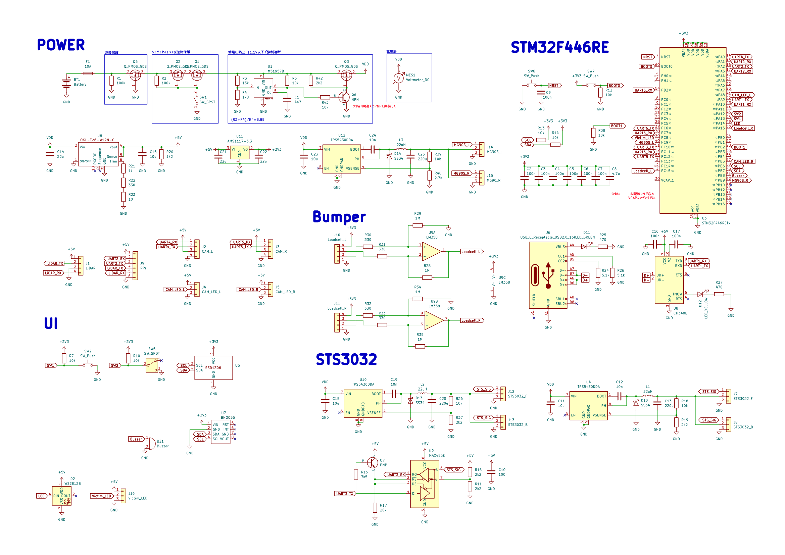

 

| 部品                          | 数  |
| ----------------------------- | --- |
| メインマイコン STM32F446RE    | 1   |
| ジャイロセンサ BNO055         | 1   |
| ディスプレイ SSD1306          | 1   |
| 圧電スピーカ PKM13EPYH4000-A0 | 1   |
| ロードセル用オペアンプ LM358  | 1   |
| RS485ドライバ MAX485          | 1   |
| DCDCコンバータ TPS5430        | 3   |
| DCDCコンバータ OKL-T/6-W12N-C | 1   |

| 接続部品                          | 数  |
| --------------------------------- | --- |
| カメラモジュール UnitV M12        | 2   |
| 連続回転サーボモータ STS3032      | 4   |
| マイクロサーボモータ SG90(MG90S)  | 2   |
| 1kgロードセル                     | 2   |
| LiDAR T-mini Plus                 | 1   |
| 被災者発見LED フルカラーLEDテープ | 1   |
| 04-RPi基板 (Raspberry Pi)         | 1   |

ほとんどのセンサ・アクチュエータはこちらの基板に接続されています。
STM32F446REで処理を行い、RaspberryPiと通信することでセンサ情報の受け渡しやアクチュエータの操作を行います。

LiDARは高速に処理するために、STM32F446REを介せず直接Raspberry Piに接続しています。

多くの機能を1枚の基板に詰め込んだので部品点数は今までのTutonの基板の中で一番多いです。
裏面をJLCPCBさんにPCBAしてもらいました。これを手ではんだ付けするのはしんどいです。ありがとうございます！！

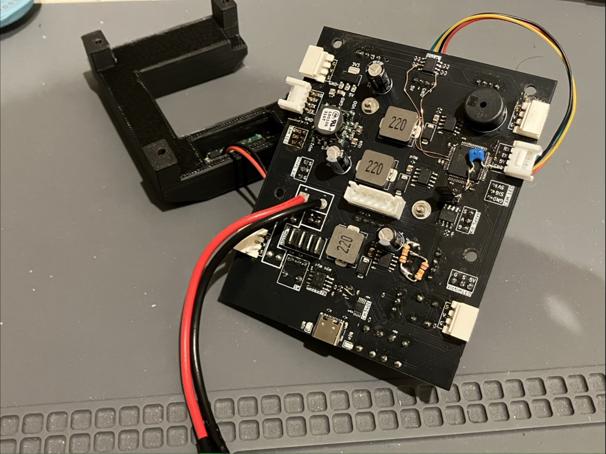

 
STS3032用の7.2V、マイクロサーボ用の6.0VをTPS5430で生成しています。Raspberry Piや各種センサに必要な5VはOKL-T/6-W12N-Cで生成し、ここからLDOでSTM32など用の3.3Vも作っています。

Rescue Lineの時にマイコン用とサーボ用の5Vを同じDCDCで生成してひどい目に合ったので、モータとプロセッサでそれぞれDCDCを用意しました。

JLCPCBでPCBAしてもらう場合、[TPS5430はBasic Parts](https://jlcpcb.com/partdetail/TexasInstruments-TPS5430DDAR/C9864)なので安く作ることができます！
周辺回路を自分で設計する必要がありますが、5.5V～36V（可変）、3Aを生成することができ使いやすいICです。

## 02-BOTTOM基板

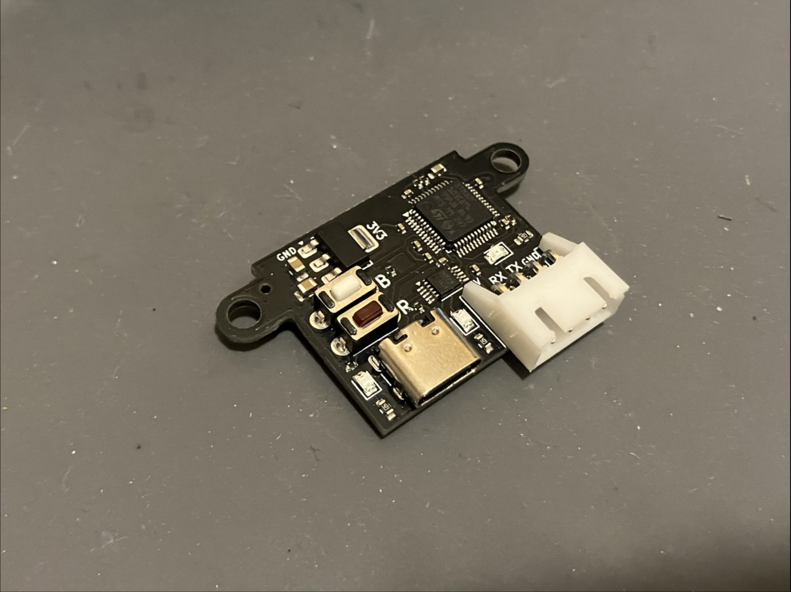
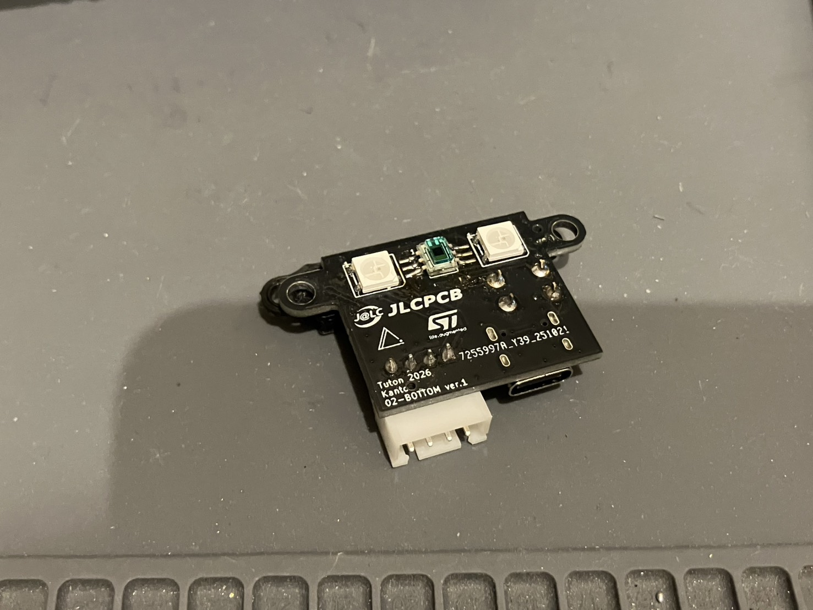

 

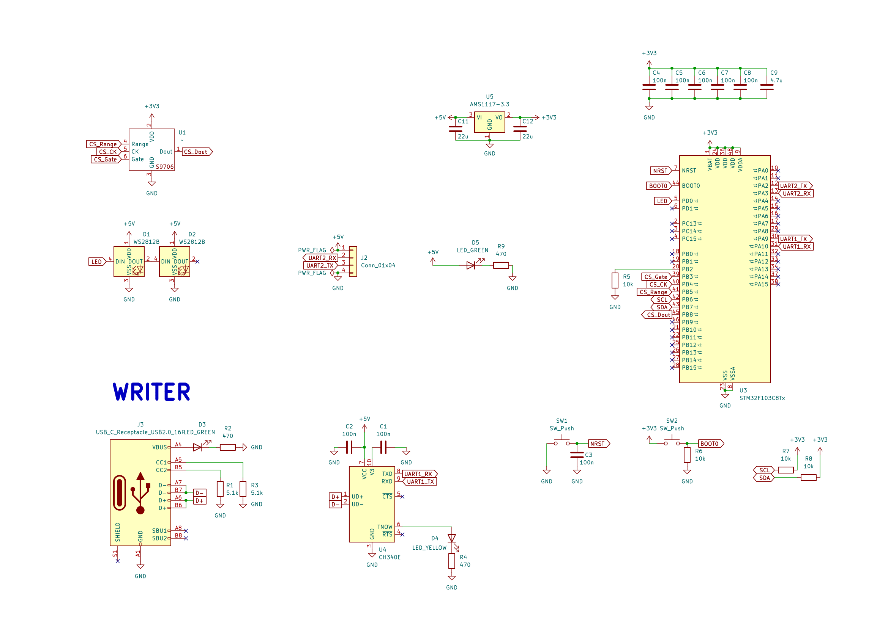

 

| 部品                     | 数  |
| ------------------------ | --- |
| サブマイコン STM32F103RC | 1   |
| カラーセンサ S9706       | 1   |
| フルカラーLED WS2812B    | 2   |

床の色を読むためのセンサです。UARTでRaspberryPiにカラーセンサの情報を送ります。できるだけコンパクトに作りました。

サブマイコンにはSTM32F103C8を採用しました。これもJLCPCBのPCBAでは[Promotional Extended Parts](https://jlcpcb.com/partdetail/STMicroelectronics-STM32F103C8T6/C8734)なので安く作ることができます。

カラーセンサはレスキューラインに引き続きS9706を採用し、LEDはNeo PixelのWS2812Bにしました。LEDとカラーセンサの仕切りの3Dプリントパーツを挟んで固定します。

## 04-RPi基板

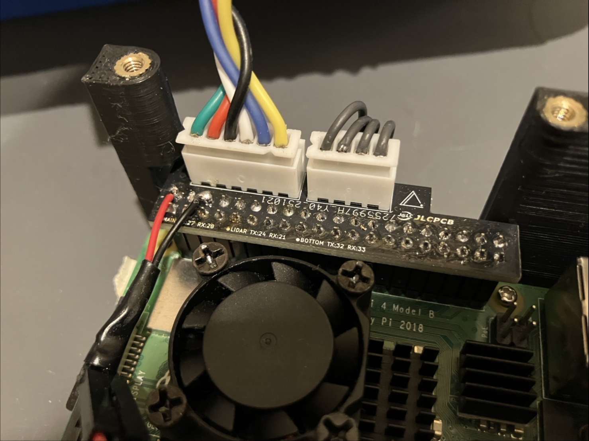
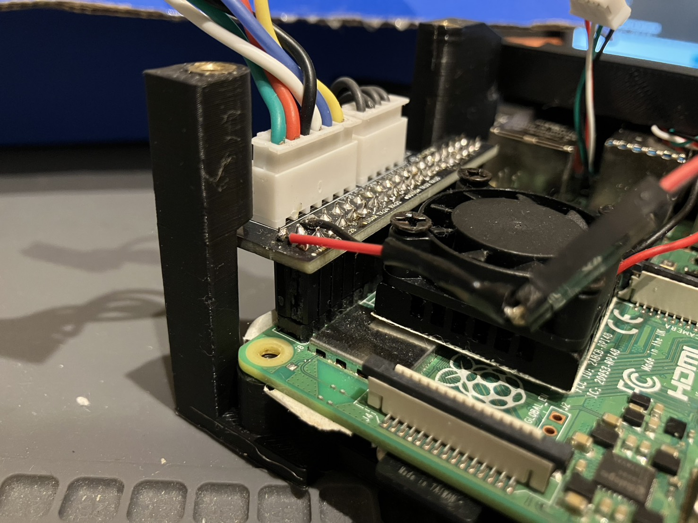

 

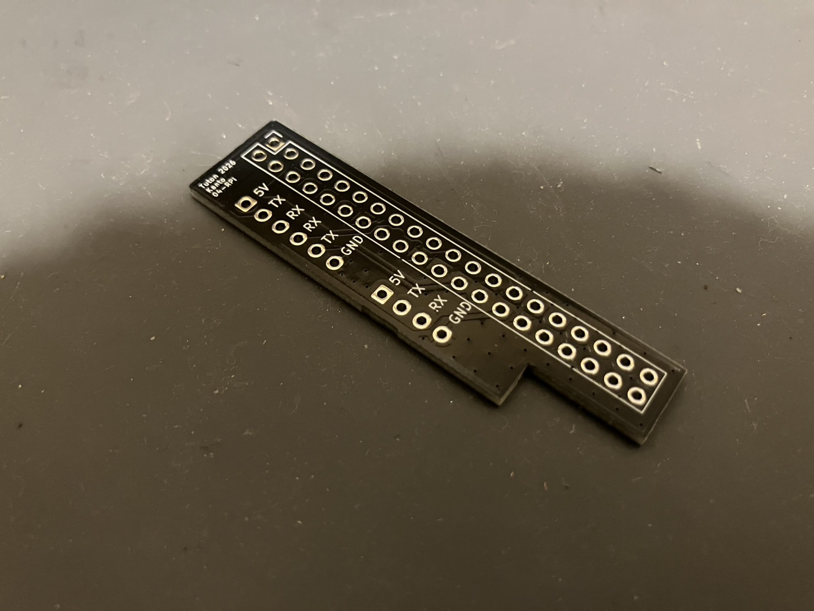

 

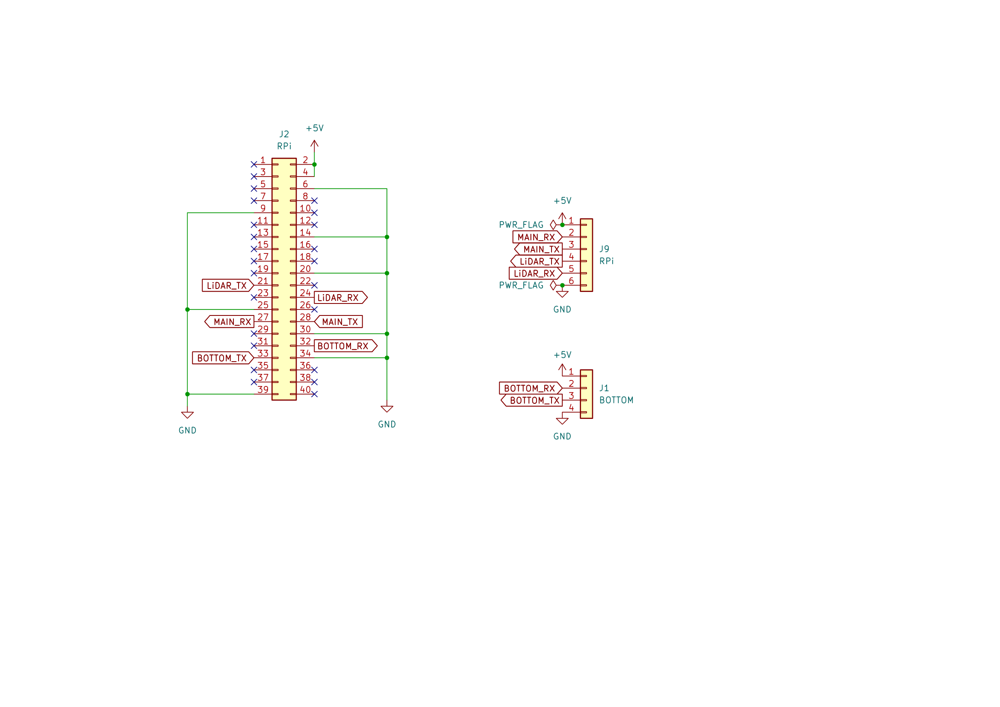

 

| 接続部品               | 数  |
| ---------------------- | --- |
| Raspberry Pi 4 model B | 1   |
| 01-MAIN基板            | 1   |
| 02-BOTTOM基板          | 1   |

今年はRaspberry Pi 4 model Bをメインプロセッサとして使用します。
これはXHケーブルでRaspberryPiと接続するためのシールドみたいな基板です。

以下のものがUARTでRaspberryPiにつながっています。
- 01-MAIN基板　STM32F446RE
- 01-MAIN基板 LiDAR T-mini Plus
- 02-BOTTOM基板 STM32F103C8

# 基板ユニット
これらの基板は全てこのような1つのユニットとして組み立てられます。

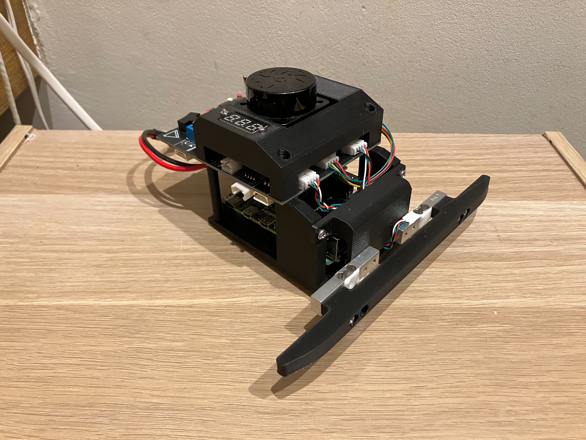
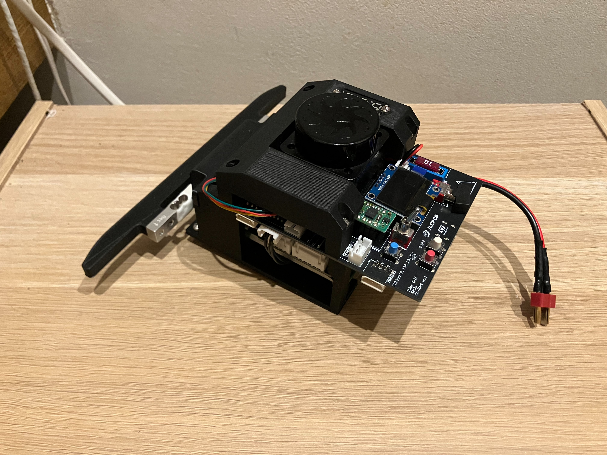

 
 

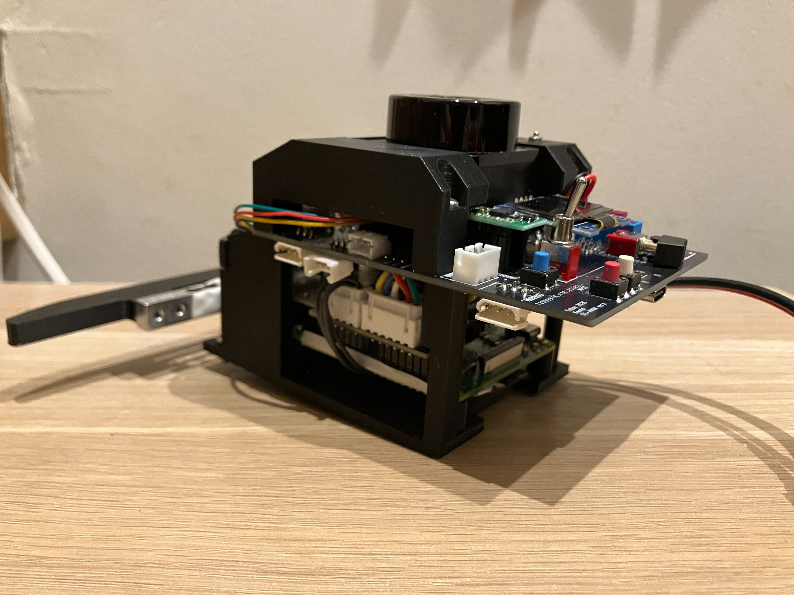
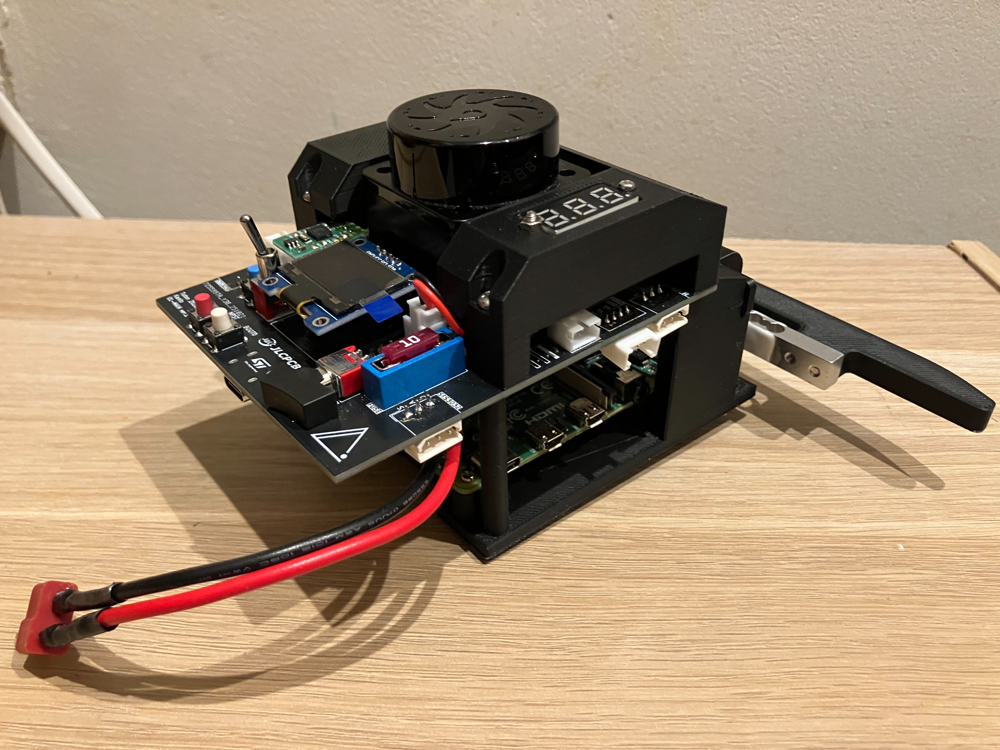

 

そして...

<iframe width="560" height="315" src="https://www.youtube.com/embed/SbAF_Ybdz7A?si=G4pD1EqrWoBbQAfI" title="YouTube video player" frameborder="0" allow="accelerometer; autoplay; clipboard-write; encrypted-media; gyroscope; picture-in-picture; web-share" referrerpolicy="strict-origin-when-cross-origin" allowfullscreen></iframe>

こんな風に差し込んで2箇所ねじ止めするだけでロボット本体と組み合わせることができます！！

この構造にしたことで整備性も開発効率も今までで一番良くなった気がしています。

# メイズ初号機「クロ」

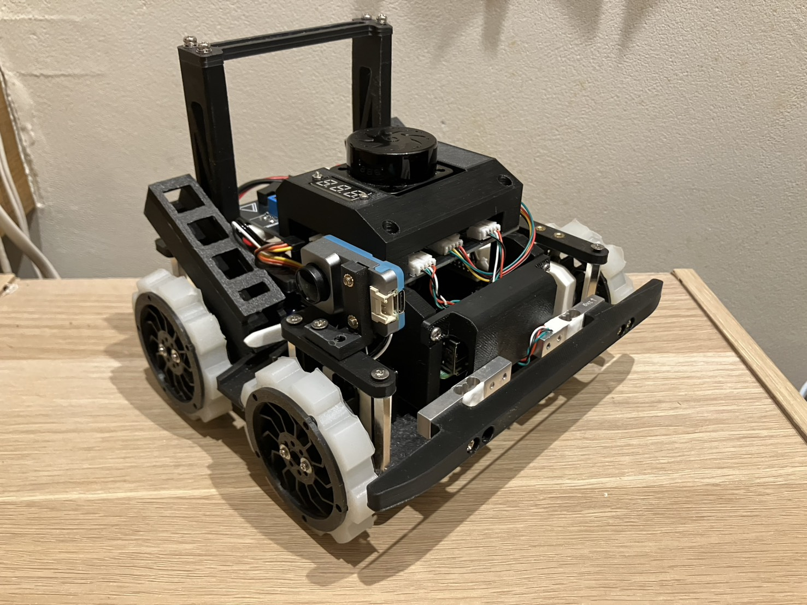
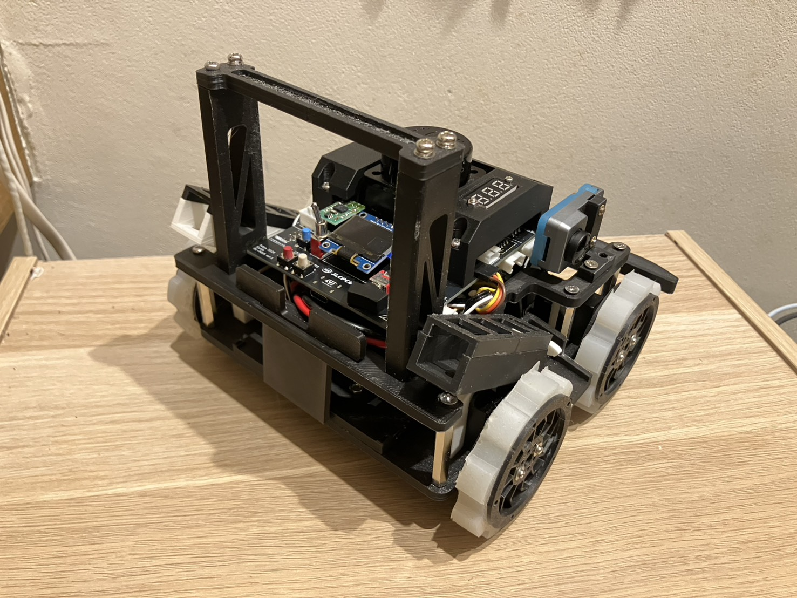

Tutonの記念すべき初のメイズ機体です。2025名古屋の機体「シロ」と打って変わって全体的に黒いので名前は「クロ」です。
ハードウェアの動作確認が一通り終わり、本格的にソフトウェア開発に取り掛かっているところです。

これはとりあえず迷路探索してるところを動画に撮りたくて、最低限のコードを雑に書いて動かしてみた様子です。（照明がチカチカしてごめんなさい）

<iframe width="560" height="315" src="https://www.youtube.com/embed/_25MeoID3pc?si=HaxuSD_ZTFPxJosp" title="YouTube video player" frameborder="0" allow="accelerometer; autoplay; clipboard-write; encrypted-media; gyroscope; picture-in-picture; web-share" referrerpolicy="strict-origin-when-cross-origin" allowfullscreen></iframe>

 

現在ハード班は二号機の開発に着手しています。クロは12月上旬までのソフトウェア開発で使用し、二号機が完成し次第、ソフトウェアも二号機へと移行する予定です。

なのでこの機体が大会に出ることはおそらくないです。メイズが初めてなためブロック大会前に1機体作って様子を見たうえでブロック機体を作りたかったということと、時間が無いのでとりあえず動くものを完成させて早いうちからソフトウェア開発を進められるようにしたかったということがありこのような形になりました。

# 最後に
関東ブロックのRescue Mazeは激戦になりそうなので何が何でも勝つためにメンバー一同必死に開発中です。あと1か月ちょと、めちゃくちゃ頑張ります。楽しみにしていてください。

