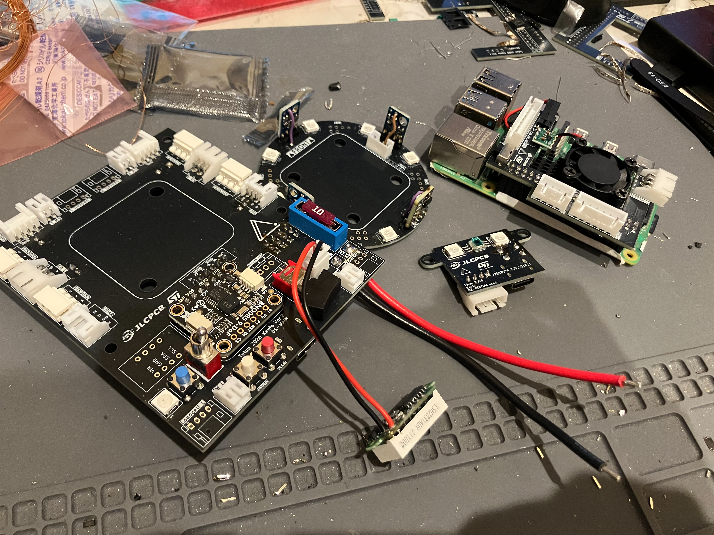
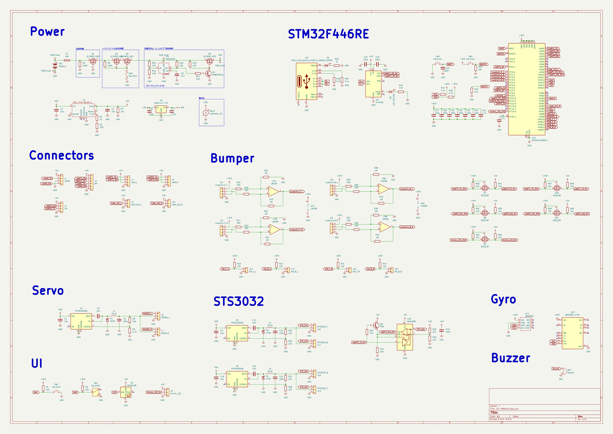
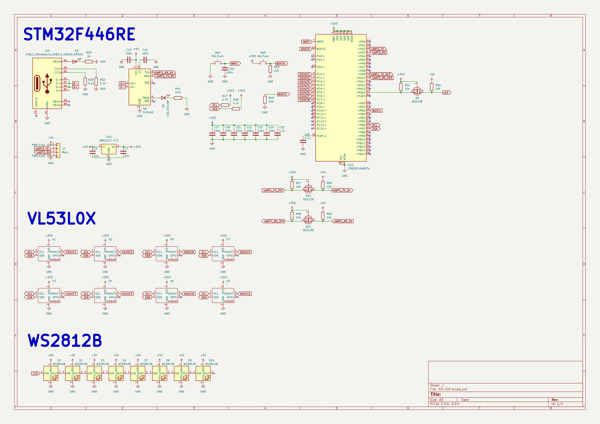
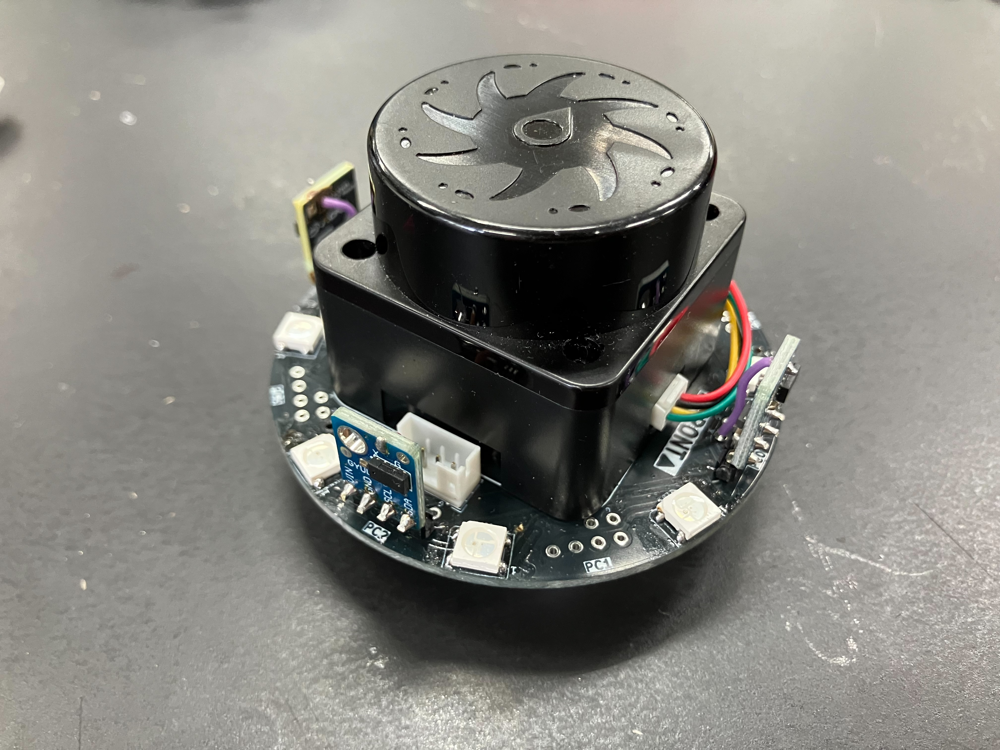
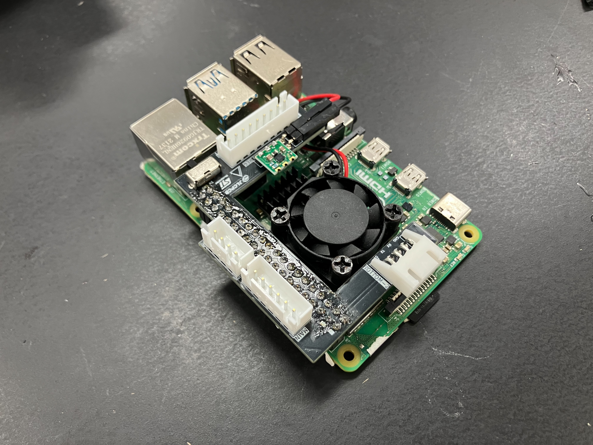
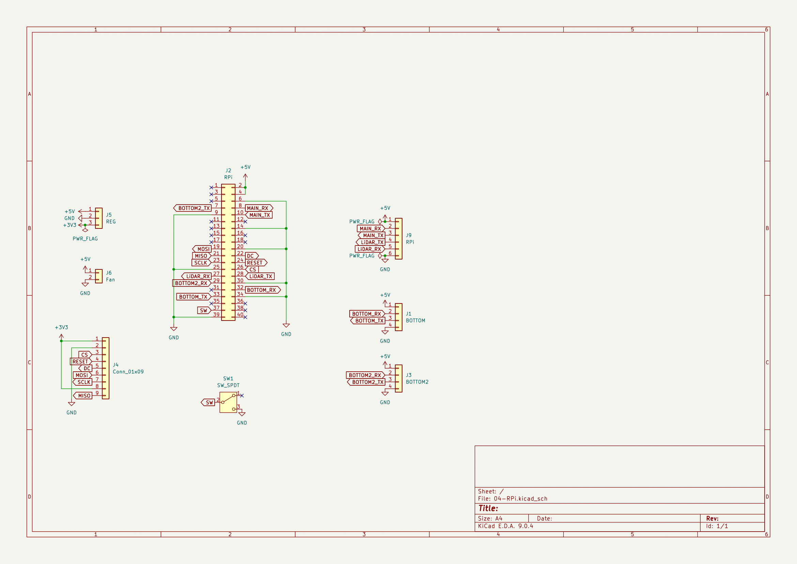
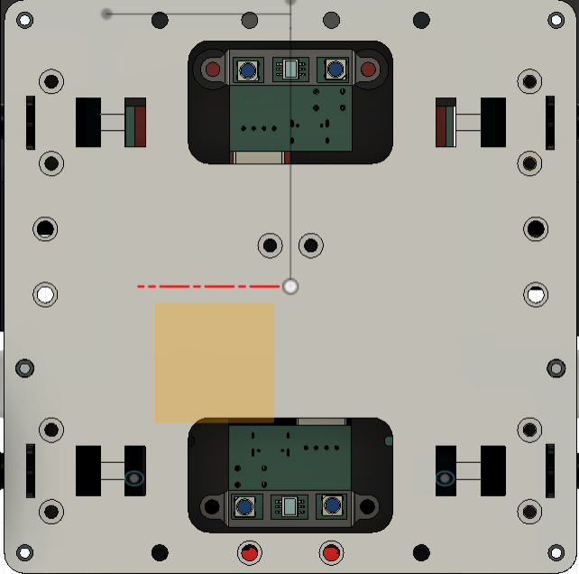
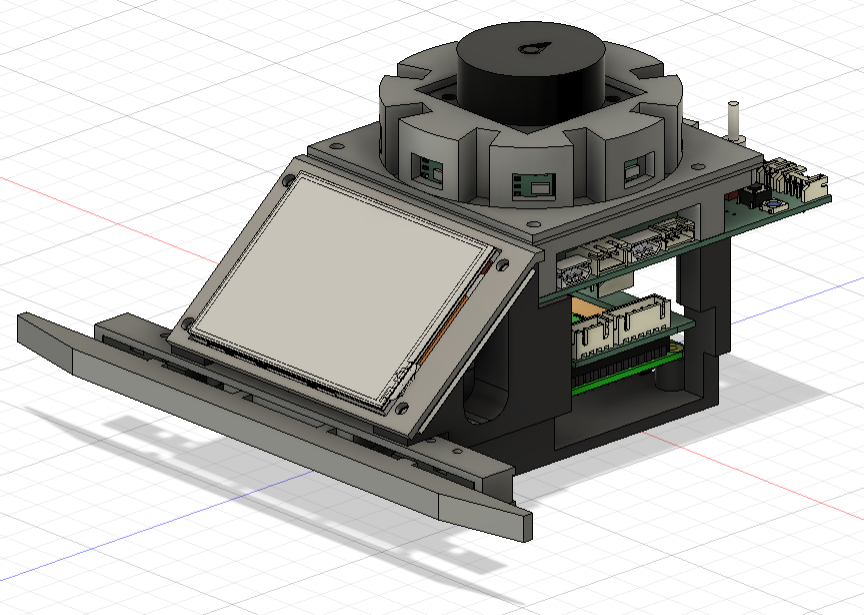

こんにちは、回路担当のshujiです。

期末試験が終わり、本格的に関東ブロックに向けて開発を進めています。

JLCPCBさんに発注させていただいた二号機の基板が完成したので紹介します！

## JLCPCBの紹介

[JLCPCBさんのホームページはこちら(https://jlcpcb.jp/)](https://jlcpcb.jp/)

今回発注したものを含む私たちのロボットの基板やCNC部品は全てJLCPCB様にスポンサーとして提供いただいています。

JLCPCBは基板やCNCなどを取り扱っている中国の製造会社です。高品質で低価格、そして迅速な配達が特徴で、個人や学生チームのロボット開発にとてもぴったりな企業です！

JLCPCBでは非常にたくさんの部品から選んで表面実装までしてもらうことができるため、高性能なロボットを作るのにとても役立っています。

新規ユーザーは$60ほどのクーポンがもらえるので、初めての方もぜひJLCPCBで発注してみてください！

表面実装で発注する方法は[こちらの記事](https://tuton-rcj.github.io/20241030/)で解説しています！

CNCを発注する方法は[こちらの記事](https://tuton-rcj.github.io/20240419/)で解説しています！

## 発注した基板
今回は3種類の基板を作っていただきました。

 

 

- 01-MAIN基板
  - メイン基板。各種センサやアクチュエータをまとめ、RaspberryPiとやり取りする。
- 03-ToF基板
  - 周囲の壁までの距離測定を行う。01-MAIN基板と接続する。
- 04-RPi基板
  - RaspberryPiに取り付ける基板。02-BOTTOM基板、01-MAIN基板とRaspberryPiを繋げる。

01-MAIN基板と04-RPi基板は前回のリメイク版、03-ToF基板は新規の基板です。
02-BOTTOM基板（カラーセンサ）は前回のをそのまま使います。

## 01-MAIN基板

 

 

| 部品                          | 数  |
| ----------------------------- | --- |
| メインマイコン STM32F446RE    | 1   |
| ジャイロセンサ BNO085         | 1   |
| 予備ジャイロセンサ BNO055     | 1   |
| 圧電スピーカ PKM13EPYH4000-A0 | 1   |
| ロードセル用オペアンプ LM358  | 1   |
| RS485ドライバ MAX485          | 1   |
| DCDCコンバータ TPS5430        | 3   |
| DCDCコンバータ OKL-T/6-W12N-C | 1   |

| 接続部品                                | 数  |
| --------------------------------------- | --- |
| カメラモジュール UnitV M12              | 2   |
| 連続回転サーボモータ STS3032            | 4   |
| マイクロサーボモータ SG90(MG90S)        | 2   |
| バンパー（ロードセル/マイクロスイッチ） | 2   |
| LiDAR T-mini Plus                       | 1   |
| 被災者発見LED フルカラーLEDテープ       | 1   |
| 03-ToF基板                              | 1   |
| 04-RPi基板 (Raspberry Pi)               | 1   |

ほとんどのセンサ・アクチュエータはこちらの基板に接続されています。
STM32F446REで処理を行い、RaspberryPiと通信することでセンサ情報の受け渡しやアクチュエータの操作を行います。

前回の基板から以下の変更を行いました。
- ジャイロセンサをBNO055からBNO085に変更
  - より精度が高く安定性があると評判のBNO085に変更しました。BNO055も実装できるようにしてあります。
- バンパーをマイクロスイッチに変更
  - ロードセルを使用したバンパーからマイクロスイッチを使用したバンパーに変更します。障害物検知にはマイクロスイッチバンパーの方が適してると判断したためです。
  - ロードセルバンパーに切り替えることもできるように、ロードセル用のコネクタ及び増幅回路とマイクロスイッチ用のコネクタを両方用意しています。
- ディスプレイを削除
  - SSD1306ディスプレイを無くしました。代わりにロボット前方にMSP2807　2.8inchディスプレイを搭載します。
- サーボモータのコネクタをQIコネクタからXHコネクタに変更
  - 向きが決まっていて、抜けにくいXHコネクタに変更しました。サーボモータの配線を切ってXHに圧着し直しています。
- 軽微なミスの修正

裏面をJLCPCBさんにPCBAしてもらいました。

 

STS3032用の7.2V、マイクロサーボ用の6.0VをTPS5430で生成しています。Raspberry Piや各種センサに必要な5VはOKL-T/6-W12N-Cで生成し、ここからLDOでSTM32など用の3.3Vも作っています。

JLCPCBでPCBAしてもらう場合、[TPS5430はBasic Parts](https://jlcpcb.com/partdetail/TexasInstruments-TPS5430DDAR/C9864)なので安く作ることができます！
周辺回路を自分で設計する必要がありますが、5.5V～36V（可変）、3Aを生成することができ使いやすいICです。

電源回路として、逆接保護回路、逆流防止回路、低電圧遮断回路を搭載しました。
低電圧遮断回路は電圧監視IC M51957BとMOSFETを使って組んだのですが、閾値付近の電圧で動作が不安定になってしまったので取り除きました。いつかリベンジしたいです。

## 03-ToF基板

 

 

| 部品                     | 数  |
| ------------------------ | --- |
| サブマイコン STM32F446RE | 1   |
| ToF測距センサ VL53L0X    | 8   |
| フルカラーLED  WS2812B   | 8   |

壁までの距離を測定するためのToFセンサを搭載しています。
LiDARは細かい角度分解能で距離を測定することができますが、測定が遅いという欠点があります。
そこで、高速に距離を読み取る用途でToFセンサも搭載することにしました。
円形上に8個配置できるようになっています（現在はとりあず4つだけ搭載しています）。

また、フルカラーLEDを8つ搭載しています。これは被災者検知のLEDとして使用する予定です。

LEDの所には白色PLEフィラメントを薄く印刷したカバーを取り付けます。

LiDARをこのように取り付けますが、LiDARのケーブルはこの基板ではなく01-MAIN基板に直接挿しています。

 

## 04-RPi基板

 

 

| 接続部品                    | 数  |
| --------------------------- | --- |
| Raspberry Pi 4 model B      | 1   |
| 01-MAIN基板                 | 1   |
| 02-BOTTOM基板               | 2   |
| 2.8inchディスプレイ MSP2807 | 1   |

Raspberry Piのシールド基板です。

前回から以下の内容を変更しました。
- ディスプレイ接続用コネクタの搭載
- 02-BOTTOM基板用コネクタを2つに増設
- ファン用のコネクタを用意

以下のものがUARTでRaspberryPiにつながっています。
- 01-MAIN基板　STM32F446RE
- 01-MAIN基板 LiDAR T-mini Plus
- 02-BOTTOM基板 STM32F103C8 ×2

# 前後対称性について

ここまでの記事を読んでお気付きの方もいらっしゃるかもしれませんが...

今回の基板では、障害物検知バンパーとカラーセンサをロボットの前後に合わせて2セット搭載できるようになっています。

 
<em>前後についているカラーセンサ</em>

これはどちらを前方にしても走行できるようにするためです。

進行方向を切り返す際に、180°回転するのではなくそのまま後ろ向きに走行するようにすれば、わずかですが時間短縮になるだけでなく、バンプに引っかかって回転できないといった問題の発生する可能性が低くなるのではないかと考えています。

ソフトウェアの実装が間に合えば、関東ブロックでその動きをお披露目できるかもしれません（間に合わなかったらやらないかも）。

# 基板ユニット

以上の基板を合体するとこのようなユニットになります。
ほとんど前回と同じですが、01-MAIN基板の上に03-ToF基板が付いたことと、バンパーとディスプレイが前方に付いたことが主な変更点です。

 

# 基板のGitHubリポジトリ公開！

2026シーズンの基板のリポジトリをPublicにしました。
何か参考になる情報があれば幸いです。

すべてKiCAD 9.0で作成しています。

[https://github.com/tuton-RCJ/RCJ2026PCB](https://github.com/tuton-RCJ/RCJ2026PCB)

# 最後に

関東ブロック大会まで1か月を切りました。
ソフトウェア開発をとことん詰めていきたいと思います。

12月はQiitaのアドベントカレンダーも参加しています。
(12/14時点でやや遅れ気味ですが...)ぜひご覧ください。

[https://qiita.com/advent-calendar/2025/tuton](https://qiita.com/advent-calendar/2025/tuton)

# おまけ

少しだけ二号機の様子を。

  <iframe width="100%" height="180" src="https://www.youtube.com/embed/i1AUFM88UCQ" title="Happy Birthday" frameborder="0" allow="accelerometer; autoplay; clipboard-write; encrypted-media; gyroscope; picture-in-picture; web-share" referrerpolicy="strict-origin-when-cross-origin" allowfullscreen></iframe>

