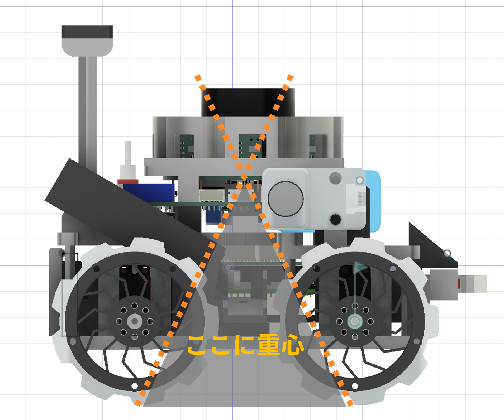
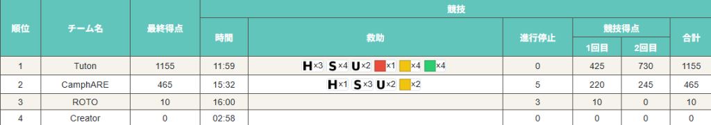
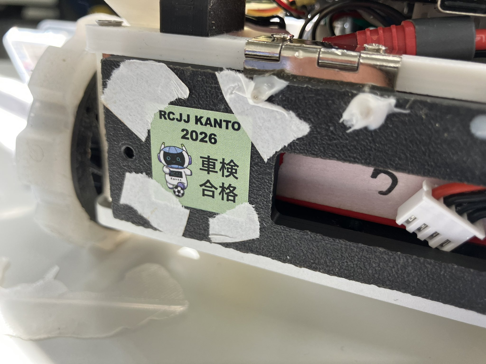
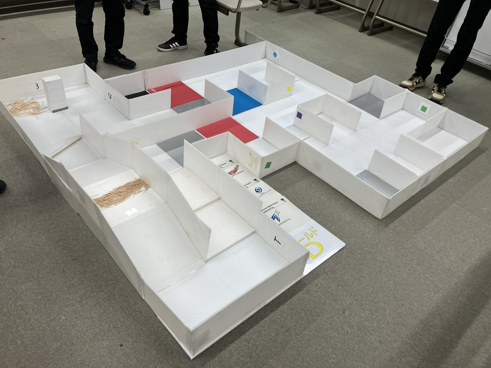
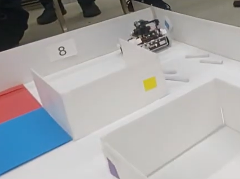
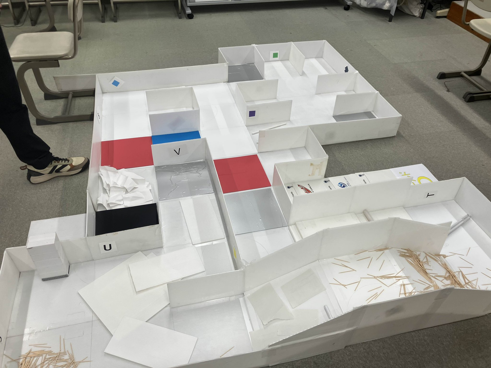
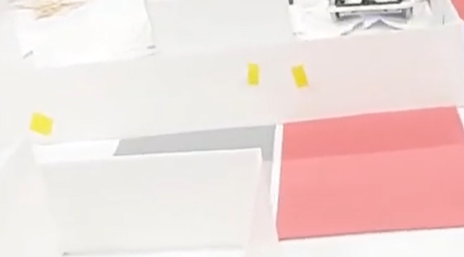
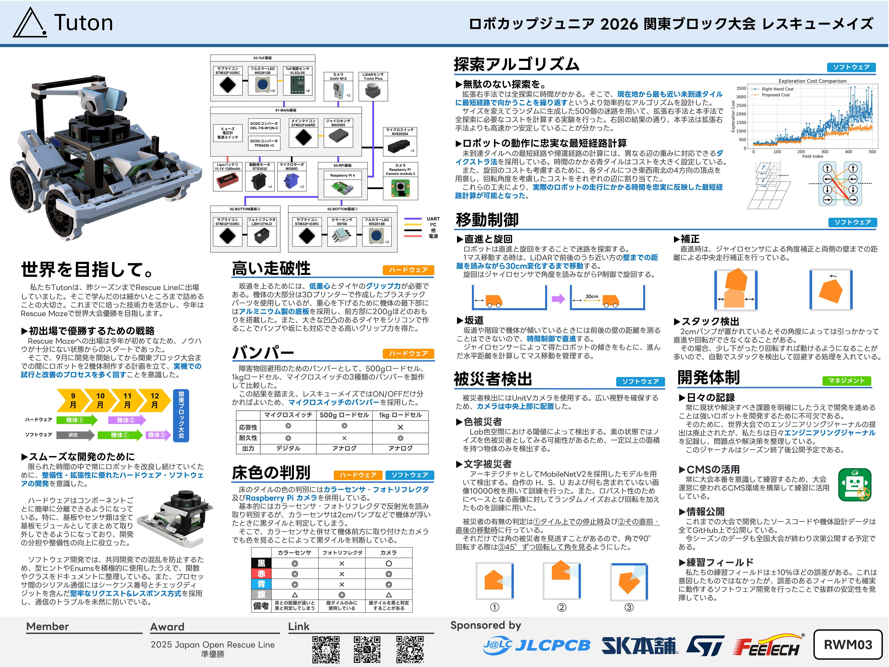

こんにちは、回路担当のshujiです。

2026/01/12に行われた関東ブロック大会で優勝することができました！
関東ブロック機体に使用したCNC部品の発注と、関東ブロック大会の振り返りについて書きたいと思います。

# 1. CNC部品の発注

## JLCPCBの紹介

[JLCPCBさんのホームページはこちら(https://jlcpcb.jp/)](https://jlcpcb.jp/)

今回発注したものを含む私たちのロボットの基板やCNC部品は全てJLCPCB様にスポンサーとして提供いただいています。

JLCPCBは基板やCNCなどを取り扱っている中国の製造会社です。高品質で低価格、そして迅速な配達が特徴で、個人や学生チームのロボット開発にとてもぴったりな企業です！

JLCPCBでは非常にたくさんの部品から選んで表面実装までしてもらうことができるため、高性能なロボットを作るのにとても役立っています。

新規ユーザーは$60ほどのクーポンがもらえるので、初めての方もぜひJLCPCBで発注してみてください！

表面実装で発注する方法は[こちらの記事](https://tuton-rcj.github.io/20241030/)で解説しています！

CNCを発注する方法は[こちらの記事](https://tuton-rcj.github.io/20240419/)で解説しています！

## 発注したCNC部品
今回はロボットの底板にあたるこちらの部品をCNC加工で作っていただきました。

 

 
 

 
レスキューメイズの坂や階段で転ばないようにするためには、機体の重心を下げることが必要です。

タイヤの地面との接地点よりも重心が後ろにあると倒れてしまうので、25°の坂を上り下りしても転倒しないようにするには、以下の範囲に重心が位置している必要があります。
 

 

そのために、機体の底板を厚さ5mmのアルミニウム板で作ることで重心を大きく下げました。これはレスキューラインの時も採用していた方針です。

前後対称性を持たせようとしていたので前後に2つカラーセンサ基板を取り付けられるようにしました。

 

 

今回はねじ穴は自分でタッピングしましたが、JLCPCBで加工してもらうことも可能です。

# 2. 関東ブロック大会の振り返り

それでは、1/12に行われた関東ブロック大会の振り返りです。

結果は以下の通りです。

 

 

合計1155点で優勝しました！2走目ではなんと満点を取ることができました。

また、プレゼンポスター賞も頂きました。

 

 

## 車検

今回の関東ブロック大会では、車検で以下の指摘を受けました。

- Li-Poバッテリの仕様書がない
- 木ネジが露出している箇所がある
- カメラの取り付けがやや不安定
- バッテリーのケーブルの接続部がやや負荷がかかっている

全国大会では改善していきたいと思います。

 

 

## 調整

今回のフィールドです。つまようじは二走目で撒かれました。

 

 

まず、以下の調整を行いました。

- カメラのしきい値の調整
- 底面カラーセンサ・フォトリフレクタのしきい値の調整

そして、試走してみて以下の問題が発生しました。

- Dangerous Zoneの入口・出口である赤タイルを、赤被災者と誤検知する現象。
- 階段を上ると前後に壁がなくなって直進制御ができなくなる現象。
- 「8」をS被災者と誤検知する現象。

Dangerous Zoneを認識して何か処理を行う予定はなかったので、練習では赤タイルを用意していませんでした。それが裏目に出てしまい、赤タイルを赤被災者と誤検知してしまいました。練習用フィールドはルール通りにしっかり作るべきですね。

階段上のトラブルについては、坂道をのぼった前後に壁がないところでは定数制御で直進する処理を書いていたので、それを階段にも適用できるよう調整しました。

アルファベットは全て学習データに入れていたのですが、数字は入れていなかったため、「8」をSと誤認識してしまいました。これは当日の調整ではどうしようもないので運頼みです。50:50くらいの確率で誤認識していました。

 

 

## 1走目

走行動画です。

<iframe width="560" height="315" src="https://www.youtube.com/embed/HMauHP4pZB0?si=iQfe_1a6MkMO2t4g" title="YouTube video player" frameborder="0" allow="accelerometer; autoplay; clipboard-write; encrypted-media; gyroscope; picture-in-picture; web-share" referrerpolicy="strict-origin-when-cross-origin" allowfullscreen></iframe>

 

坂の上でマッピングエラーが発生し、全探索はできませんでした。が、ずれの仕方がちょうどよくスタートタイルに帰還することはできました。

赤タイルの被災者誤検知も発生しています。

425点で暫定一位でした。

## 2走目

走行動画です。

<iframe width="560" height="315" src="https://www.youtube.com/embed/qTt0xDdNFyM?si=6DA8cwTMeXw-6lOR" title="YouTube video player" frameborder="0" allow="accelerometer; autoplay; clipboard-write; encrypted-media; gyroscope; picture-in-picture; web-share" referrerpolicy="strict-origin-when-cross-origin" allowfullscreen></iframe>
 

満点走行しました！730点です。

赤タイルの被災者誤検知は、壁の端の被災者を見るためのプログラムのバグが原因だったようで、調整時間に修正して解決することができました。

「8」をSと読み間違えることが唯一の懸念点だったのですが、本番では「3」に変わっていたため誤認識はしませんでした。

2走目ではDangerous Zone内の坂道上に爪楊枝が撒かれましたが、特に問題なく走行できました。

 

 

## エキシビション

競技終了後、レスキューの参加者全員が参加するデモンストレーション走行をしました。

スタッフの方々がフィールドを魔改造し、Dangerous Zoneが世界大会レベルになりました。

 

 

斜面に紙を置かれると滑りまくりました。

全国大会か世界大会までにはこれらのハザードにも対応できるようにしていきたいと思います。どうすればいいんだ。

あと面積が小さい偽被災者もありました。レスキューはルールの自由度が高いので難しくしようとしたらとんでもなく難しくなりますね。恐ろしい。
 

 

## ポスター

プレゼンポスター賞を頂きました！

LINEフォントとDuolingoカラーを使用してみました。

A2で印刷して掲示しましたが、回路ダイアグラムの文字が少し小さかったかもしれません。全国大会はA3なのでそれらも踏まえつつ見やすいポスターを作りたいと思います。

 

 

## 振り返りと今後の展望

今回はソフトウェアの調整に多くの時間を費やすことができました。

関東大会までに機体を2機体作り、ハードウェア・ソフトウェア共に限られた時間の中でPDCAサイクルをたくさん回すことができたのが勝因かなと思います。

壁の端や角にいる被災者の検出は念のため詰めておこうと思って大会3日前～2日前に実装したものでしたが、これが功を奏しました。

全国大会では満点走行3回を達成できるように、とことん安定性を追求していきたいと思います。

現在の機体には主に以下のような欠陥があります。今の機体でソフトウェアの調整を続けつつ、ハード班はこれらを改善した新機体の開発を早急に進めていきたいと思います。

| 欠陥                                                           | 改善方法                                                                             |
| -------------------------------------------------------------- | ------------------------------------------------------------------------------------ |
| 重心が高く、25度の坂道に20mmバンプがあると転倒する。           | 部品配置を見直す。タイヤを金属で作成する。                                           |
| ToFセンサ（VL53L0X）の長距離での精度が悪く、使用できなかった。 | 別のToFセンサの仕様を検討する。                                                      |
| 前方が坂道なのか壁なのかを区別しづらい。                       | ToFセンサを上下に取り付け、距離の差で壁と坂道を区別できるようにする。                |
| ブザーの音量が小さい。                                         | 音量を大きくする。                                                                   |
| ディスプレイがない。                                           | ディスプレイまたはその代わりになるものを搭載し、現在位置などを表示できるようにする。 |
| バンパーを後ろから押すと反対側のセンサが反応する。|バンパーの構造を見直し、前からの押し込みにのみ反応するようにする。|

今の機体でも全国大会優勝は十分狙えると思っていますが、新機体でさらに安定性を高め、満点走行＆全国大会優勝を目指していきたいと思います！

# おわりに

それでは、全国大会でお会いしましょう！これからも†異次元の開発†を続けていきます。

ソースコードやエンジニアリングジャーナルは全国大会終了後に公開予定です。もうしばらくお待ちください。

また、Tutonは学生ロボットEXPOにも参加します。ぜひお越しください！

[学生ロボットEXPOのHPはこちら(https://robot.exposition.tokyo/)](https://robot.exposition.tokyo/)

# おまけ

関東ブロックのみんなと。

 

 