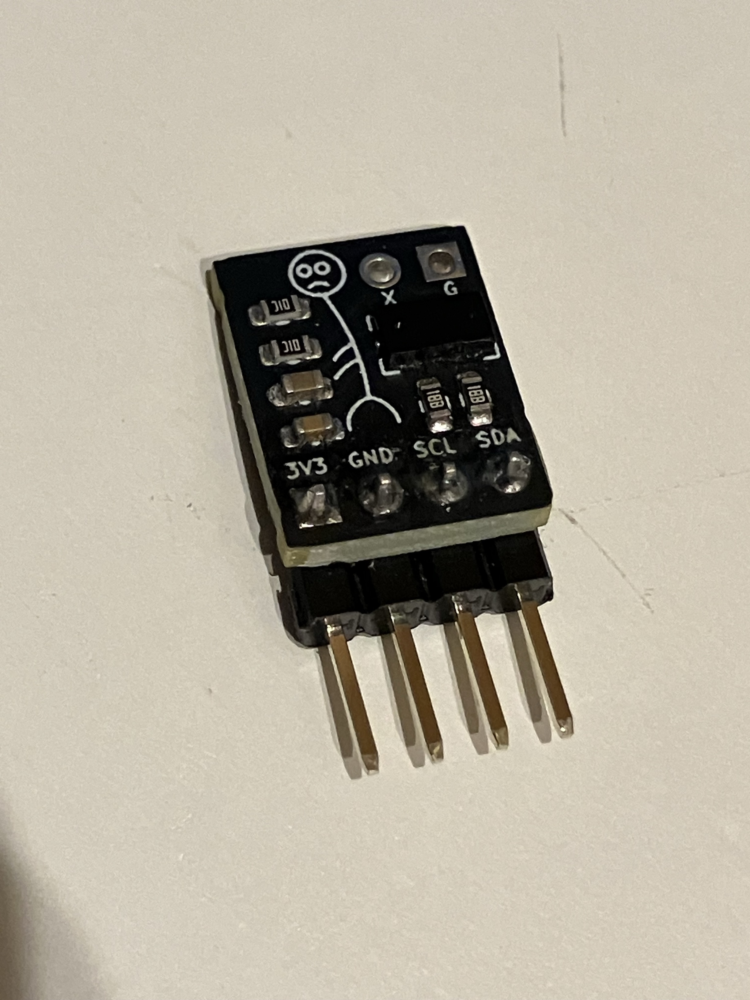
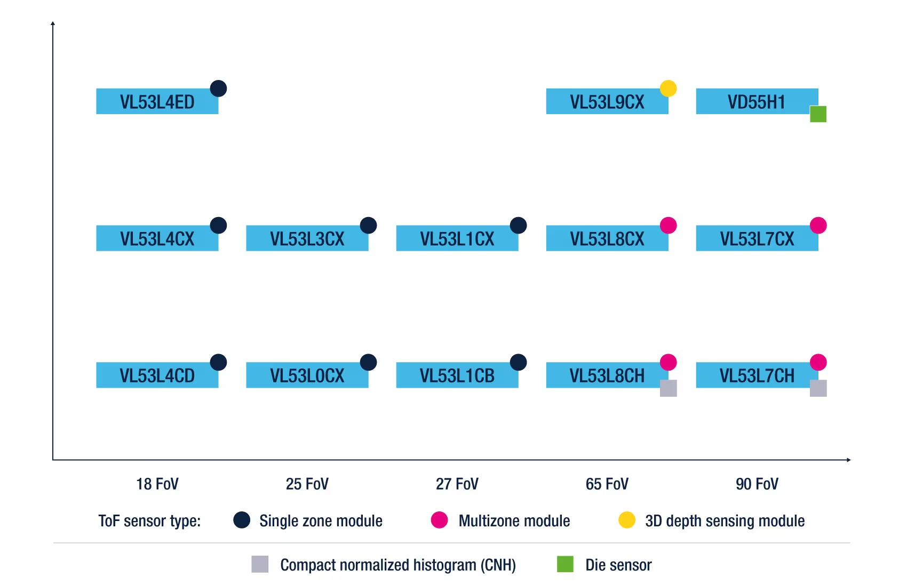
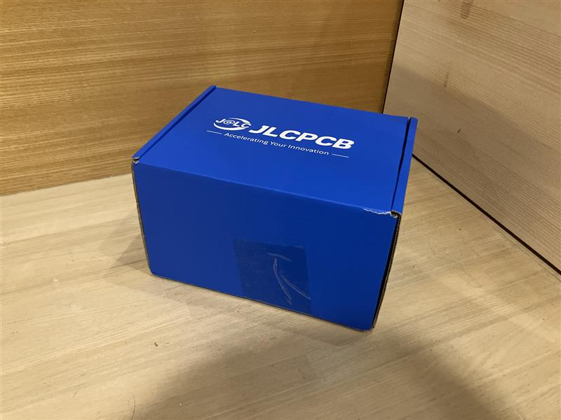
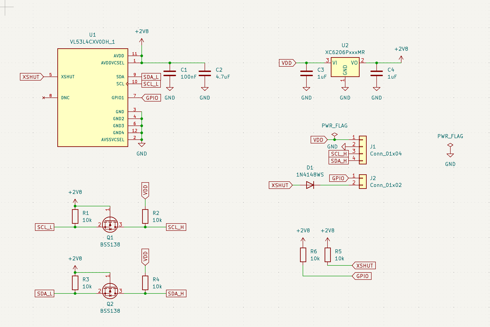
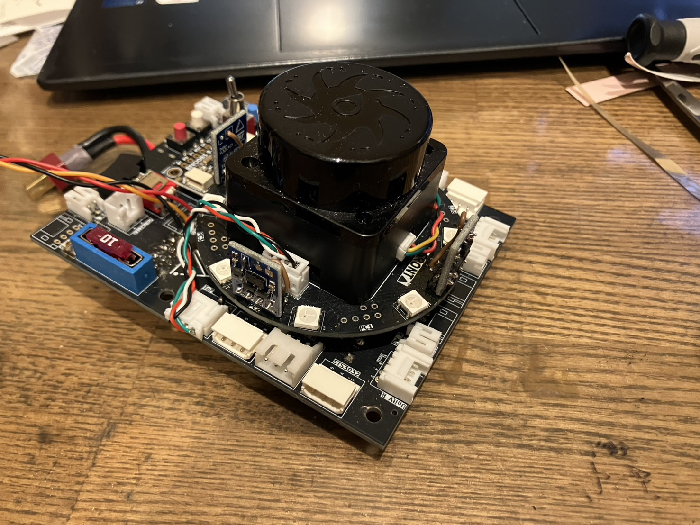
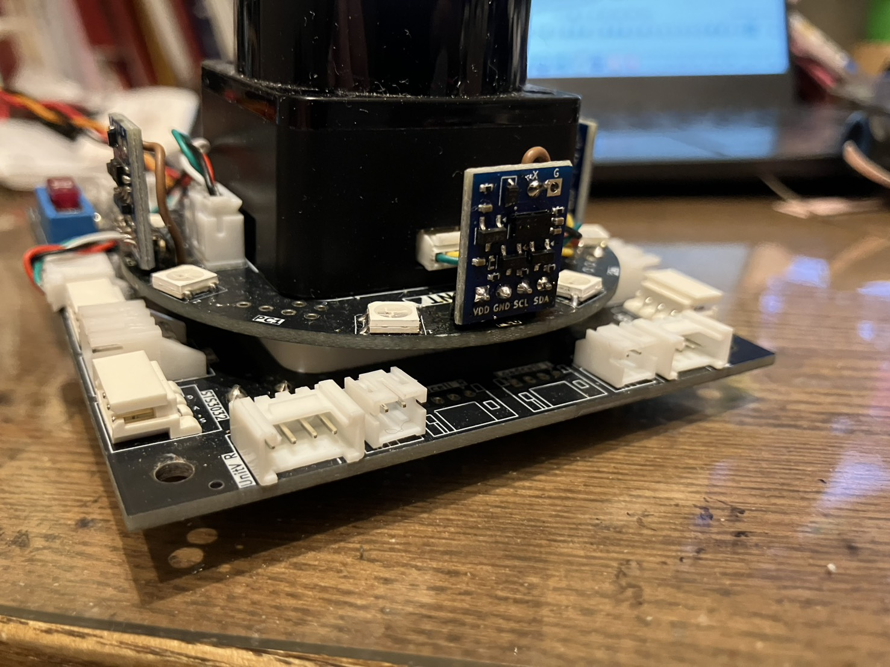

こんにちは、回路担当のshujiです。

レスキューメイズ用にVL53L0CXよりも高性能なVL53L4CXを使ったToFモジュールを作ったので紹介します！

# JLCPCBの紹介

[JLCPCBさんのホームページはこちら(https://jlcpcb.jp/)](https://jlcpcb.jp/)

今回発注したものを含む私たちのロボットの基板やCNC部品は全てJLCPCB様にスポンサーとして提供いただいています。

JLCPCBは基板やCNCなどを取り扱っている中国の製造会社です。高品質で低価格、そして迅速な配達が特徴で、個人や学生チームのロボット開発にとてもぴったりな企業です！

JLCPCBでは非常にたくさんの部品から選んで表面実装までしてもらうことができるため、高性能なロボットを作るのにとても役立っています。

新規ユーザーはなんと**$123**ほどのクーポンがもらえるので、初めての方もぜひJLCPCBで発注してみてください！

そして、実はすべてのユーザーにこのように毎月SMTのクーポンが配られています！久しぶりの人もこのクーポンを使って表面実装を発注してみてはいかがでしょうか？

 

表面実装で発注する方法は[こちらの記事](https://tuton-rcj.github.io/20241030/)で解説しています！

また、CNCを発注する方法は[こちらの記事](https://tuton-rcj.github.io/20240419/)で解説しています！

# VL53L0Xの問題

まずは今回の発注の背景を説明したいと思います。

私たちは、30cmの直進に前方/後方までの距離情報を主に使用しています。

そのために関東ブロック機体ではVL53L0Xを採用していたのですが、VL53L0Xは距離が90cm以上になるととても不安定になってしまい使い物になりませんでした。

<em>自作のVL53L0Xモジュール。 これもJLCPCBのPCBAサービスで作ってもらいました！ 詳しくは<a href="https://tuton-rcj.github.io/20241118/">こちら</a></em>

 

結局関東ブロックではLiDARのみを使用したのですが、LiDARは読み取りに時間がかかるのでこのままでは全国大会・世界大会では全探索が間に合わない可能性があります。

そこで、より長い距離を測定できるToFに変更することにしました。

# VL53L4CXとは

VL53L4CXというのはSTマイクロエレクトロニクスが開発したToFセンサです。

STが開発しているToFセンサには以下のようなラインナップがあります。

  

出典： [https://www.st.com/ja/imaging-and-photonics-solutions/time-of-flight-sensors.html](https://www.st.com/ja/imaging-and-photonics-solutions/time-of-flight-sensors.html)

いくつかのToFを比較してみました。

|              | VL53L0CX | VL53L1CX | VL53L3CX | VL53L4CX | VL53L4CD | VL53L4ED |
| :----------: | :------: | :------: | :------: | :------: | :------: | :------: |
| 最大測定距離 |    2m    |    4m    |    3m    |    6m    |   1.2m   |   1.3m   |
|    視野角    |   25°    |   27°    |   25°    |   18°    |   18°    |   18°    |

レスキューメイズの競技には、最大測定距離が長く、視野角も狭いVL53L4CXが適していると考えました。

VL53L4CXは大量のヒストグラムデータをマイコンに送るため、RAM容量の大きいマイコンが必要になるようです。今回はSTM32F446REで十分動作しました。

# 作った基板
JLCPCBのPCBAサービスで作ってもらいました！

VL53L4CXはStandard PCBAで実装することとなります。
Standard PCBAは最小サイズが10cm × 10cmなので、自動で外側に基板が追加されました。

 

 

今まで使用していたVL53L0Xと同じサイズ、同じピン配置にして、互換性を持たせました。
VL53L0Xのモジュールと間違えないように基板の色を青色にしてみました！青もかっこいいですね！

また、前にVL53L0Xモジュールを作った時は2.8Vの入出力をそのまま3.3Vのマイコンに接続していましたが、今回はレベル変換回路を入れました。

<em>回路図</em>

 

# 基板への実装
これまでVL53L0Xを搭載していた03-ToF基板に実装しました。
サイズとピン配置を統一していたため、そのまま交換することができました。

前後左右の4方向につけています。

 

# 実験

実用的な測定距離を実験で確かめました。

 
<em>実験の様子</em>

240cmくらいまでは安定して測定することができました。環境光があることを考えるとこのくらいかなと思います。
これだけあればレスキューメイズの競技では十分使えると思っています（4.8m以上の直線が無ければ使えるので）。

# 高速化
VL53L4CXの処理を高速化するために以下の工夫をしました。

- I2Cの通信速度を高速化（800kHzに設定）
- 測定時間をデフォルトの33msから15msに短縮
- 01-MAIN基板との通信方式をリクエスト＆レスポンスから、測定終了後に自動でデータを送る方式に変更

# おわりに

VL53L4CXに変更したことで移動の精度と速度が向上しました！

そろそろロボットの様子を公開していこうと思いますので、楽しみにしていてください！
