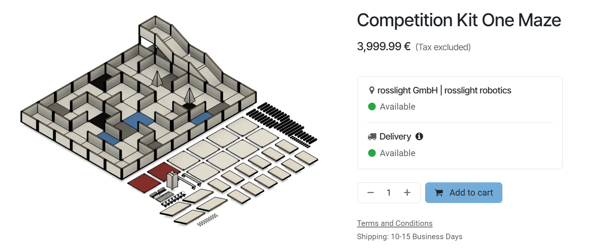
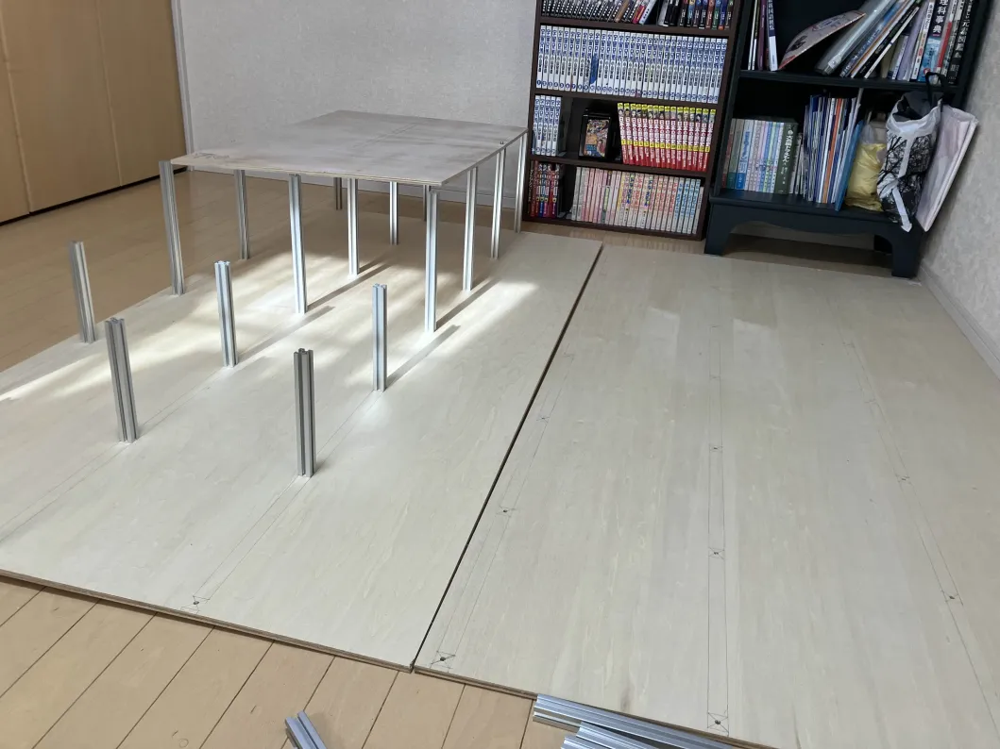
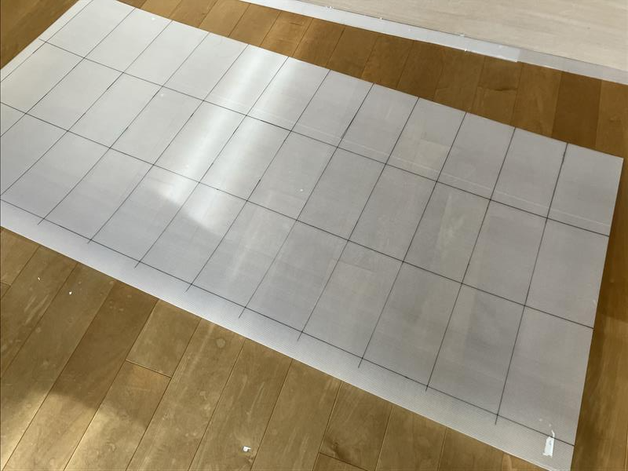
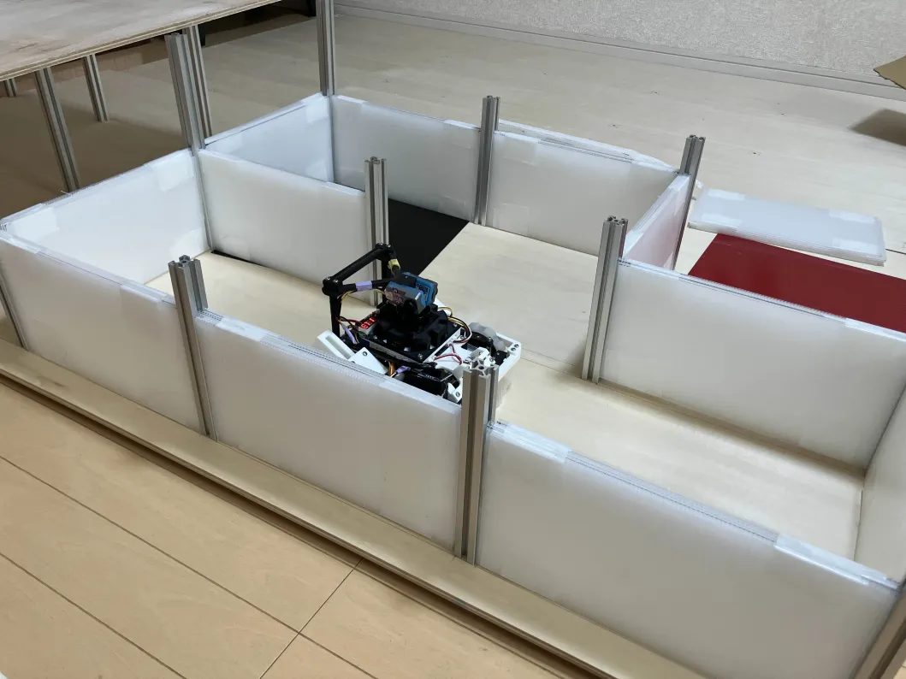
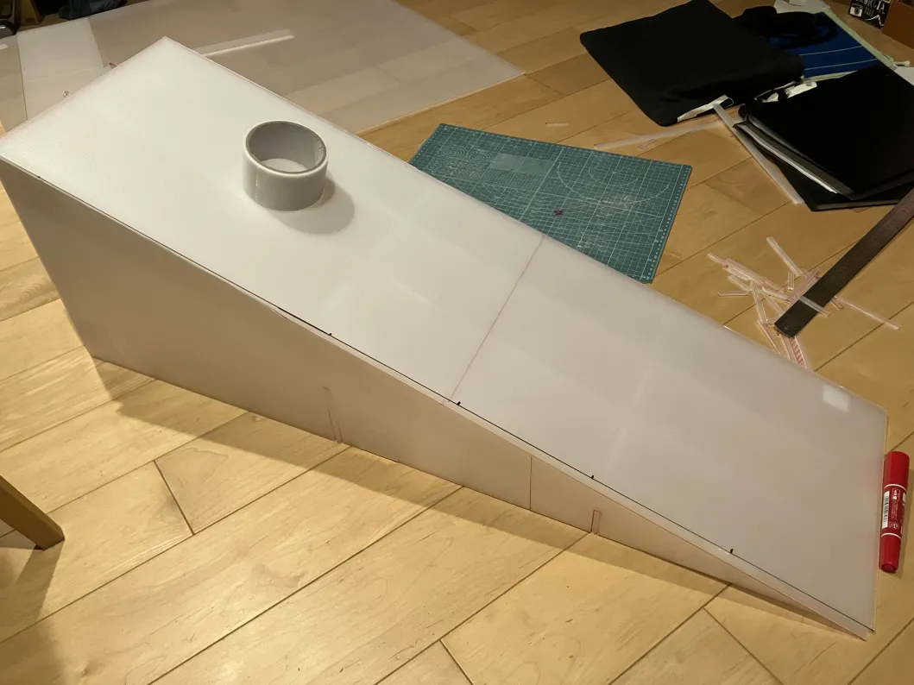
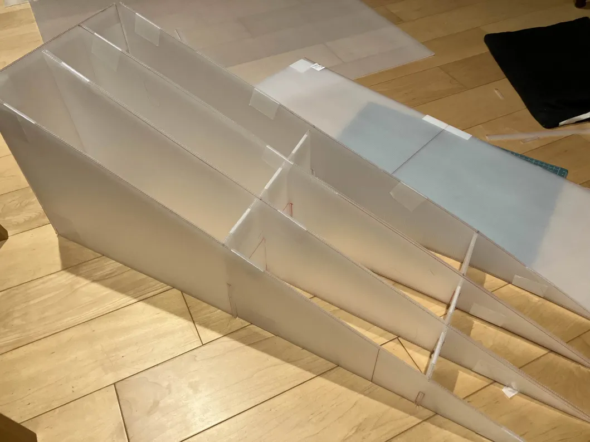
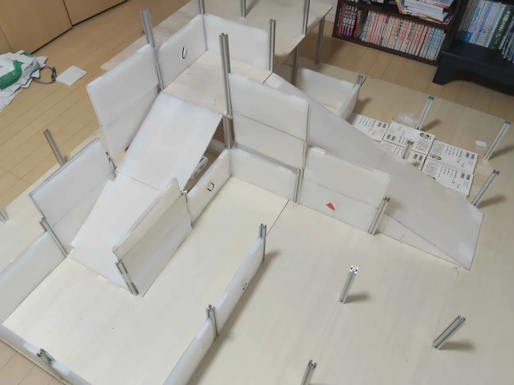
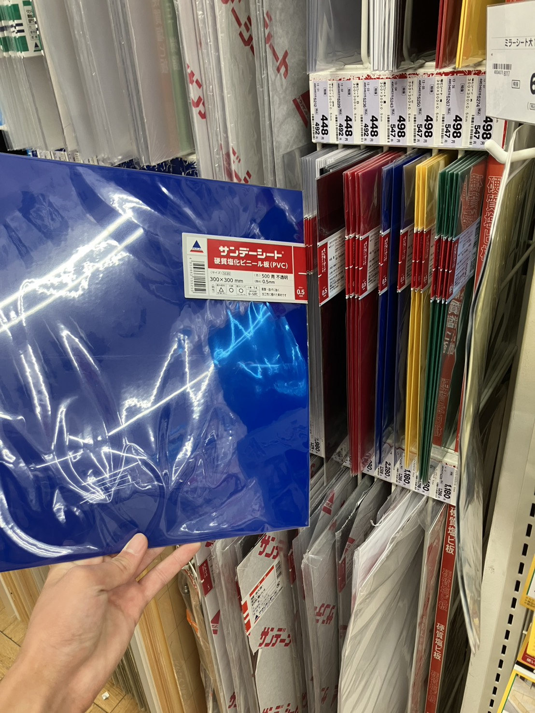
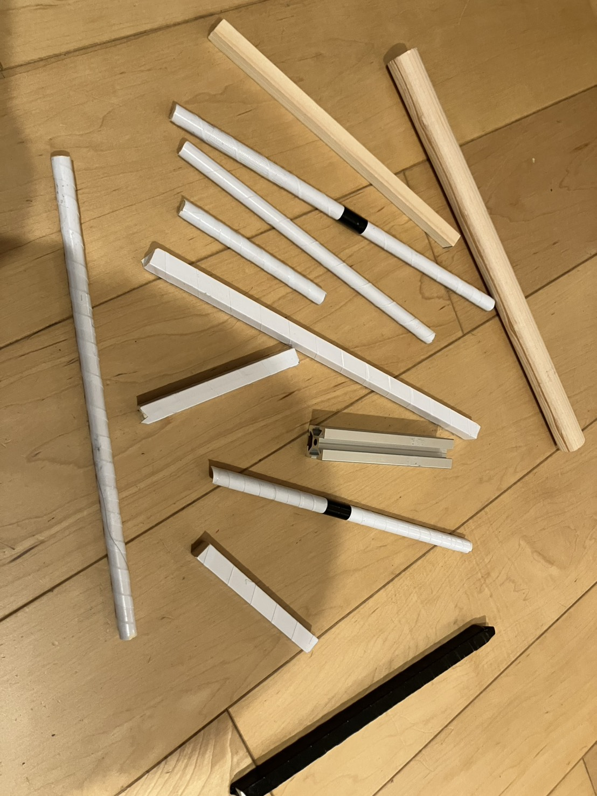

こんにちは。
レスキュー競技では、練習用のフィールドをきちんと作ることがとても大切です。

今回は私たちが作った練習用フィールドを紹介します。

# コンセプト

以下の要件を満たすフィールドを作ることを目標にしました。

- レイアウトを自由に変更できること
- ある程度の広さがあること（目安：6×6マス以上）
- 2階建ての立体交差が作れること

実はこれらを満たす完璧なフィールドキットが販売されているのですが...

[公式のフィールドキットはこちら](https://robotics.rosslight.de/shop/rcj-arena-resc-competition-kits-10-competition-kit-one-maze-2166)

高すぎて個人じゃ絶対に買えませんね。

この記事ではTutonで6×6マスのフィールドを作った際の作り方を紹介します。

# 材料

私たちが作成したフィールドの材料は以下の通りです。

| 材料            | 単価 | 個数   | 購入先         |
| --------------- | -------------- | ------ | -------------- |
| 910×1820mm 合板 | 5000円         | 2枚    | ホームセンター |
| アルミフレーム  | 150円          | 40本   | モノタロウ     |
| 黒タイルシート  | 500円          | 1枚    | ホームセンター |
| 赤タイルシート  | 500円          | 1枚    | ホームセンター |
| 青タイルシート  | 500円          | 1枚    | ホームセンター |
| 養生パネル      | 200円          | 5枚    | ホームセンター |
| M5ボルト        | 10円           | 40個  | ホームセンター |
| 木の棒          | 100円          | 適当数 | ホームセンター |

(単価・個数はおおよその値です)

# 作り方

## 骨組みの作成
まずは、合板に穴を開けます。

30cm間隔で5.5mmの下穴をドリルであけていきます。

ていねいに印をつけて間隔が一定になるようにするのが大切です。間隔がバラバラだと壁を差し込むことができません。

次に、アルミフレームを取り付けます。

アルミフレームにねじ穴を掘っておき、合板の裏側からボルトでアルミフレームを取り付けていきます。

アルミフレームは通常の柱は20cmのものを、2階を作るところは30cmのものを使っています。
（15cmのフレームより20cmのフレームの方が安かったので）

これでフィールドの骨組みが完成しました！

## 壁の作成

壁はコーナンの2.5mm厚の養生パネルで作ります。プラダンでもよいですが、こちらの方が安いのでおすすめです。

1つの壁につき、280mm×150mmの板を4枚、290mm×150mmの板を2枚、合計6枚の板を使用します。

290mmの板を真ん中にして挟み込むように重ね合わせ、養生テープでぐるぐる巻きにすると、こんな感じのアルミフレームに差し込める壁ができます。

 

このように切り出すのがおすすめです。290mmを1列、280mmを2列切り出していて、養生パネル1枚で6個の壁を作れます。

 

完成したら、アルミフレームに差し込んでいきます。これで自由にレイアウトを変えられるフィールドができました。

## 坂道の作成

坂道も養生パネルで作ります。

以下のように、中に柱を作るようにして丈夫に作ります。このくらい柱を入れるとロボットが走っても耐えられるぐらいの強度が出せます。

長い坂も同じように作れます。

 

立体交差を作りたい場合は、小さな合板を買ってきて、30cmのアルミフレームの上に2階を固定するとよいです。
2マスか3マスかけて30cm上がる坂を作れば立体交差ができます。（arctan0.5≒26°なので2マスはややギリギリです）

## 階段

階段は作るのがめんどくさいのでとりあえずは本で代用しましょう。

家にある本を適当に積み上げると階段になります。

私たちは日本の歴史という漫画を使いました。

## 障害物

何でもいいのでちょうどいい大きさのものを置いておきましょう。

## 被災者

印刷しましょう。

来年から被災者は変わるのであまり意味はないかもしれませんが、一応2025ルールの被災者のPDFを置いておきます。A4で印刷すればちょうどいいサイズになります。偽被災者もあります。

[被災者の印刷用PDFはこちら](https://drive.google.com/file/d/1kZSdyqkBzDk9CejFe8XjnN50NYRns7cr/view?usp=sharing)

似ている文字の誤検知は非常に多いのでしっかり練習しておくといいと思います。

今年の被災者だと、以下のような偽被災者の誤検知が多かった印象です。

| 被災者 | 誤検知されやすい文字 |
| ------ | -------------------- |
| H      | A、T                   |
| S      | 8、3、$(ドル)              |
| U      | V、C                 |

サイズの違う被災者という偽被災者もあります。これはどう対策すればいいんでしょうね。難しいです。

## 色タイル

30cm×30cmのサンデーシートと、アルミの板を使用しました。

 

赤タイルを赤被災者と誤検知する可能性があるので、「Dangerous Zoneの赤タイルで特別な処理をする予定はない」という場合も練習フィールドに赤タイルを置いた方が良いと思います。私たちはこれを準備せずに関東ブロック大会で初めて気付きました。

## バンプ

バンプは木の棒を切って作ります。
色々な長さを作りました。10mmバンプと20mmバンプ、丸いバンプと四角いバンプの両方を作るとよい練習になります。
アルミフレームもバンプにできます。

 

白ビニールテープを巻いてあるものが多いのはレスキューライン用にも使っていたためです。

## 瓦礫

ティッシュや爪楊枝やペットボトルの蓋などをばらまきます。

これらは軽視せずに練習用フィールドにも撒いておいた方がいいです。大会当日になって問題に気付く可能性があるので。

# 最後に

関東大会までは寸法がめちゃくちゃなフィールドで練習していたのですが、やはりきちんとしたフィールドで練習するのは大切だなと感じました。

前に作った世界大会の過去問集を共有します。障害物や偽被災者、瓦礫のバリエーションなど参考にしてみてください。

[https://hackmd.io/@shuji4649/ry9yYsuDZl](https://hackmd.io/@shuji4649/ry9yYsuDZl)
