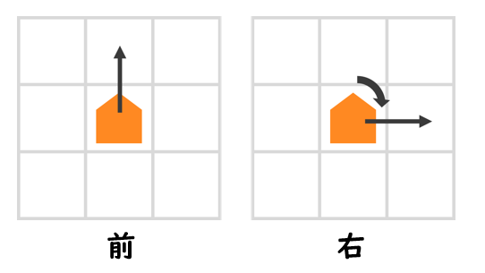
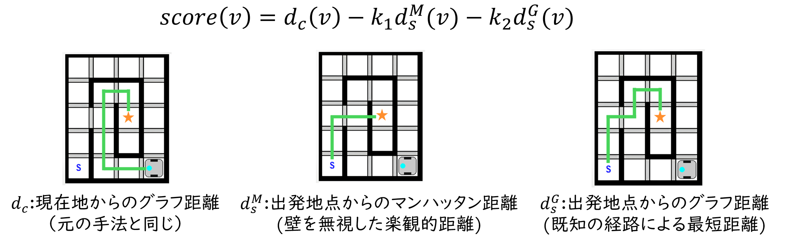
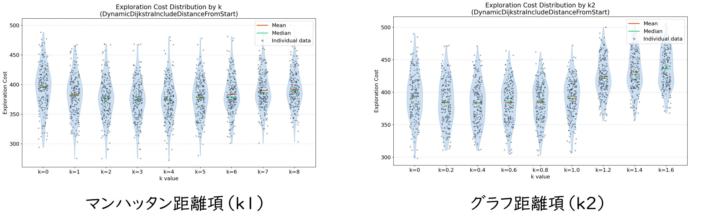
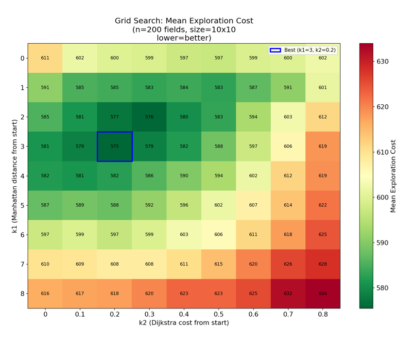
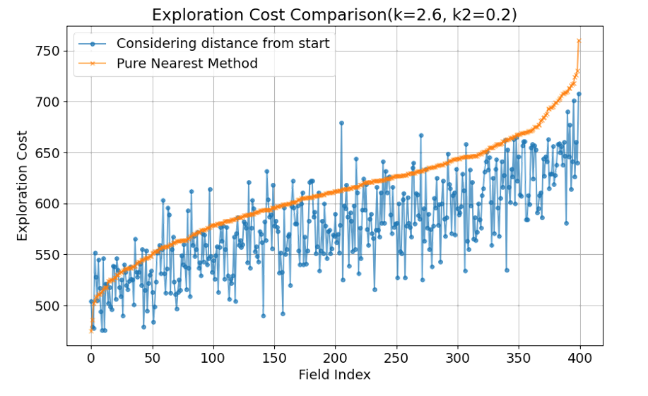
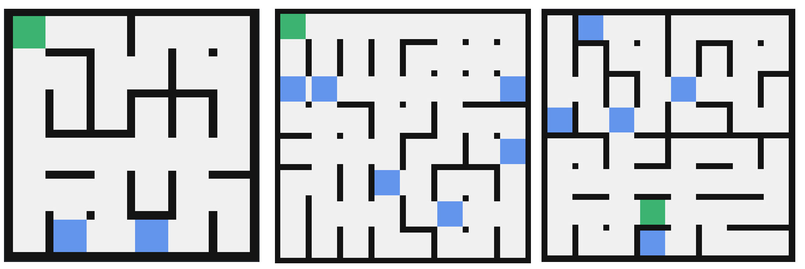

こんにちは。
この記事ではTutonの迷路探索アルゴリズムについて解説します。

# はじめに：研究用ソフトウェア

迷路探索アルゴリズムの研究のために、専用のプログラムを作りました。

 

GUI表示、ランダム迷路生成、評価実験等に対応しています。

使い物になるか分かりませんが一応以下で公開しています。Python製です。

[https://github.com/shuji4649/maze_exploration](https://github.com/shuji4649/maze_exploration)

# 基本方針

基本方針は単純で、「現在から最も近い未訪問タイル」に最短経路で移動することを繰り返します。

未訪問タイルとは、すでに訪問したタイルに隣接したタイル（ロボットが存在を認識しているタイル）のうちまだ訪問していないタイルのことです。

最寄りの未訪問タイルに直接最短距離で移動することで、拡張右手法などに比べて効率的に探索できるのではないかと考えました。

<em>この図で★のタイルが未訪問タイル</em>

 

拡張右手法（※1）とこの手法で探索コストを比較させた結果を以下に示します。5種類のサイズの迷路（6x6, 8x8, 10x10, 12x12, 14x14）で100個ずつランダムに生成した迷路を探索させました。

 

青が拡張右手法、オレンジが今回の手法の探索結果です。

このようにこの手法の方が拡張右手法よりもはるかに効率的で、探索コストも安定していることが分かりました。

※1 右手を優先しつつ、訪問回数が少ないタイルがあればそちらを優先するアルゴリズムとして拡張右手法を実装しました。一般的な認識とずれていたらすみません。

# 最短経路の計算

「現在地から最も近い未訪問タイル」を求めるための最短経路計算について説明します。

最短経路の計算にはダイクストラ法というアルゴリズムを使用します。ダイクストラ法は調べればいくらでも解説が出てくるのでここでは説明しませんが、グラフ上の最短経路を求めるアルゴリズムの一つです。

レスキューメイズの迷路は、各タイルを頂点として隣接したタイルの頂点間を辺で結ぶことで無向グラフとして表現できます。

このグラフ上でダイクストラ法を適用すれば、現在地からそれぞれの未訪問タイルまでの最短距離と最短経路を計算することができます。

ダイクストラ法は辺の重みの差を考慮して経路を計算することができるので、青タイルはコストを重くすることで最短経路計算に反映するようなこともできます。

しかし、これでは不十分な点があります。
実際のロボットは、1マスの直進と90°の旋回にそれぞれコスト（所要時間）があります。
そのため、目の前のマスに進む場合と右側のマスに進む場合では必要なコストが異なるのです。ところが、現在の手法ではこの差を考えることができません。

<em>右に進む場合は90°の旋回が必要なのでコストが高い</em>

 

そこで、それぞれのタイルについて、ロボットの向きを含めた頂点にすることで各頂点を4つに拡張します。

<em>イメージ図</em>

 

この頂点間には、旋回角度を考慮した辺の重みをつけることができます。

これでロボットの実際の動作に忠実なコスト計算ができるようになりました。

ちなみに、この拡張ダイクストラがどのくらい有効なのかを調べた結果を以下に示します。

 

これはフィールドサイズ12×12、直進コスト3、90°コスト2で探索させた結果です。
オレンジが旋回コストを考慮しない探索、青が考慮させた探索です。

確かに青の方が平均的に見ればコストは落とせていますが、そこまで劇的に変わるわけではなさそうです。
この結果は迷路探索そのものがランダム性が大きいためだと考えています。

ただ、帰還経路計算などでは回転を考慮した方が効率的なのは間違いないので、余裕があれば実装してみるとよいと思います。

# 追加の検証

ここからは研究の成果として得られたものの全国大会機体には未実装である内容について説明します。

いくつか探索の様子を見ていると、せっかく遠くまで行ったのにすぐに戻ってきてしまい、またさっき行った遠いところに探索しに行く、というような挙動が見られました。

そこで、スタート地点から遠い点を優先的に回るようにすることで効率的に探索できるのではないかと考えました。

先ほどのアルゴリズムは、現在地からのグラフ距離を評価値として、それが最も小さいマスに移動したと考えることができます。
そこで、この評価値を以下のように変更することで、スタートからの距離を考慮することにしました。

 

各項の強さを調整する係数k1とk2を変化させて探索効率が改善されるのかを見てみます。

まず、片方を0にして、もう片方を変化させてみます。

 

どうやらどちらもわずかに効率を改善する力を持ってるようです。

そこで、グリッドサーチを行い、k1とk2の最適な組み合わせを探してみました。

 

この結果から、どちらか片方を強くするのではなく、両方をほどほどに強くするのが効率的な探索につながることが分かりました。
Optunaライブラリでベイズ最適化を行ったりして、最適パラメータをk1=2.6、k2=0.4と定めました。

この値で元のアルゴリズムと比較した結果を以下に示します。

 

このように、多くのフィールドでコストをわずかにですが改善できることが分かりました。

# 迷路生成について

実験に使用した迷路のランダム生成について解説します。

迷路を自動生成するアルゴリズムとして、穴掘り法（※2）というものがあります。
しかし、穴掘り法では木構造の迷路しか生成できないため、レスキューメイズのフィールドとしては不適です。
一方で、完全に壁をランダムに配置する方法だと、直線が少なかったり、つながった迷路ができない可能性があったりして、これも難しいです。

そこで、以下のような手順で生成しました。

1. 穴掘り法で木構造迷路を生成する。
2. 1.で作成した迷路の壁を一定の割合でランダムに破壊する。
3. スタート地点・青タイルをランダムに配置する。

この方法で以下のようなそれっぽい迷路を生成できるようになりました。

 

迷路探索アルゴリズムの研究という目的において立体的な迷路を使用する必要はあまりないと考えたため、2次元の迷路しか生成していません。

※2 穴掘り法はこーじさんの動画などが分かりやすいです：[https://youtu.be/yHXkuBPNvmk](https://youtu.be/yHXkuBPNvmk)

# 最後に

GUIを作ったことの最大のメリットは、ロボットが迷路探索しているかわいいアニメーションを見て癒されることでした。かわいいでしょ。

<iframe width="560" height="315" src="https://www.youtube.com/embed/UBBypPrd-d8?si=Q2Wo0WRgwEOypZ1Q" title="YouTube video player" frameborder="0" allow="accelerometer; autoplay; clipboard-write; encrypted-media; gyroscope; picture-in-picture; web-share" referrerpolicy="strict-origin-when-cross-origin" allowfullscreen></iframe>

 

ちなみに、これを学校の課題研究の授業の研究テーマにしていたので発表スライドやポスターがあります。あんまり凝ったものではないですがもし興味があれば以下からご覧ください。

[研究データ（Google Drive）](https://drive.google.com/drive/folders/18LiKXv8QAUZ4EMl_11zOP68RvQiUVVTg?usp=sharing)

何か質問があればTwitterのDMやマシュマロなどで気軽に聞いてください！

[shuji4649のマシュマロ](https://marshmallow-qa.com/wvxcgdpm90lzfzr)