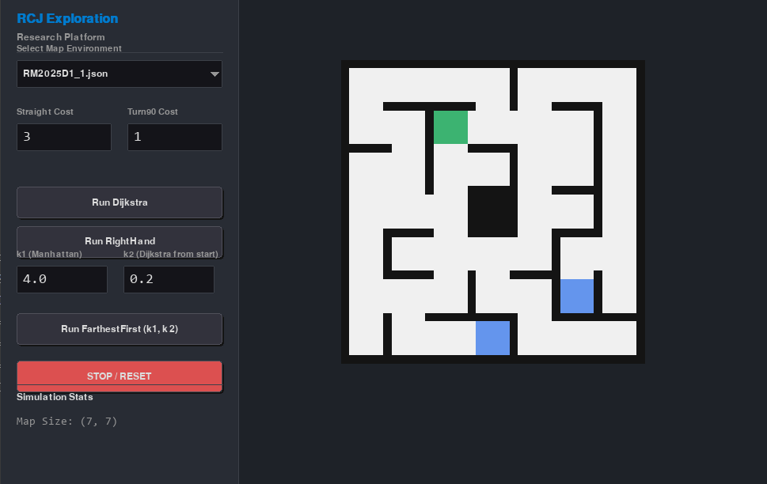
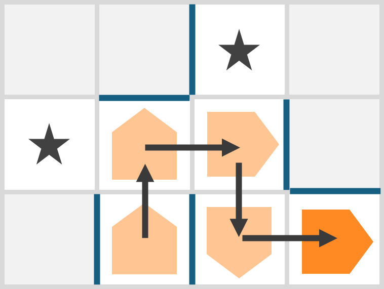
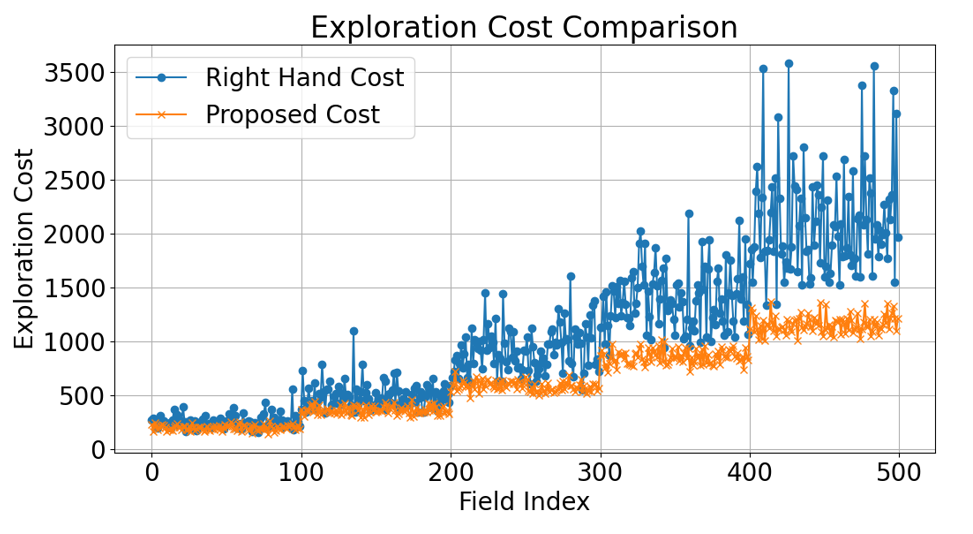
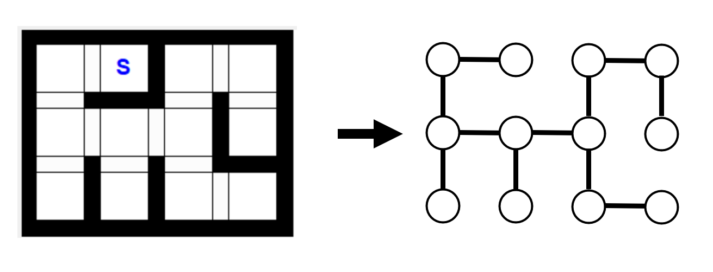
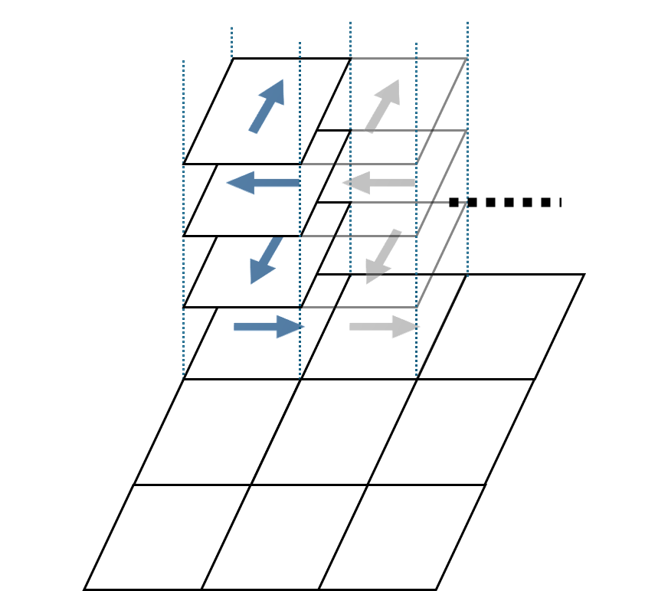
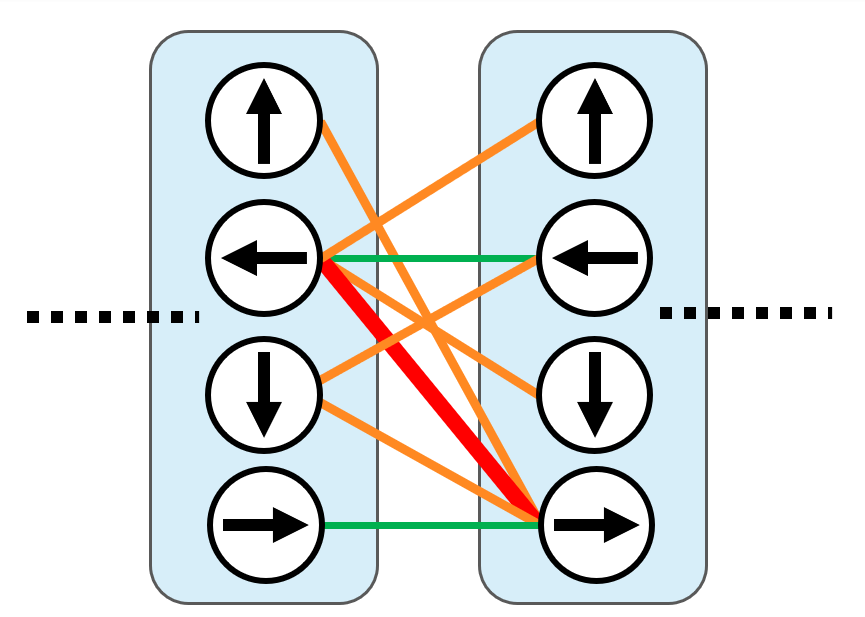
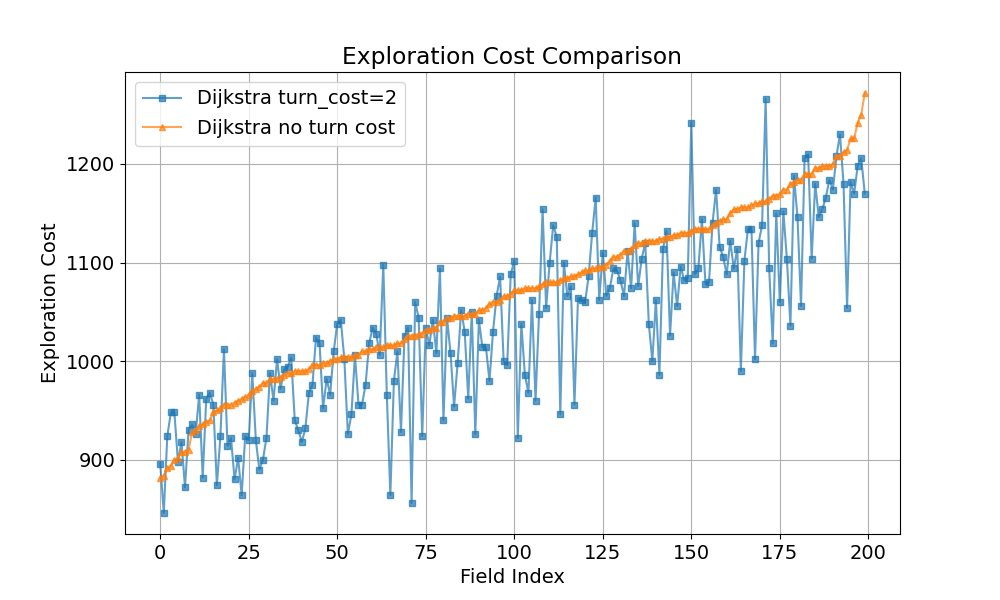

こんにちは、回路担当のshujiです。

Tutonの迷路探索アルゴリズムについて解説します。

# 研究用ソフトウェア

迷路探索アルゴリズムの研究のために、専用のプログラムを作りました。

GUI表示、ランダム迷路生成、評価実験等に対応しています。

以下で公開しています。Python製です。

[https://github.com/shuji4649/maze_exploration](https://github.com/shuji4649/maze_exploration)

# 基本方針

現在から最も近い未訪問タイルに最短経路で移動することを繰り返します。

未訪問タイルとは、すでに訪問したタイルに隣接したタイルのうちまだ訪問していないタイルのことを言います。

<em>この図で★のタイルが未訪問タイル</em>

周囲のタイルの中で訪問回数が最も少ないタイルに移動する、という訪問回数記録法（たぶん拡張右手法と同じ）と、この手法で探索コストを比較させた結果を以下に示します。

このようにこの手法の方が拡張右手法よりもはるかに効率的であることが分かります。

# 最短経路の計算

最短経路の計算はダイクストラ法で行います。

レスキューメイズの迷路は、各タイルを頂点として隣接したタイルの頂点間を辺で結ぶことで無向グラフとして表現できます。

このグラフ上でダイクストラ法を適用すれば、現在地からそれぞれの未訪問タイルまでの最短距離と最短経路を計算することができます。

ダイクストラ法は辺の重みの差を考慮して経路を計算することができるので、青タイルはコストを重くすることで最短経路計算に反映することができます。

しかし、これでは不十分な点があります。
実際のロボットは、1マスの直進と90°の旋回にそれぞれコスト（所要時間）があります。
そのため、目の前のマスに進む場合と右側のマスに進む場合では必要なコストが異なるのです。ところが、現在の手法ではこの差を考えることができません。

そこで、それぞれのタイルについて、ロボットの向きを含めた頂点にすることで各頂点を4つに拡張します。

この頂点間には、旋回角度を考慮した辺の重みをつけることができます。

これでロボットの実際の動作に忠実なコスト計算ができるようになりました。

ちなみに、この拡張ダイクストラがどのくらい有効なのかを調べた結果を以下に示します。

これはフィールドサイズ12×12、直進コスト3、90°コスト2で探索させた結果です。
オレンジが旋回コストを考慮しない探索、青が考慮させた探索です。

確かに青の方が平均的に見ればコストは落とせていますが、そこまで劇的に変わるわけではなさそうです。
この結果は迷路探索そのものがランダム性が大きいためだと考えています。

ただ、帰還経路計算などでは回転を考慮した方が効率的なのは間違いないので、余裕があれば実装してみるとよいと思います。

# 追加の検証

ここからは研究の成果として得られたものの全国大会機体には未実装である内容について説明します。

いくつか探索の様子を見ていると、せっかく遠くまで行ったのにすぐに戻ってきてしまい、また同じところに戻ってくる、というような挙動が見られました。

そこで、スタート地点から遠い点を優先的に回るようにすることで効率的に探索できるのではないかと考えました。

先ほどのアルゴリズムは、以下の値が最も小さいマスに移動したと考えることができます。

そこで、この評価関数を以下のように変更することで、スタートからの距離を考慮することにしました。

単純にすべてのマスについてこの値を計算して一番小さいタイルを探します。

k1とk2を変化させて最適値を探しました。

# ダイクストラ法について

ダイクストラ法というのはグラフ上で1つの始点から全頂点までの最短距離・最短経路を効率的に計算するためのアルゴリズムです。

超有名な基礎的なアルゴリズムなので使えるようにしておくとよいです。

