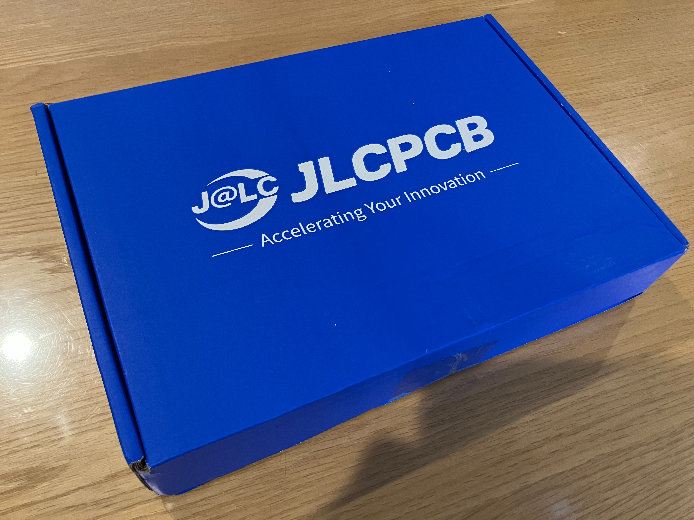
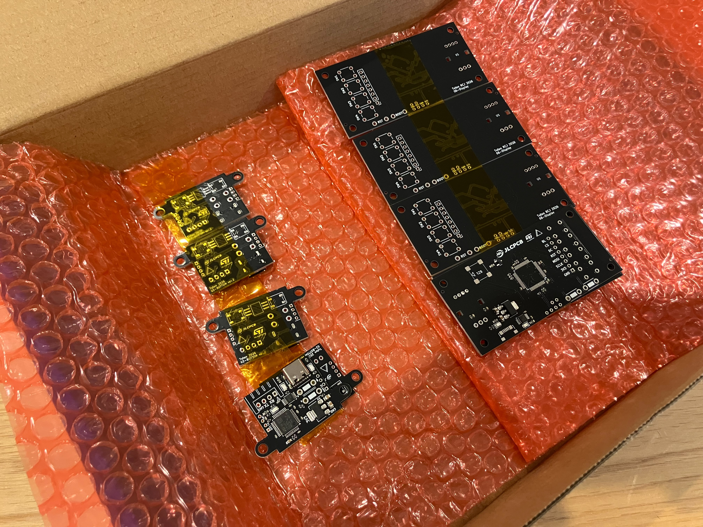
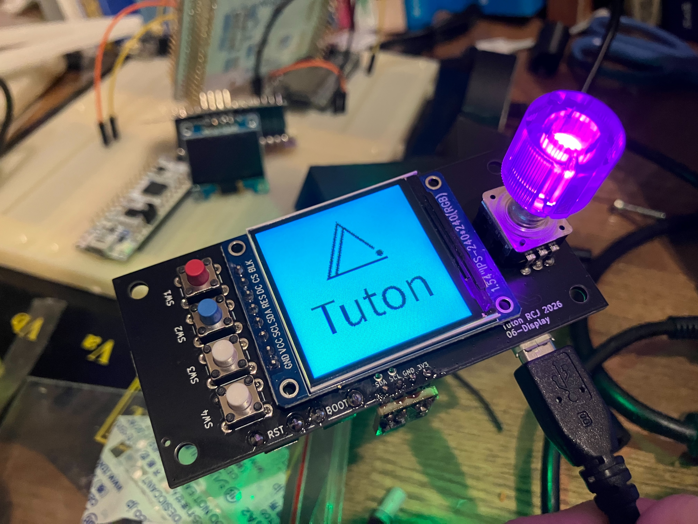
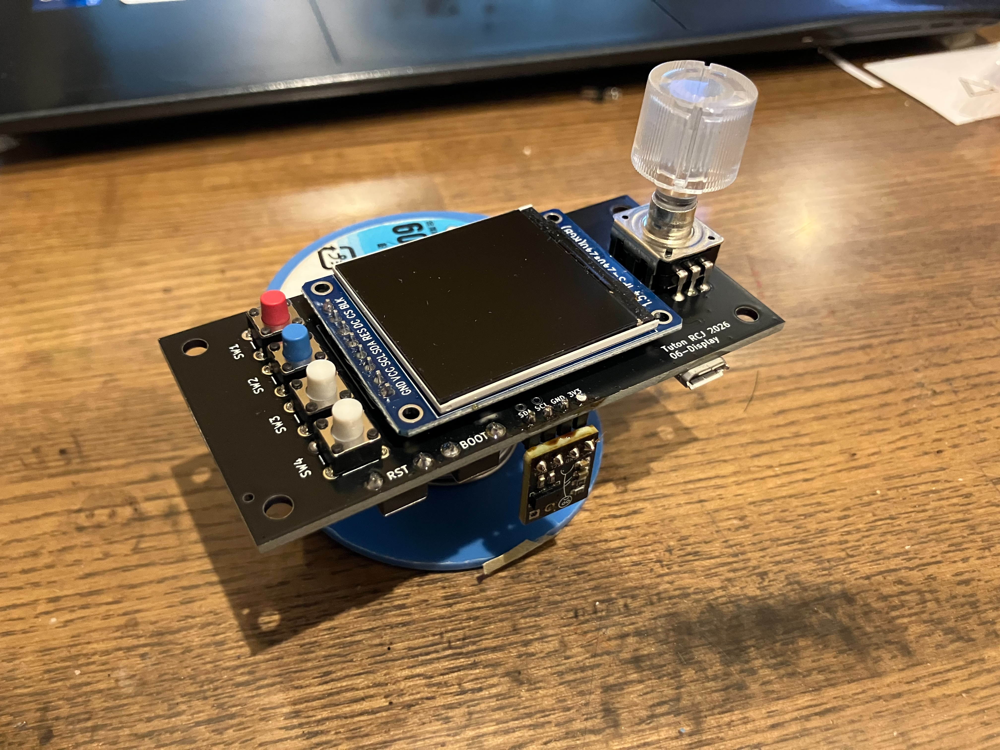
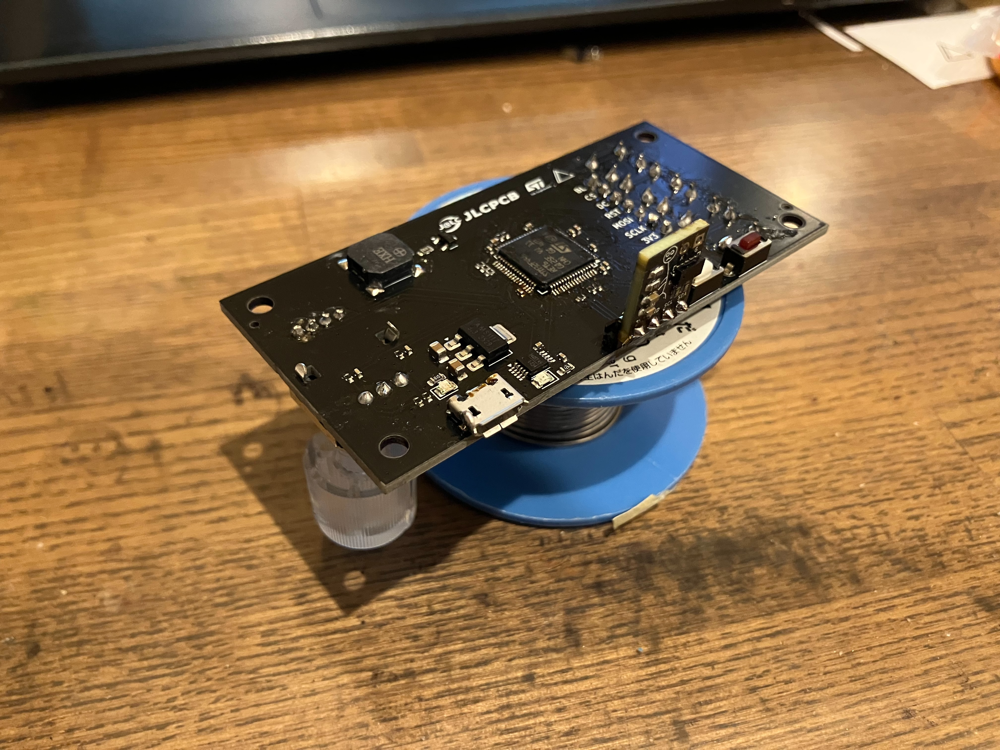
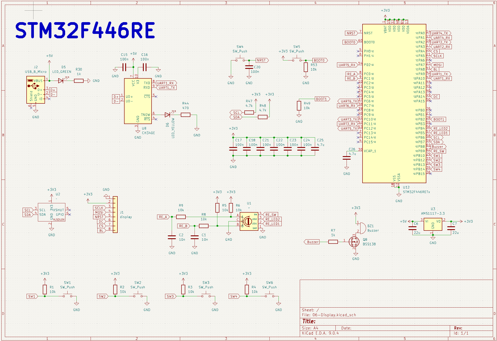
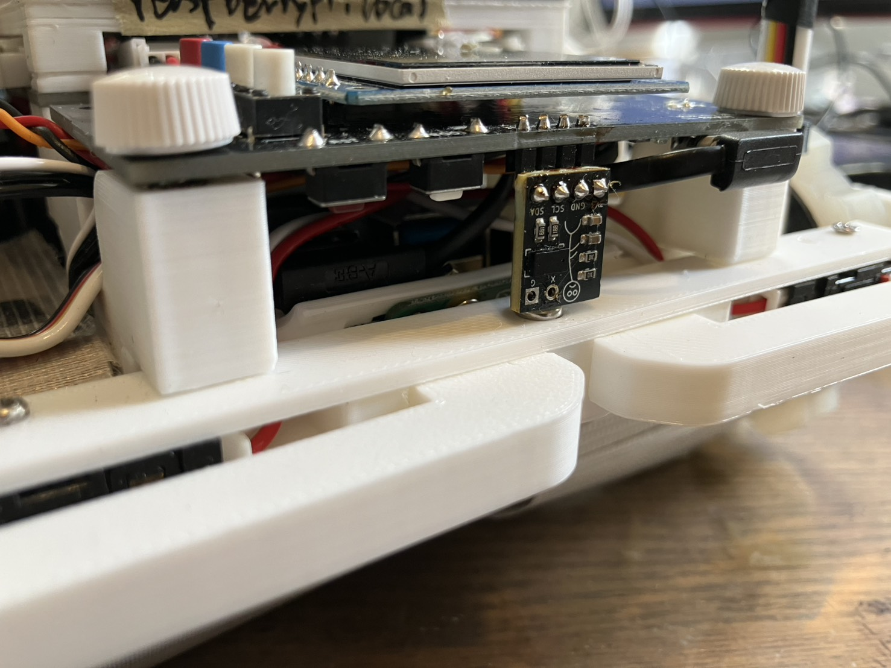
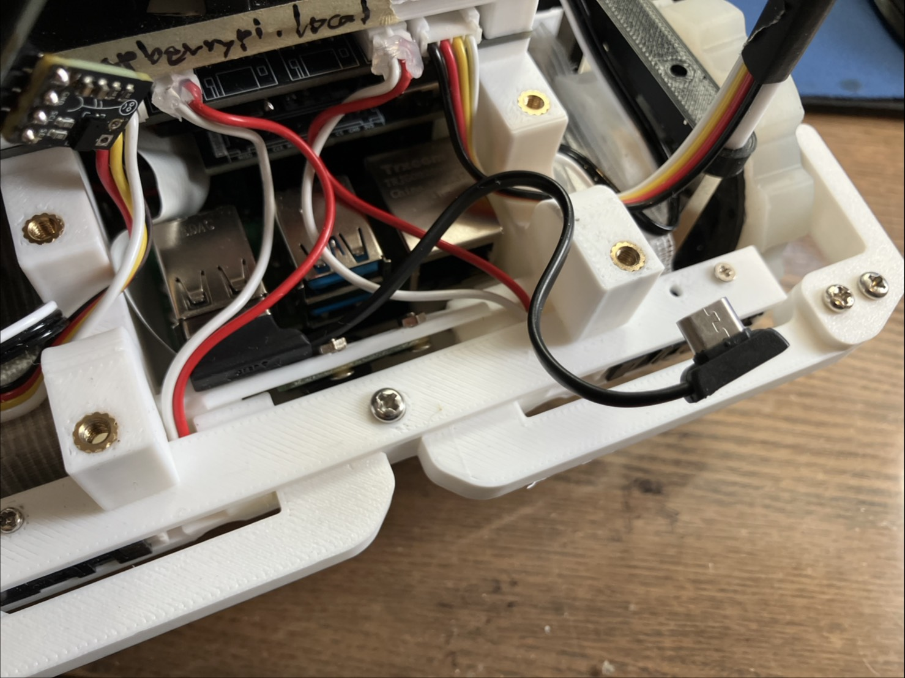
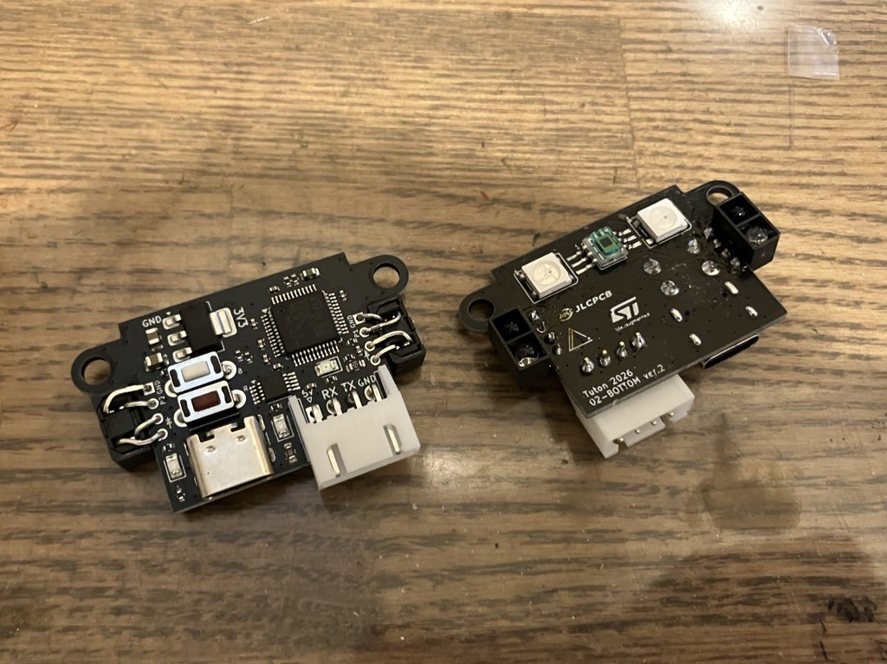
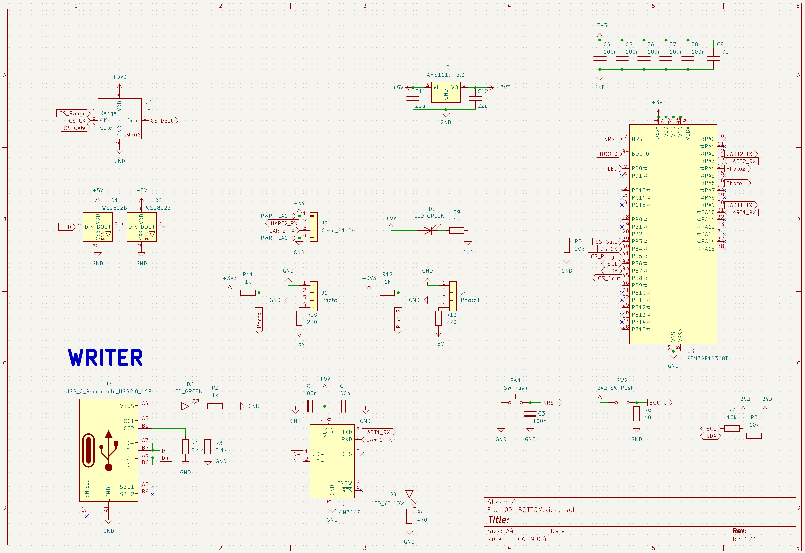

こんにちは、回路担当のshujiです。

全国大会前に発注した基板について紹介します！

# JLCPCBの紹介

[JLCPCBさんのホームページはこちら(https://jlcpcb.jp/)](https://jlcpcb.jp/)

今回発注したものを含む私たちのロボットの基板やCNC部品は全てJLCPCB様にスポンサーとして提供いただいています。

JLCPCBは基板やCNCなどを取り扱っている中国の製造会社です。高品質で低価格、そして迅速な配達が特徴で、個人や学生チームのロボット開発にとてもぴったりな企業です！

JLCPCBでは非常にたくさんの部品から選んで表面実装までしてもらうことができるため、高性能なロボットを作るのにとても役立っています。

新規ユーザーはなんと**123ドル**ほどのクーポンがもらえるので、初めての方もぜひJLCPCBで発注してみてください！

そして、実はすべてのユーザーにこのように毎月SMTのクーポンが配られています！久しぶりの人もこのクーポンを使って表面実装を発注してみてはいかがでしょうか？

 

表面実装で発注する方法は[こちらの記事](https://tuton-rcj.github.io/20241030/)で解説しています！

また、CNCを発注する方法は[こちらの記事](https://tuton-rcj.github.io/20240419/)で解説しています！

# 発注した基板

今回はディスプレイ基板とカラーセンサ基板の改良版を発注しました！

 

大会直前の発注だったのですが、1週間ほどで届けてくださり大会に間に合わせることができました！

# 06-Display基板

ロボットの前方に取り付ける、ディスプレイを搭載した基板です。

 

 

 

| 部品                                                                                   | 数  |
| -------------------------------------------------------------------------------------- | --- |
| マイコン STM32F446RE                                                                   | 1   |
| ToF測距センサ VL53L0X                                                                  | 1   |
| [1.54インチカラーディスプレイ](https://akizukidenshi.com/catalog/g/g131019/)           | 1   |
| [2色LED付スイッチ付ロータリーエンコーダ](https://akizukidenshi.com/catalog/g/g105772/) | 1   |
| タクトスイッチ                                                                         | 4   |
| 表面実装ブザー                                                                         | 1   |

裏面の部品をPCBAでJLCPCBさんに実装していただきました！STM32の周辺回路などの細かい部品を実装していただけるのはとてもありがたいです。

全国大会では使いませんでしたが、今後しきい値の調整等に使えるように、スイッチやロータリーエンコーダを搭載しています。

また、VL53L0XというToF測距センサを1つ搭載しています。もともと搭載していた距離センサと高さをずらして配置することで、前方が壁なのか坂なのかを判別できるようにしました。

 
このVL53L0Xセンサのモジュールも昔JLCPCBさんに作っていただいたものです。詳しくは[こちらの記事](https://tuton-rcj.github.io/20241118/)をご覧ください！

全国大会ではこのように座標を表示して使っていました。今後、他にもUIとしての機能を追加していく予定です。
座標を表示すると、走行中にマッピングずれが起きていないかを確認できるので、レスキューメイズに参加するチームには何らかのディスプレイを搭載することをおすすめしたいです！

<blockquote class="twitter-tweet">
デザイン凝ってる時間はないのでこれでいく <a href="https://t.co/AJD8s2J5Dj">pic.twitter.com/AJD8s2J5Dj</a>
&mdash; shuji (@shuji_4649) <a href="https://twitter.com/shuji_4649/status/2036432975626428596?ref_src=twsrc%5Etfw">March 24, 2026</a></blockquote> 

 

ちなみに、この基板はRaspberryPiとUSBケーブルで接続しています。

[オーディオファンの短いmicro-bケーブル](https://www.amazon.co.jp/dp/B07KZS8JDT/)を使っているのですがとても便利なのでおすすめです。

 
# 02-BOTTOM基板 v2.0

 

 

| 部品                                                                       | 数  |
| -------------------------------------------------------------------------- | --- |
| マイコン STM32F103C8                                                       | 1   |
| [カラーセンサ S9706](https://akizukidenshi.com/catalog/g/g102493/)         | 1   |
| フルカラーLED WS2812B                                                      | 2   |
| [フォトリフレクタ LBR127HLD](https://akizukidenshi.com/catalog/g/g104500/) | 2   |

[こちらの記事](http://tuton-rcj.github.io/20251118/)で紹介している、以前作ったロボットの底面に取り付ける基板の改良版です。

サイドに1つずつフォトリフレクタを追加できるようにしました。これまでは違法建築でフォトリフレクタを無理やり付けていたのですが、量産に備えてちゃんとスルーホールを出した基板を作りました。

フォトリフレクタは銀タイルの検知に使用しています。可視光のLED・カラーセンサだとうまく銀の判別ができなかったので、赤外線を使用するフォトリフレクタで判定しています。

フォトリフレクタはLBR127HLDを使用していたのですが、白タイルと銀タイルの差が微妙だったのでもっと出力の大きなものに変更しようと思います。

# さいごに

Tutonの今年の基板はすべてこちらのリポジトリで公開しています！参考になれば幸いです。

[https://github.com/tuton-RCJ/RCJ2026PCB](https://github.com/tuton-RCJ/RCJ2026PCB)

