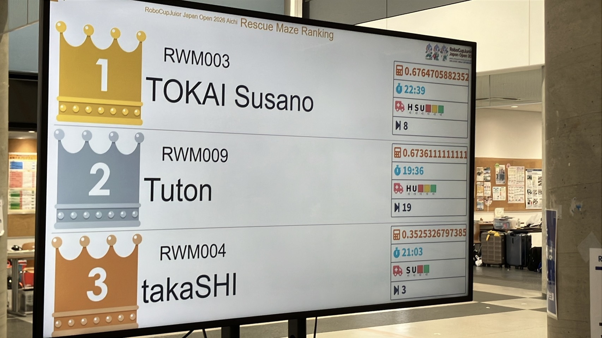
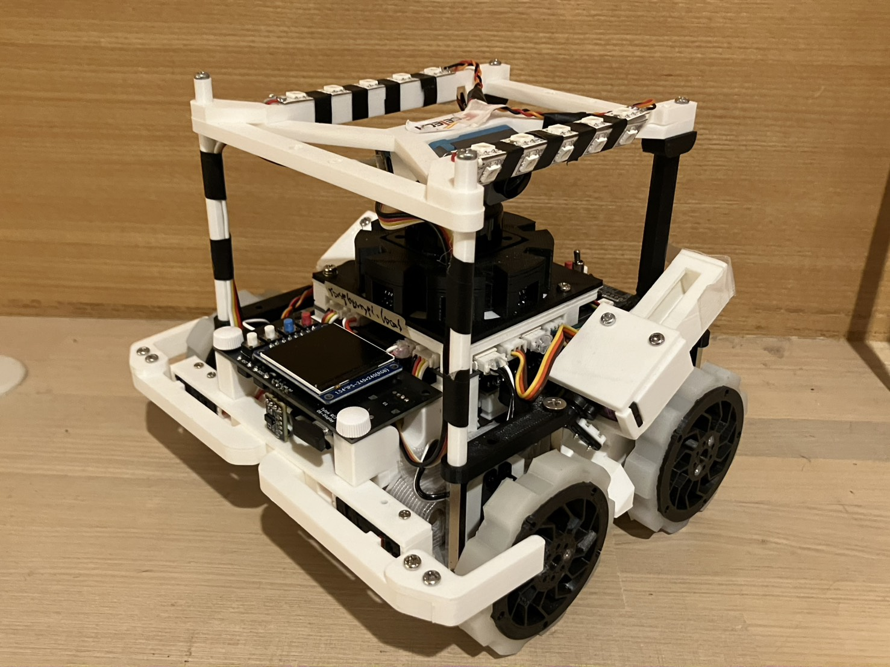
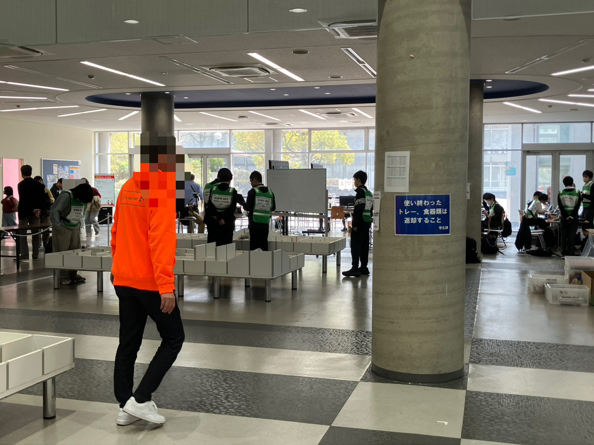
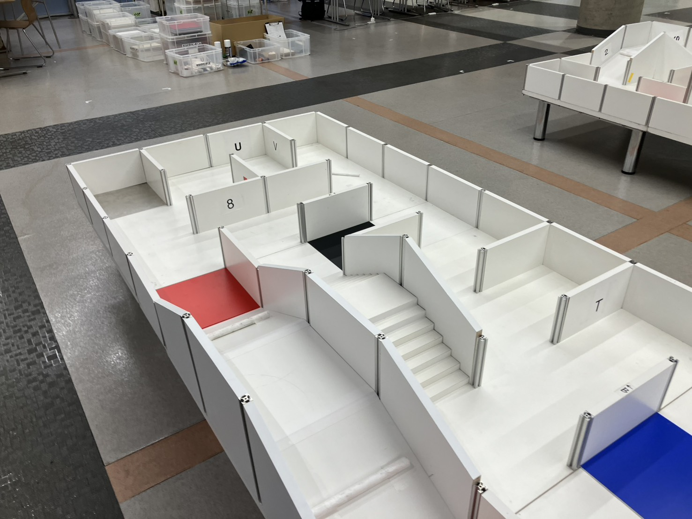
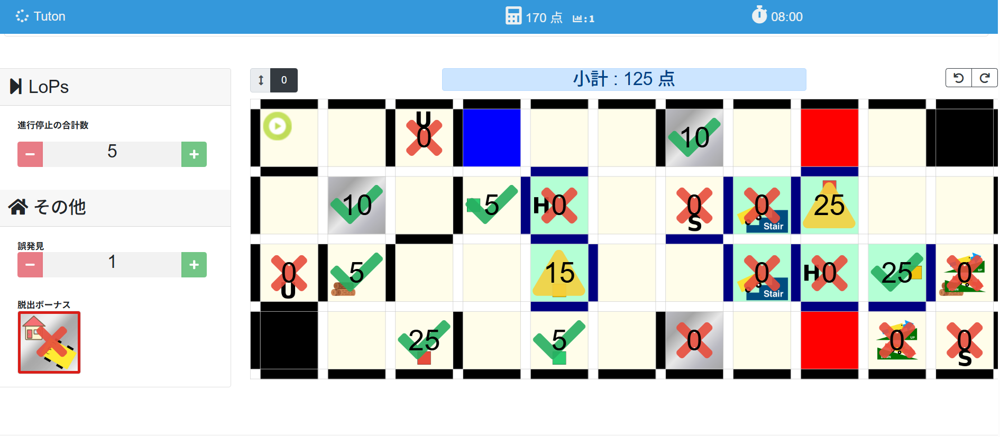
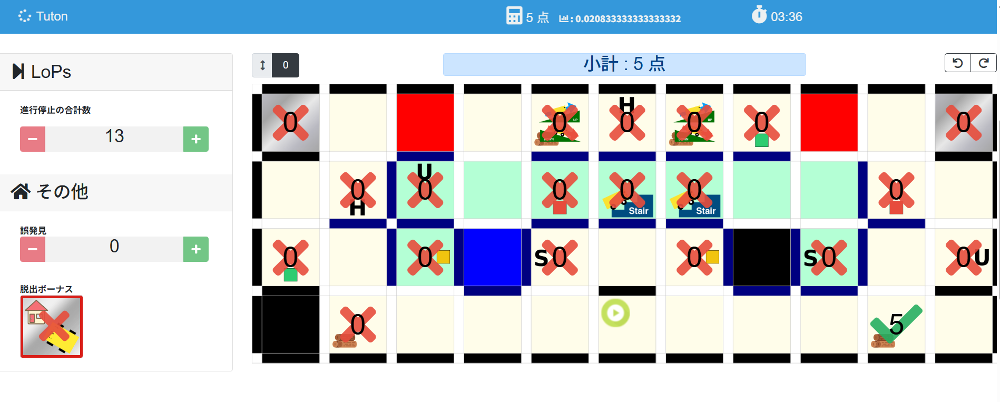
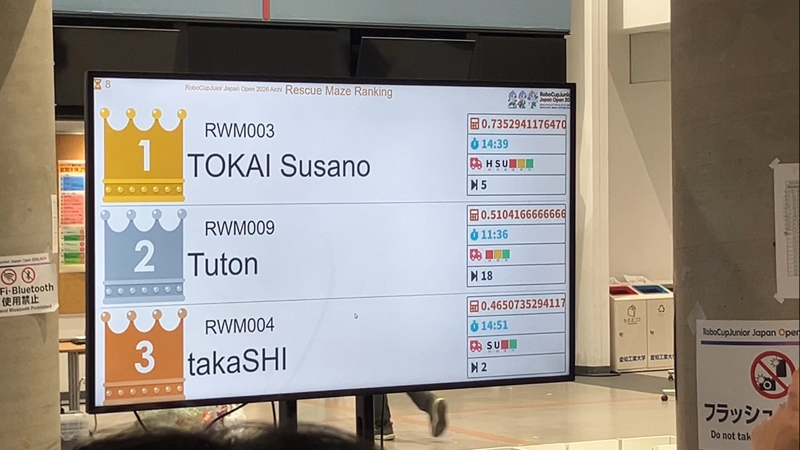
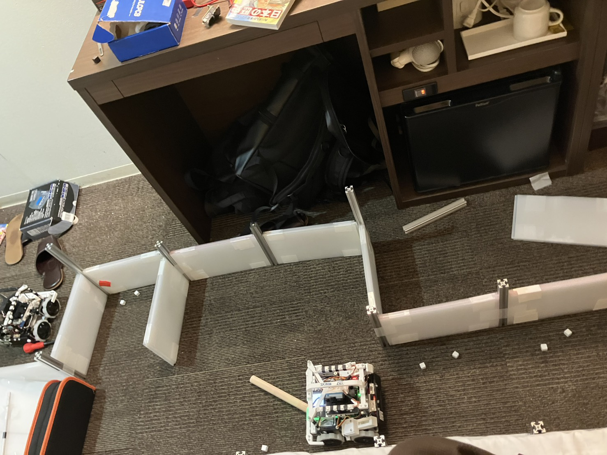
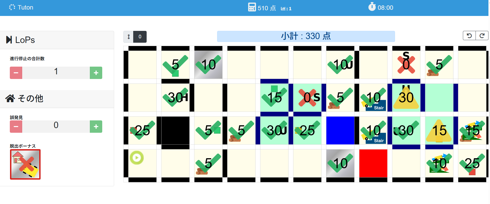
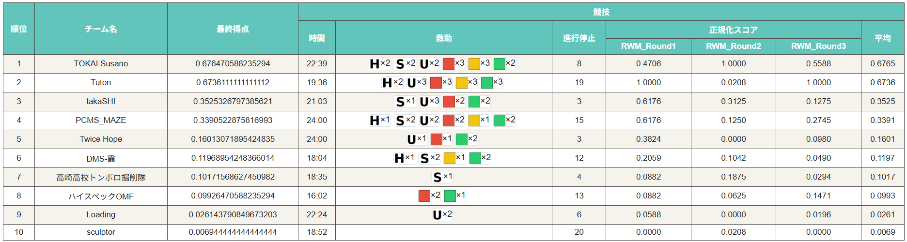

こんにちは、キャプテンのshujiです。

2026/03/27～2026/03/29に開催されたロボカップジュニアジャパンオープン2026愛知の競技の振り返りをします。

今回は走行動画の公開はありません。ごめんなさい。

# 結果

結果は以下の通りとなりました。

 
- レスキューメイズ競技 準優勝
- 優秀プレゼンテーション賞
- ソフトウェア奨励賞
- 人工知能学会賞

実力を発揮しきることができず準優勝に終わってしまったことをとても悔しく思います。

メイズは最近2枠世界大会推薦をもらえることが多いので、世界大会へ行けた際はこの反省を活かして本気で優勝を狙っていきます。

競技結果は残念でしたが、昨年度に引き続きドキュメントや開発過程を評価していただけたことは嬉しく思います。

提出したすべてのドキュメントは以下で公開しています。ぜひご覧ください。

[https://tuton-rcj.github.io/20260325/](https://tuton-rcj.github.io/20260325/)

# 今年のロボット

今年のロボットは「クロ」と名付けました。初めは黒かったからです。今はフィラメントの関係で白くなってしまいました。

 

ロボットのデータは以下の通り公開しています。何か質問等があれば私の[Twitter](https://x.com/shuji_4649)や[マシュマロ](https://marshmallow-qa.com/wvxcgdpm90lzfzr)でお気軽に聞いてください。

- 機体データ（Fusion）：[https://a360.co/4cgz3n4](https://a360.co/4cgz3n4)
- 基板データ（KiCAD）：[https://github.com/tuton-RCJ/RCJ2026PCB](https://github.com/tuton-RCJ/RCJ2026PCB)
- RaspberryPiのコード：[https://github.com/tuton-RCJ/Kanto2026RPi](https://github.com/tuton-RCJ/Kanto2026RPi)
- STM32、UnitVのコード：[https://github.com/tuton-RCJ/Kanto2026Software](https://github.com/tuton-RCJ/Kanto2026Software)

それでは、競技の振り返りに入ります。
# 調整

1日目会場に到着後、うっすら懸念していた光景が目に映り込んできました。

「太陽光が会場にめっちゃ差し込んでくる」

<em>窓でかすぎ。やめてくれ。</em>

 

こわいこわい。不安を抱えながらもパドックで準備をし調整に入ります。

さてさてロボットを動かしてみると、明らかに様子がおかしいです。どこかで遅延が発生しているようです。
制御周期が普段よりも大幅に長くなっていることが判明し、原因は特定できませんでしたが予備機体に切り替えると正常に動くことが分かったので、とりあえず予備機体を車検に出して練習を再開しました。これは後でモーターのライブラリの変更ミスが原因だったことが分かりました。

そして、坂にある20mmバンプと長い階段を登れないことを確認した（これは前からハードウェア的に無理だろうなと思っていた）ため、坂を検知したら壁と判断して回避するようにプログラムしました。

<em>坂の20mm丸バンプと長い階段</em>

 

また、何もないところで「S」を読む現象が発生しました。これはデータセットに白飛びしたSの画像がいくつか入っていたことが原因だと分かったため、とりあえずSは読むのをやめることにして対処しました。

1日目はこのような感じで調整をして終わりました。

2日目動かしてみると、LiDARのノイズが激しいことが判明します。1日目は大丈夫そうだったので油断していたのですが、窓が東向きだったため時間帯によって太陽光の影響が変わるようでした。会場の奥だとノイズは見られなかったので明らかに太陽光の影響でした。

ノイズ除去を入れたり最低移動時間を追加したりして対処していましたが、完全には解決しないまま走行に臨むことになりました。

# 1走目

 

取り切れなかったバグのせいで進行停止の多い不安定な走行でしたが、少しは走って救助もしてくれました。

170点というあまりにも低い点数でしたが、他のチームの調子も悪かったようで正規化得点は1.00でした。

# 2走目

 

さっきの170点がかわいく見えてきました。なんと5点です。Tuton史上最悪の走行です。

スタートタイルの前後に5マスの直線があるコースで、前後どちらに向けても2マス進むとそのまま真っすぐ直進し続けるバグが発生してどうにも先に進めませんでした。

何回かいろいろな向きで試してみましたが（進行停止13回!?）どうしようもなく、リタイアして終わりました。

練習しているときはこのバグは無かったので、LiDARのノイズ対策をする中で埋め込まれてしまったものだと考えています。明確な原因特定はまだできていません。

正規化得点は0.02です。大きく足を引っ張ってしまいました。

# 2日目の夜

 
2日目時点での結果です。1位のチームと2倍弱の点数差をつければ逆転優勝できる状態でした。

明日の走行は昼であり、LiDARのノイズが激しくなることが予想されるため、LiDARを使わない方針でプログラムを書き換えることにしました。

ホテルに簡易フィールドを建設し、1晩かけて1マス移動を秒数の定数制御に変更しました。

 

また、レスキューキットが練習環境よりもよく跳ねる問題が発生しており、中にナットを入れることで改善されることを会場滞在中にハード担当が検証していたので、1晩かけて12個新しいレスキューキットを作成してもらいました。予備のレスキューキットをたくさん印刷してきてよかったです。

そしてこれは予想外の産物でしたが、この作業を通して作業用手袋についていたモーターの油がレスキューキットに付着したことにより排出機構の中での滑りが良くなりました。

2走目の終了後に、3走目は坂道や階段を易しくすると聞いたので、坂道や階段を確実に突破できるようにするためにタイヤを小さいタイヤに交換しました。（タイヤを小さくすると重心が下がってわずかに転びづらくなります）

# 3走目

 

直前にカメラのトラブルがあり、40秒ほど遅れてのスタートになってしまいました。

徹夜開発の成果が出て、かなり安定した走行ができました。

階段で一回転倒してしまったため時間が足りなくなって帰還まではできませんでした。

最初の40秒があればもう少し点が取れていたと思うと悔しいです。

正規化得点は1.00でした。

# 最終成績

<em>情けなさすぎる成績表</em>

 

結局僅差で2位に終わってしまいました。どこかの走行であと1つ何かをクリアしていれば優勝できていたような点数なので、悔しさが残ります。というか素点合計なら優勝でした。

そんなことを言っても仕方がありません。準備不足と大会での行動選択のミスが重なって敗北を突き付けられました。とはいえ、これだけの不調の中でこの成績を残せたのは、ハードやソフトの両面でメンテナンス性や冗長性を高めてきたからだと思います。まあ優勝できなかった程度のものだったとも言えますが。

諸事情で大会直前にあまりソフトウェアの開発をできなかったのも大きな敗因だと感じています。

# 今後について

世界大会への推薦をもらえるかは分かりませんが、とりあえず今はそれを期待することしかできないので、推薦をもらえることを前提に世界大会に向けての準備を進めていきます。

ハードウェアの改善、新しい被災者への対応、ソフトウェアのリファクタリング・改善、ドキュメントの作成など、できることを一つひとつ進めていきたいと思います。

今年度はメンバー全員高校3年生で受験勉強もあるため、推薦をもらえなかった場合はこれで引退する可能性が高いです。

どうなるか分かりませんが、これからもどうぞよろしくお願いします。

