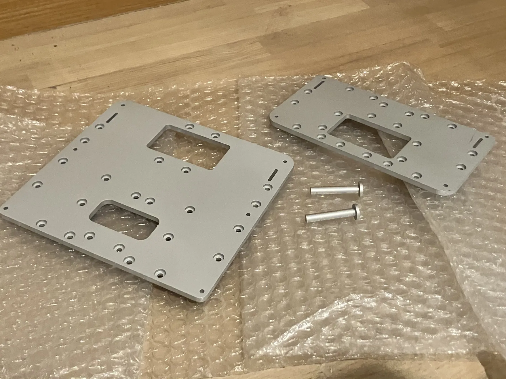
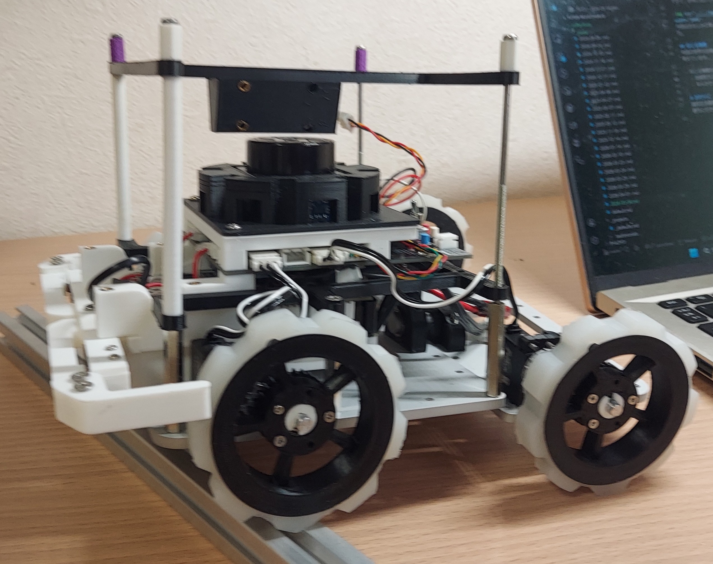

お久しぶりです！ハード担当のkapiです。久しぶりの更新です。

## 世界大会参加決定！

X（旧Twitter）ではすでに発表させていただきましたが、RoboCup 2026世界大会への参加が決定しました。全国大会では優勝を逃しましたが、世界大会ではその悔しさを晴らすつもりで、1位を目指して準備を進めていきます。

<blockquote class="twitter-tweet">
この度、TutonはRoboCup2026世界大会への推薦をいただくことができました！  最後のロボカップ、今まで学んできたことを全て生かして最大限の努力を尽くします。  優勝目指して頑張ります。これからもよろしくお願いします！！ <a href="https://t.co/4sabN5CBiQ">pic.twitter.com/4sabN5CBiQ</a>
&mdash; Tuton (@tuton_RCJ) <a href="https://twitter.com/tuton_RCJ/status/2045657438079344759?ref_src=twsrc%5Etfw">April 19, 2026</a></blockquote> 

応援していただけると嬉しいです。

---

## 新機体の開発開始

今回の世界大会では、全国大会での反省を活かし、機体の安定性と走破性を高めるために設計を一新しました。まったく新しい機体で世界大会に臨みます。

新機体はまだ愛称を決めていません。いい名前があればXなどで教えてください。

---

## パーツ発注と製造パートナー：JLCPCB様

### スポンサー企業の紹介

Tuton RCJの機体製造を支えてくださる[JLCPCB](https://jlcpcb.jp/)様について紹介させていただきます。

JLCPCBは、中国の高品質な製造サービス企業で、次のような特徴があります。

- **高品質で低価格**：競争力のある価格で、プロフェッショナルレベルの品質を実現
- **迅速な配送**：短納期で、世界中への迅速な配達が可能
- **豊富な機能**：基板やCNC加工、表面実装など幅広いサービスを提供
- **学生チーム向け**：個人や学生ロボットチームの開発にもぴったり

Tuton RCJのすべてのロボット基板とCNC加工部品は、JLCPCB様にスポンサーとして提供していただいています。ロボット開発の核となる部品製造を、このような信頼できるパートナーに支えていただけることは、チーム全体にとって大きな励みです。

各サービスの詳しい利用方法については、以下の記事をご参照ください：

> **[PCB表面実装について詳しくはこちら](https://tuton-rcj.github.io/20241030/)**
>
> **[CNC加工発注方法はこちら](https://tuton-rcj.github.io/20240419/)**

---

## 今回の発注内容

### 発注した部品一覧

今回の発注では、新規機体に必要な構造部品を製造していただきました。

| 部品名 | 素材 | 数量 | 製造方式 | 用途 |
| --- | --- | --- | --- | --- |
| 底板（タイプA） | アルミニウム | 1枚 | CNC加工 | 機体ベース |
| 底板（タイプB） | アルミニウム | 1枚 | CNC加工 | ねじり機構対応版 |
| シャフト | アルミニウム | 2本 | CNC加工 | ねじる機構の回転軸 |

4月中旬の発注にもかかわらず、ゴールデンウィーク前には製造が完了し、発送までしていただきました。おかげで、ゴールデンウィーク期間中から本格的に機体製作を進めることができました。

今回はいつもの青い箱ではなく、ひと回り大きな茶色の段ボール箱で届きました。

### 底板について

今回の機体では、従来の単一型底板ではなく、2種類の異なる底板を採用しています。これは、後述するねじり機構を搭載するために、前後で底板を分けたためです。

---

## ねじり機構の導入

今回の世界大会機には、**機体の前後で独立して動作するねじり機構**を搭載する予定です。

### ねじり機構のメリット

#### 1. **走破性の大幅な向上**

ねじり機構がない場合、前輪が段差に当たると機体がスタックすることがあります。しかし、ねじり機構があれば、機体が柔軟に曲がることで、より多くの車輪が同時に接地します。これにより、

- 段差上を走行する際の安定性が向上
- 接地車輪数の増加により、より大きな段差に対応可能
- スタックリスクの低減
- 走破性の向上

#### 2. **外観のカッコ良さ**

ねじり機構を搭載することで、機体の見た目がダイナミックになり、より先進的で高性能なロボットというイメージが強まります。

### ねじり機構のデメリット

#### 1. **機体強度の低下**

機体を前後で二分し、回転軸で支える構造になるため、軸周辺に荷重が集中し、強度が低下します。

#### 2. **構造の複雑化と整備性の低下**

ねじり機構を搭載すると機体の構造が複雑になり、分解整備がめんどくさくなります。

---

## 実際の動作

以下は、ねじり機構のテスト動画です。

<iframe width="100%" height="400" src="https://www.youtube.com/embed/aBnV0ECO8sI" title="世界大会機体ねじる機構テスト" frameborder="0" allow="accelerometer; autoplay; clipboard-write; encrypted-media; gyroscope; picture-in-picture; web-share" referrerpolicy="strict-origin-when-cross-origin" allowfullscreen></iframe>

動画のように、機体の後方部がシャフトを介して前方部とつながり、自由に回転できるようになってます。

---

## おわりに

世界大会では優勝を目指して全力で頑張ります。
