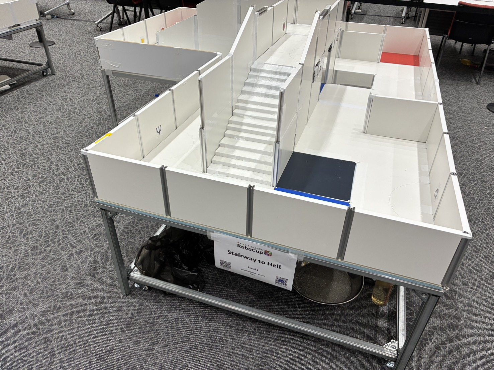
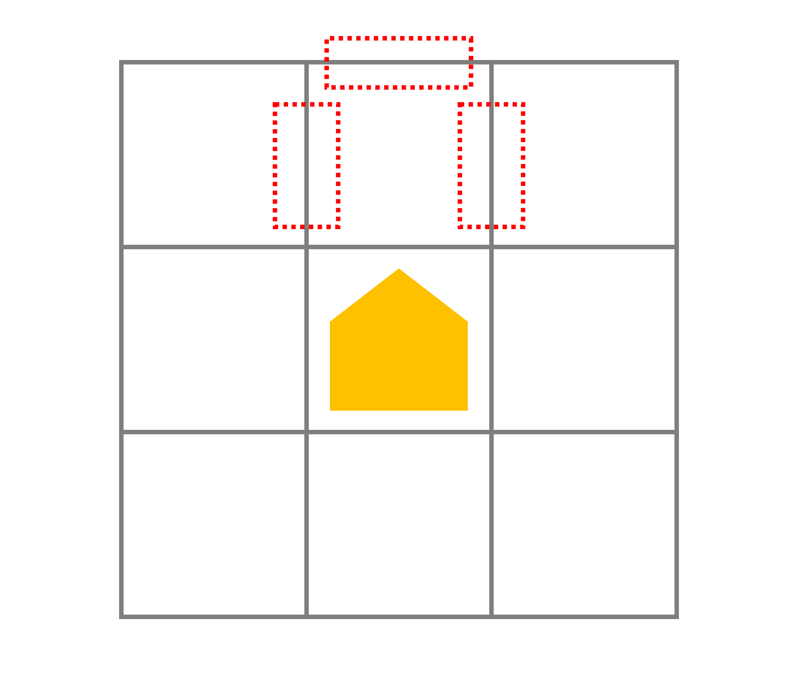

こんにちは、全国大会以降機体のソフトウェアを担当していたshujiです。

カメラによる被災者検出の話はmituが記事を書いてくれると思うので、それ以外のソフトウェアについて、全国大会の後世界大会までに実装した主な内容を紹介します。

# 開発体制の移行

全国大会までは、
- STM32によるセンサ・モータ制御などの低レイヤ処理：shuji
- Raspberry Piでのロボットの全体制御：mitu
- UnitVカメラによる被災者検出：mitu

という体制で開発を進めていましが、基板の新たな開発がほとんど不要なことと、被災者が世界大会で全面的に変わることを踏まえ、

- カメラ以外のソフトウェア：shuji
- カメラによる被災者検出：mitu

という体制に移行しました。そのため、機体のメインプログラムを2人とも熟知している状態で大会に臨むことができ、これはTechnical ChallengeやSuperTeamで大きな強みになったと思います。

それでは以降、世界大会までに実装した内容を紹介していきます。

ソースコードは[こちらのリポジトリ](https://github.com/tuton-RCJ/Kanto2026RPi)で公開しています。

# ログ管理

これまではPythonのprint()でしかログを出力していませんでしたが、世界大会に向けてちゃんとしたログ管理を導入しました。

loggingモジュールを使って、家での練習や大会本番の得点走行も含めてすべての走行でログをファイルに出力し、いつでも見返せるようにしました。特に、大会会場では無線でのSSHが使えない可能性があるので、ログ出力はほぼ必須です。

Raspberry Piを使っている人は全員ログ出力を導入しましょう。開発効率が格段に上がります。

- [ログの例：世界大会1走目のログ(GitHub)](https://raw.githubusercontent.com/tuton-RCJ/Kanto2026RPi/refs/heads/main/src/logs/robot_20260702_094301_Incheon1stRun.log)

# 立体交差への対応

一番力を入れた点です。

## 鉛直移動距離によるレイヤーマッチング

オドメトリで計算した移動距離にIMUで取得した角度のsinをかけて鉛直移動距離を計算し、坂を上り下りした際の階層の高度を推定するようにしました。単純にz座標を1ずつ増やしていくのではなくこのような方式を採用したのは、[2024のフィールド](https://rescue.rcj.cloud/events/2024/Maze%20Fields/Day_2-3.jpg)で異なる傾斜の坂によって階層が接続されていた例があったためです。

基本的には精度よく高度を推定で来ていたのですが、階段を上り下りした際は少し距離が長く計算されてしまっていました。
2マスの階段が来ることはないだろうと考え、1マスの坂・階段の時は高さを15cmと決め打ちすることで対策していました。

しかし、今年の世界大会のフィールドで2マス分の長さの階段が出てしまいました。傾斜の異なる坂は無かったのでフィールドを見たタイミングで修正しておけばよかったのですが、このことをすっかり忘れていたためそのまま突っ込み座標ずれを起こしました。頑張った立体交差を得点源にすることができず悔しかったです

 

- [該当コード：3Dマッピング(GitHub)](https://github.com/tuton-RCJ/Kanto2026RPi/blob/7ab57b16f2ee24530f224f279c416e875d6d417f/src/mazeUtils/mazeMap.py#L470-L598)

## 直近の鉛直移動距離情報に基づいた坂と階段の判別

階段はマスに合わせて設置する必要がないので、とても厄介です。階層移動を伴わない階段があって、上りだけ坂と判断して下りの階段を坂と判断しなかったことで、マッピングの階層がずれるという危険性があります。

そこで、直近5回の移動での鉛直移動距離を保存しておき、坂を上り下りしたとしても、鉛直移動距離の合計が0に近かった場合は、階段と判断し、階層を変えないようにしました。

これを導入してから、練習・本番共に階段を坂と誤検知することは一回もありませんでした。

<blockquote class="twitter-tweet">
いじわるな階段に対応 <a href="https://t.co/K6atJzUy9T">pic.twitter.com/K6atJzUy9T</a>
&mdash; shuji (@shuji_4649) <a href="https://x.com/shuji_4649/status/2068165146552459554?ref_src=twsrc%5Etfw">June 20, 2026</a></blockquote> 

 

- [該当コード：階段の上りを上り坂として検知した際の処理(GitHub)](https://github.com/tuton-RCJ/Kanto2026RPi/blob/7ab57b16f2ee24530f224f279c416e875d6d417f/src/mazeUtils/moveTile.py#L2537-L2554)
- [該当コード：階段の下りを下り坂として検知した際の処理(GitHub)](https://github.com/tuton-RCJ/Kanto2026RPi/blob/7ab57b16f2ee24530f224f279c416e875d6d417f/src/mazeUtils/moveTile.py#L2392-L2453)

# 被災者検出

画像処理をして被災者を発見するのはUnitVの仕事なので、ここではUnitVから送られてくる情報に基づいてRaspberryPi側で行う被災者救助の処理について書きます。

基本的にはメインループが回っている間ずっとカメラから送られてくる値を読んでいればよいのですが、壁が無いときに遠くの被災者を読んでしまうといけなので、壁があるときだけ被災者を読むようにしなければなりません。

LiDARを積んでいるとはいえ、UnitVで動かしているモデルは文字被災者の座標は求められないのと、LiDARの周期がそこまで高くないので、被災者を読み取るたびにLiDARの点群を見て壁があるかを見る、みたいなことはできません。

まず、マスの中央に着いたときとその直前・直後は読むようにしています。そして、マス移動開始前に今いるマスと次に行くマスの両方に壁があるかをLiDARの点群で確認し、もし両方に壁があるなら移動中ずっと被災者を読む、というようにしました。

回転する際に直角に壁が配置されている場合は、回転中にずっと被災者を読んでいます。ただし、ここで問題なのは角の被災者を読む時は45°程度傾いているものを読まないといけない、という点です。文字被災者の検出にはそこまで影響はありませんが、Cognitive Targetは少し苦戦しました。結局傾いていても読めるようにカメラ側で調整してくれましたが、45度ずつ止まってモードを切り替えて読む、というプログラムも実装してありました。

直角に壁が置いていないところで90°旋回する場合は、曲がった後に少し下がるようにしています。世界大会機体になってカメラがやや前方に配置されるようになった結果、見逃すことが多発したためです。

また、Cognitive Targetで、間違った値を読んでしまうことが練習で何回かありました。そこで、レスキューキットが1個必要な被災者として認識し、1個投下した直後に、レスキューキットが2個必要な被災者として再度読んだ際には、追加で1個のみ投下する、というような処理も入れました。これは文字被災者にも同じように適用しているので、Φの半分だけ見えていてΨと認識してしまう、という状況にも対応できます。
ただカメラ側の改善でCognitive Targetの読み取りミスは起きにくくなったので世界大会ではこれらの処理は1回も発動していません。

# Dangerous Zoneの処理

全国大会までは赤タイルは特に処理を入れていませんでしたが、世界大会では先にDangerous Zone以外を探索するべきだろうということで、Dangerous Zoneの処理を追加しました。

これはDijkstraの計算において赤タイルから未探索タイルへの移動コストを大きな値にしておくことで簡単に実装できます。こうすれば自然とDangerous Zone以外のタイルを優先的に探索するようになり、他が探索済みになった後にDangerous Zoneに入っていくようになります。

赤タイルから未探索タイルへ移動したときにフラグを切り替えれば、Dangerous Zone内にいるかも簡単に判定できます。これを使ってDangerous Zone内の坂道は回避、なども実装しました。

（実はDangerous ZoneのタイルかどうかはDangerous Zone以外を全て探索し終わった後じゃないと判定できないんですよね。なのでDangerous Zoneの中で特別な処理を入れたい場合は先に他を探索するようなプログラムにしなければなりません。）

- [該当コード：Dijkstra計算における赤タイルの例外処理(GitHub)](https://github.com/tuton-RCJ/Kanto2026RPi/blob/7ab57b16f2ee24530f224f279c416e875d6d417f/src/mazeUtils/mazeMap.py#L94-L106)

# LiDARによる障害物検出

主に以下の3つの目的でLiDARを使った障害物検出を実装しました。

- 中央障害物があったときに回避する
- 左右に障害物があったときにあらかじめよけながら進むことで衝突回数を減らす
- バンパーが使えなくなったときのバックアップ
  
壁と障害物の判別は連結している点群の長さを見て行っています。ほぼ100%正しく検知できているので優秀です。

<iframe width="560" height="315" src="https://www.youtube.com/embed/rgqJRbsMQpc?si=K-IB_uTFUgKz1eKK" title="YouTube video player" frameborder="0" allow="accelerometer; autoplay; clipboard-write; encrypted-media; gyroscope; picture-in-picture; web-share" referrerpolicy="strict-origin-when-cross-origin" allowfullscreen></iframe>

 

中央障害物を発見した場合は通行不可と判断して回避し、左右に障害物を発見した場合は少し反対側に傾いてからマス移動をすることで障害物を避けます。（これはBioBrauseの動きに憧れて実装しました）

<blockquote class="twitter-tweet">
中央障害物回避 <a href="https://t.co/p1MekFv6HQ">pic.twitter.com/p1MekFv6HQ</a>
&mdash; shuji (@shuji_4649) <a href="https://x.com/shuji_4649/status/2070161300056109065?ref_src=twsrc%5Etfw">June 25, 2026</a></blockquote> 

 

- [該当コード：障害物検出(GitHub)](https://github.com/tuton-RCJ/Kanto2026RPi/blob/7ab57b16f2ee24530f224f279c416e875d6d417f/src/mazeUtils/device/LiDAR.py#L213-L338)

# 残り時間を見て帰還開始

世界大会のフィールドは広いので全部探索し終わった時のみ帰還開始だとリスクがあります。

Dijkstraで計算した、現在地からスタートタイルまでの最短経路をたどるのにかかる時間をもとに、30秒くらい余裕をもって帰還開始するようにしました。

6走目ではこの処理を発動させるため、LoP中に30秒くらい戦略的に待機するということをしました。難易度の高い世界大会のフィールドでは時にはこのような判断も有効かもしれません。

スタートからの距離を考慮せず定数にしてもよいので、残り時間が少なくなったら帰還開始する、という処理は得点を稼ぐために入れておいた方がよいと思います。

- [該当コード：残り時間を見て帰還開始(GitHub)](https://github.com/tuton-RCJ/Kanto2026RPi/blob/7ab57b16f2ee24530f224f279c416e875d6d417f/src/main.py#L98-L105)

# マップ破壊後の帰還

何かにスタックして1マスずれただけで帰還ができなくなるのは悲しいです。

マップが破壊されたとしても、スタート地点が近くにあると思われるタイルの中で、スタート地点の周囲の壁情報と一致するマスがあったらそこをスタート地点とみなして帰還する、という処理を追加しました。

が、マップ破壊が発生した走行で帰還できたのは結局1回もありませんでした。ムズカシイ

- [該当コード：スタートタイルの推定(GitHub)](https://github.com/tuton-RCJ/Kanto2026RPi/blob/7ab57b16f2ee24530f224f279c416e875d6d417f/src/mazeUtils/mazeMap.py#L1069-L1133)

# コの字検出

LiDARを使うと、隣り合ったタイルがコの字型のタイル（3辺が壁に囲まれたタイル）かどうかを判断できるので、コの字型のタイルは優先して探索する処理を入れました。ほとんどの場合コの字型のマスは見つかったらすぐに訪れておく方が効率的です。

<blockquote class="twitter-tweet">
コの字マスの検出 <a href="https://t.co/4RFuEEo7cu">pic.twitter.com/4RFuEEo7cu</a>
&mdash; shuji (@shuji_4649) <a href="https://x.com/shuji_4649/status/2070436791581298968?ref_src=twsrc%5Etfw">June 26, 2026</a></blockquote> 

 

検出方法は単純で、以下の3つの領域の中に点が一定数以上あるかを見ているだけです。
領域を大きめに設定したため誤検知も多かったですが、誤検知しても大きな問題はないうえ、ランダム性を入れておくと繰り返しLoPした時とかに役立ったりするのでそのままにしておきました。

 

- [該当コード：コの字マスの検出(GitHub)](https://github.com/tuton-RCJ/Kanto2026RPi/blob/7ab57b16f2ee24530f224f279c416e875d6d417f/src/mazeUtils/device/LiDAR.py#L428-L484)

# 右手・左手優先探索

もしもたくさん曲がる戦略が必要になったときのために、右か左に未探索タイルがあったらそちらを優先する、というモードを追加しました。

長い直線であまりにも座標がずれるようなことがあった時のためのものです。

結局使いませんでした。

- [該当コード：右手・左手優先探索(GitHub)](https://github.com/tuton-RCJ/Kanto2026RPi/blob/7ab57b16f2ee24530f224f279c416e875d6d417f/src/mazeUtils/mazeMap.py#L751-L761)

# 位置補正

全国大会での反省を踏まえ、基本的には定数（オドメトリ）で1マス移動するように変更しましたが、それだとどうしても少しずれてしまいます。

前後1マス以内に既知の壁があるときは距離を測って補正するようにしました。これだけでかなり安定して走れるようになった気がします。

- [該当コード：位置補正(GitHub)](https://github.com/tuton-RCJ/Kanto2026RPi/blob/7ab57b16f2ee24530f224f279c416e875d6d417f/src/mazeUtils/moveTile.py#L1777-L1830)

# 最後に

あまり図とかを作っている余裕が無くて文章ばかりになってしまいました。すみません。

レスキューメイズって見た目以上に例外処理がたくさん必要な競技だなあとこの3ヶ月で感じました。特に階段と障害物が厄介ですね。

ちなみに上に書いた追加実装の内容は、すべてフラグを切り替えるだけで有効・無効を切り替えられるようにしてあり、世界大会でのフィールドの様子を踏まえてすぐに対応できるようにしていました。特殊な機能を追加していく際はこのようにフラグで切り替えられるようにしておくと良いと思います。

あとやっぱりハードウェアの対称性は大事ですね。LiDARは中央に置いた方が楽だし、カメラも機体の真ん中に置いておくと考えることがだいぶ減る気がします。

来年はどんなルールになるのでしょうか。楽しみですね。今年被災者が大きく変わったのでそこまで大きな変更はないような気がします。

質問等あれば[DM](https://x.com/shuji_4649)か[マシュマロ](https://marshmallow-qa.com/wvxcgdpm90lzfzr)にお願いしますー
