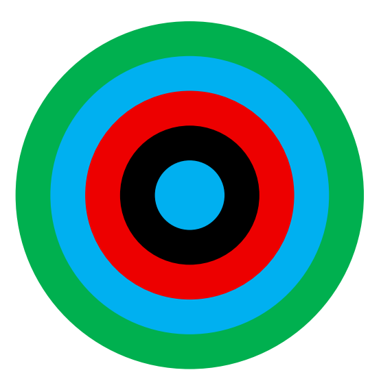
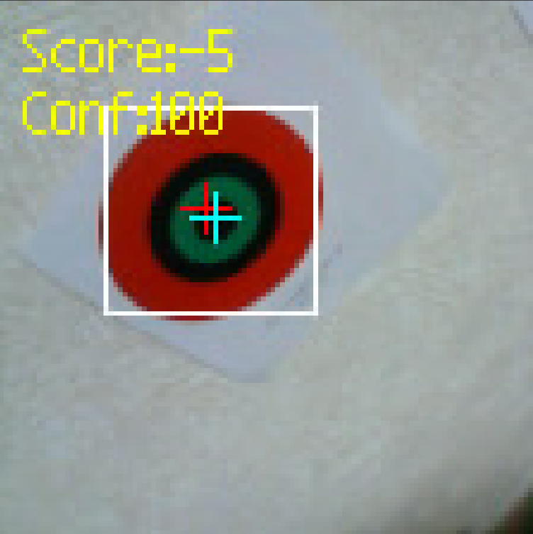

こんにちは、カメラと全国大会以前のソフトウェアを担当していたmituです。今回は世界大会での被災者検出について紹介します。

被災者検出以外のソフトウェアについては[shujiの記事](https://tuton-rcj.github.io/20260714/)を参照してください。

ソースコードはこちらの[リポジトリ](https://github.com/tuton-RCJ/Kanto2026Software)で公開しています。

# Letter Victimsの検出

Letter Victimsについては2026年ルールの変更点が文字の変更のみだったため、全国大会と同様にUnitV上のK210にmobileNetV1を乗せて検出する方式を採用しました。

## 入力画像の前処理

モデルへの入力は適当な閾値で二値化された画像としました。これは会場の環境光の影響を受けにくくするためです。

二値化は大きく情報量を損なうので、精度を落とすのではないかとも考えられます。一方、二値化された画像で学習したモデルと通常の画像で学習したモデルの精度を比較したところ、優位な精度の低下は見られなかったため、二値化画像を入力とすることにしました。

## 偽被災者検出

[世界大会のフィールド](https://rescue.rcj.cloud/events/2024/Maze%20Fields/Day_2-3.jpg)では検出すべき文字ではないような文字(以下、偽被災者と呼びます)が多数存在しており、これらを検出しないような対策が必要です。(今年のフィールドには1つもありませんでしたが…)

もちろん、学習データに偽被災者の画像を含めることで、モデルが学習データに含まれているような偽被災者については検出しないようにすることができます。しかし、当然のことながら、学習データに含まれていない偽被災者については検出してしまう可能性があります。

そこで、Energy score (Liu et al.(2020))を採用し、モデルが検出した被災者の信頼度を評価することで、偽被災者の検出を抑制することにしました。

実際、Energy score を導入することで、学習データに含まれていない偽被災者のうち約6割ほどを検出しないようにすることができました。

# Cognitive Targetsの検出

Cognitive Targetsは2026年ルールでColored Victimsの代わりに導入された新しい被災者です。詳細な解説は[公式ルール](https://junior.robocup.org/wp-content/uploads/2026/02/RCJRescueMaze2026-final.pdf)に譲るとして、ここでは簡単に説明します。

 

上の図のようにCognitive Targetsは同心円状の輪を5つ重ねたような形をしており、各色の輪がいくつあるかによって投下すべきレスキューキットの数が変化します。

## 概要

Cognitive Targetsの検出は大まかに以下の流れで行います。

1. 事前に決定された閾値からCognitive Targetsの候補を求める

2. 候補の中からCognitive Targetsの形状に合致するものを選択する
  
3. 選択された候補について中心推定を行う

4. 推定された中心に基づいて、各輪の色を判定する

以下、各ステップについて詳しく説明していきます。

## 候補の抽出

事前に決定されたLAB色空間における閾値を用いて、Flood Fillによる領域抽出を行い、Cognitive Targetsの候補を求めます。

UnitV の公式ファームウェアのFlood Fillの実装では、複数の閾値を用いたFlood Fillはサポートされておらず、閾値として複数の色を指定した場合には、各色に対して個別にFlood Fillを行った結果をまとめて返すような実装になっています。

そのため、ファームウェアに新しく複数の閾値を用いたFlood Fillの実装を追加し、1回のFlood Fillで複数の色に対応できるようにしました。

## 候補の選択

先ほど抽出した領域の中から、Coognitive Targetsの形状に合致するものを選択します。以下のような条件を設けました。

- `0.8 < (領域の面積)/(π/4 * (領域の高さ) * (領域の幅)) < 1.2` ... 外接矩形への内接楕円に対する充填率が適切かどうか
- `min((領域の高さ)/(領域の幅), (領域の幅)/(領域の高さ)) > 0.65` ... 縦横比が適切かどうか
- `(領域の左端の x 座標) > 0 かつ (領域の右端の x 座標) < 112` ... 領域が画面内に収まっているかどうか
- `(領域の幅) > 20 かつ (領域の高さ) > 20` ... 領域が小さすぎないかどうか

## 中心推定・色判定

同心円状の輪の色を判定するにはCognitive Targetsの正確な中心位置が必要不可欠です。

一方、私たちのロボットは、視野を広くするためにカメラを傾けた状態で上方に設置しています。そのため、壁の上部ほど大きく、下部ほど小さく写るという歪みが生じます。そのため、単純に領域の重心を中心位置とすると大きなずれができてしまいます。

そこで、以下のような処理を行います。(以下、領域の幅をw、領域の高さをhとします)

1. 重心を (0,0) とし、(±0.3h, ±0.3w), (0, ±0.3w), (±0.3h, 0), (0,0) の9点を候補となる点として選択する

2. 9点のそれぞれについて、以下の処理を行う
   1.  0°, 45°, 90°, 135°, ..., 315° の8方向へ、半径の 0.1, 0.3, ..., 0.9 倍にある点の色を取得する
   2. 同じ半径の点の色の差の二乗の最大値を計算する
   3. 各半径における ii の和をスコアとする
3. 9点のうちスコアが低い上位3点を仮の中心位置として採用する

4. 仮の中心位置の4x4近傍16点について、 2.と同様の処理を行う

5. 4で得られたスコアの上位3点を再び仮の中心位置として採用する

6. 5 で得られた3点について、以下の処理を行う
   1. 0°, 30°, 60°, ..., 330° の12方向へ、放射状に直線を引く
   2. 直線を同じ色が連続する区間に分割し、それぞれの区間の長さを計算する
   3. 各区間の長さと理想的な長さの差の二乗を計算する
   4. ivで得られた値の和をスコアとする
7. 6で得られたスコアの最も低い1点を最終的な中心位置として採用する

このような処理によって斜めから見たCognitive Targetsの中心位置を推定しました。以下の図は、赤が領域の重心、青が推定された中心位置を示しています。

<figcaption>赤: 領域の重心 青: 推定された中心</figcaption>

 

また各層の輪の色の判定に関しては、上で示した6.の処理の際に同時に行っています。

# 閾値調整用ツール

Maixpy IDEにUnitVから送られてくる画像は事前にjpeg圧縮されているため、閾値の調整がしにくいという問題があります。

そこで、UnitVに対して動的に閾値を送り、UnitV側で閾値を適用した画像を送信してもらうようなツールを作成しました。

<iframe width="560" height="315" src="https://www.youtube.com/embed/vgkzL7NGoR0?si=-B8vLeOPb56FwuE_" title="YouTube video player" frameborder="0" allow="accelerometer; autoplay; clipboard-write; encrypted-media; gyroscope; picture-in-picture; web-share" referrerpolicy="strict-origin-when-cross-origin" allowfullscreen></iframe>

これによって閾値の調整が容易になり、会場での閾値調整の時間を短縮することができました。

# おわりに

あまり時間がなくざっくりとした解説になってしまいました。

去年までのルールではおそらく最も検出するのが簡単な被災者だったColored VictimsがなくなりCognitive Targetsに変更されたことで、被災者検出の難易度が大幅に上がりました。世界大会でも私たちを含めCognitive Targetsを安定して検出しているチームはほぼいなかったように思います。

そのため、今までは被災者を安定して検出できることは前提として、いかに走破性を高くするか・ソフトウェアがよくできているかという点が勝敗を決めるような印象がありましたが、今年は被災者検出の精度も勝敗を決める大きな要素になったような気がします。

Colored Victimsが追加され、その一年後にHeated Victimsがなくなり、Colored VictimsがなくなりCognitive Targetsが追加されたわけですが、Letter Victimsがなくなる日は来るのでしょうか。今後のルール変更が気になります。

質問等あれば、[X(旧Twitter)](https://x.com/mitu8541)のDMまでお願いします。

